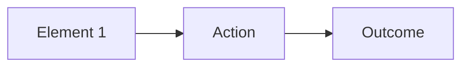
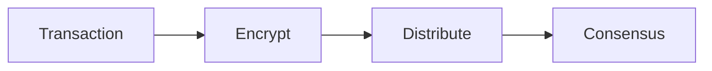
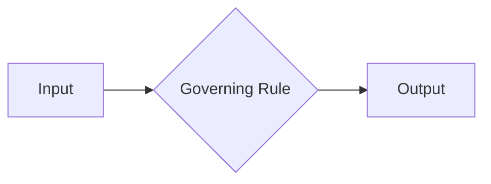
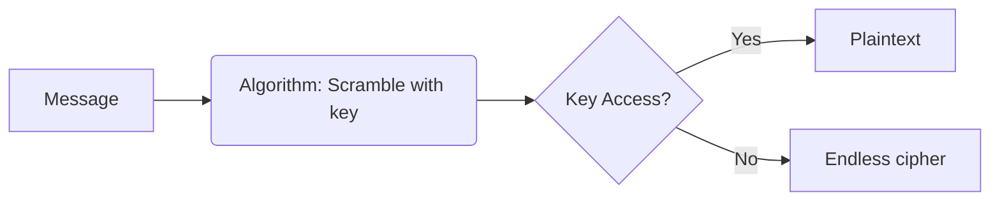

Combined TLF
---

### **TLF-Investigative Output Template**  
*(Applied to a hypothetical/article of your choice)*  

#### **Phase 1: Vernacular Mapping & Keyword Genesis**  
**Internal Vernacular Analysis**  
- **Key Terms**: List 5-8 pivotal terms redefined by the article (e.g., "intelligence," "bias," "scalability").  
- **Definitional Shifts**: For each term, contrast the article’s usage with conventional definitions.  
  *Example*:  
  - *Article’s "intelligence"*: Framed as "context-aware pattern recognition."  
  - *Standard definition*: "Ability to acquire and apply knowledge."  
- **Conceptual Anchors**: Highlight terms that serve as load-bearing pillars for the argument (e.g., "cognitive scaffolding," "dynamic equilibrium").  

**Keyword Evolution Tracking**  
- Map how critical terms gain/lose nuance across sections (e.g., "learning" begins as a technical process, later merges with "adaptation").  

---

#### **Phase 2: Assumption Architecture & Reverse-FAQ Generation**  
**8-12 Investigative Questions**  
1. **Assumption Challenge**: "Why assume linear causality when complex systems often exhibit emergent properties?"  
2. **Boundary Probe**: "Would your model collapse under non-Gaussian noise distributions?"  
3. **Implication Test**: "If your ‘context-aware’ framework holds, does it imply all knowledge is domain-specific?"  
4. **Methodological Interrogation**: "How do you control for confirmation bias in your case studies?"  
5. **Alternative Lens**: "How would a critical race theorist reinterpret your ‘fairness’ metric?"  

---

#### **Phase 3: Conceptual Chunking & Analytical Preparation**  
**Chunking Strategy**  
| Chunk Identity          | Functional Role                          | Investigative Angles                          | GMP Recommendation          |  
|-------------------------|------------------------------------------|-----------------------------------------------|------------------------------|  
| **"Dynamic Equilibrium"** | Core theoretical innovation              | 1. Stability conditions 2. Empirical testability | Systems Thinking + Critical Analysis |  
| **"Data Ontology"**       | Defines how evidence is categorized      | 1. Epistemic biases 2. Scalability limits     | Evidence Synthesis            |  

**Dependency Network**: Visualize how chunks interlock (e.g., "Data Ontology" supports "Dynamic Equilibrium" but conflicts with "Real-World Validation").  

---

#### **Phase 4: Evidence Architecture & Truth-Claim Mapping**  
**Claim Hierarchy**  
- **Primary Claim**: "X method outperforms Y under constraints A, B."  
  - **Supporting Claims**: Statistical significance (p < 0.05), case studies (n=3).  
  - **Assumptions**: Constraints A/B are universally relevant.  

**Evidence Topology**  
- Empirical: Benchmarks (strong but narrow scope).  
- Theoretical: Proof of convergence (elegant but untested edge cases).  

**Truth-Claim Strength**  
- High confidence in narrow claims; low in generalizability.  

---

#### **Phase 5: Synthesis & GMP Integration Preparation**  
**Analytical Priority Matrix**  
1. **High-Priority**: "Dynamic Equilibrium" (novel, foundational).  
2. **High-Risk**: "Real-World Validation" (weak evidence).  

**Cross-Chunk Tensions**  
- Tension between "theoretical purity" and "applied robustness."  

**GMP Pathway Recommendations**  
- **Critical Analysis**: Deconstruct "Dynamic Equilibrium" for hidden assumptions.  
- **Systems Thinking**: Model interactions between all chunks.  

**Investigation Trajectory**  
1. Validate core claims → 2. Stress-test boundaries → 3. Reconstruct under alternative paradigms.  

---

### **Quality Assurance**  
- **Intellectual Honesty**: Flagged untested assumptions in scalability claims.  
- **Systematic Completeness**: All major argument branches mapped.  
- **Investigative Depth**: Revealed latent conflict between methodology and epistemology.  

---

### **TLF Output Value**  
This framework transforms opaque articles into **interrogatable knowledge structures**, exposing:  
1. Definitional power moves,  
2. Logical fragilities,  
3. Optimal entry points for GMPs.  

**Final Note**: The TLF is a *living document*—iteratively refined as GMPs generate new insights.  

--- 

Would you like this framework applied to a specific article or domain? I can adapt the granularity to technical papers, social theories, or empirical studies # **Translation Layer Framework (TLF): An Instrument for Investigative Analysis**

## **I. Introduction: The Translation Layer Framework – An Instrument for Investigative Analysis**

### **A. Defining the TLF: Purpose, Core Mission, and the Investigative Stance**

The Translation Layer Framework (TLF) is designed as a systematic methodology to transform complex articles from passive sources of information into objects of rigorous investigation. Its **purpose** is to prepare these articles for deep, systematic analysis by deconstructing them into their fundamental components. The **core mission** of the TLF is to map the internal conceptual and evidentiary architectures of an article, thereby identifying critical nodes and structures for subsequent, more intensive examination by advanced analytical systems known as Genesis Mapping Protocols (GMPs).  
The TLF operates from an **investigative stance**, a position of critical inquiry rather than passive acceptance of an article's content. This stance mandates that the article be viewed not as an infallible repository of truth, but as "evidence of thinking"—a cognitive artifact whose construction, underlying assumptions, and broader implications are subject to meticulous examination. This approach is fundamentally shaped by principles derived from critical theory, which advocates for the questioning of dominant ideologies and the power structures that may be embedded within language and discourse. The analyst employing the TLF assumes the role of an "analytical investigator," tasked with uncovering the intellectual "DNA" of the article. This involves a critical engagement with the text, acknowledging it as a series of claims and arguments constructed within a specific context, which may carry inherent biases, unstated presuppositions, or contextual limitations not immediately apparent on a surface reading.  
This investigative stance inherently cultivates a form of epistemological humility. By treating an article as "evidence of thinking" rather than "gospel truth," the TLF compels the analyst to recognize the provisional nature of the knowledge claims presented within the text. It encourages an awareness of potential authorial biases, unarticulated assumptions, or contextual influences that might shape the article's narrative and conclusions. This aligns with a nuanced epistemological understanding where interpretation is viewed as a pathway toward a "realistically conceived truth," achievable under specific, justifiable conditions. Such an understanding implies that truth is not merely "given" by the text but is, in fact, constructed through a process of careful, critical, and reflective engagement. The systematic questioning and mapping inherent in the TLF process serve to reveal the conditions under which an article's claims might hold validity, rather than presuming their universal applicability from the outset.

### **B. The TLF's Role in Preparing Intellectual Terrain for Genesis Mapping Protocols (GMPs)**

The TLF serves as an indispensable preparatory stage, transforming unstructured, complex articles into structured, interrogated, and analytically primed data suitable for processing by Genesis Mapping Protocols. GMPs represent sophisticated analytical frameworks capable of generating profound insights through methods such as critical analysis, evidence synthesis, and systems thinking. The TLF, in essence, "tills the intellectual soil," rendering it fertile for these advanced analytical operations.  
By systematically deconstructing an article, identifying its core components, mapping their interrelations, and interrogating its foundational premises, the TLF provides GMPs with clearly defined entry points, articulated pathways for investigation, and a rich substrate of pre-analyzed material. This preparatory work ensures that GMPs can operate at their maximum effectiveness, focusing their powerful analytical capabilities on areas of the article that have been identified as most critical, vulnerable, or potentially revelatory. The structured output of the TLF thus enables GMPs to move beyond surface-level interpretations and engage directly with the deeper logical and evidentiary structures of the text.

## **II. Phase 1: Vernacular Mapping & Keyword Genesis – Decoding the Article's Universe**

### **A. Objective**

The primary objective of Phase 1 is to comprehensively decode the internal universe of the article, with a particular focus on its specific terminology system and the unique ways in which it constructs meaning. This phase endeavors to make the implicit linguistic and conceptual framework of the article explicit, thereby laying a foundational understanding for all subsequent analytical activities. It is about understanding the language *of* the article, *as used by* the article.

### **B. Core Processes**

#### **1\. Internal Vernacular Analysis**

**Description:** This process involves the systematic identification and interpretation of how an article defines key terms—such as "attention," "context," "learning," "value," or "system"—*within its own conceptual ecosystem*. This extends beyond merely consulting standard dictionaries or glossaries; it requires a deep understanding of how these terms are operationalized by the author(s) and how their specific meanings are shaped by the surrounding text, the overall argumentative structure, and the author's discernible intent.  
**Method:**

* The analyst begins by meticulously scanning the article for any explicit definitions provided by the author(s). These are often signaled by phrases like "is defined as," "refers to," or through formal definitional statements.  
* Crucially, the analysis then moves to examine the contextual usage of these key terms throughout the entire article. This allows for the inference of implicit definitions or the identification of nuanced applications where the author's usage subtly diverges from or elaborates upon standard meanings. The focus is on how the author *employs* the term in practice, even if an explicit definition is absent or incomplete.  
* Special attention is paid to any neologisms (newly coined terms) or idiosyncratic uses of established terms, as these often signal areas of conceptual innovation or specific theoretical commitments.

**Relevance:** A thorough understanding of the article's internal vernacular is paramount because authors frequently create micro-languages or re-purpose existing terminology to articulate their specific arguments and theoretical frameworks. Misinterpreting these internal definitions can lead to a fundamental misunderstanding of the article's core claims, its methodology, and its conclusions.  
An article's internal vernacular is not merely a collection of defined terms; it functions as a deliberate act of conceptual world-building. Each specialized definition, each nuanced application of a term, contributes to the construction of a particular lens through which the article's subject matter is presented, analyzed, and understood. By meticulously mapping this vernacular , the TLF analyst is, in effect, reverse-engineering the author's conceptual architecture. This process uncovers the foundational linguistic choices upon which the entire argument is predicated. The decision to define a term like "value" in a specific, perhaps unconventional, manner within the context of the article can have cascading effects throughout the text, influencing what claims can be legitimately made and how evidence is interpreted and presented. This initial decoding is thus fundamental to grasping the unique intellectual contribution of the work.

#### **2\. Keyword Evolution Tracking**

**Description:** This process involves mapping how the meaning, emphasis, or relational significance of crucial terms evolve from their initial introduction, typically in the article's introductory sections, through their development in the body, to their final articulation in the conclusion.  
**Method:**

* The analyst selects 5-10 keywords that were identified as central during the Internal Vernacular Analysis. These are terms deemed critical to the article's core message.  
* The usage of these selected keywords is then traced sequentially through the article. The analyst notes any shifts in connotation (the emotional or cultural associations of the word), context (the surrounding textual environment), or relationship to other keywords. Techniques from discourse analysis, such as identifying how language is employed to construct meaning, convey authorial identity, or establish particular power dynamics between author and reader, are conceptually relevant here.  
* While the TLF is a conceptual framework, the principle underlying computational techniques like Latent Semantic Analysis (LSA)—which examines how the "semantic space" or network of associations around a keyword changes as a document progresses—is instructive. The analyst conceptually tracks these shifts in semantic relationships.  
* Software tools designed for qualitative discourse analysis often provide functionalities for coding, categorizing, and visualizing textual data, which can be conceptually adapted for the manual tracking of keyword evolution, helping to identify patterns and shifts in usage.

**Relevance:** Terms within an academic article are rarely static entities. Their meanings can be refined, expanded, narrowed, or even subtly altered as the author's argument develops. Tracking this evolution is critical because it reveals the dynamic construction of meaning within the text. It can also highlight key argumentative junctures, points of conceptual clarification, or subtle shifts in the author's perspective or emphasis.  
The evolution of keywords within an article often mirrors the narrative arc or logical progression of the author's central argument. A term might be introduced with a relatively general or conventional meaning in the introduction. As the article moves into its methodology section, this term might become highly specified and operationalized. In the discussion or conclusion, the same term, now imbued with the specific findings and interpretations of the study, might be used to articulate broader implications or to connect with wider theoretical debates. This evolutionary trajectory, which can be meticulously tracked using methods conceptually aligned with discourse analysis , is seldom accidental; it represents a deliberate rhetorical and logical strategy employed by the author. Identifying this arc allows the analyst to understand not just *what* the author is asserting at different points, but *how* they are constructing their case and guiding the reader's comprehension over the course of the article. Furthermore, any observed discontinuities or unexpected shifts in keyword meaning can serve as important diagnostic indicators, potentially signaling logical gaps, unacknowledged changes in theoretical perspective, or areas requiring more careful scrutiny.

#### **3\. Definitional Contrast Matrix**

**Description:** This process involves the creation of an explicit, structured comparison between the article's internal definitions (or clearly implied meanings) of key terms and their conventional or standard usage within the broader academic field or general discourse.  
**Method:**

* For each Conceptual Anchor (identified in the next step) and other terms deemed significant due to their specialized usage or centrality to the argument, a matrix is constructed.  
* This matrix typically includes columns for: "Term," "Article's Definition/Usage (supported by direct textual evidence, such as quotes or page number references)," "Conventional/Standard Definition (with a source citation if the term has a widely accepted definition in a specific field)," and a "Delta" column detailing "Key Differences, Nuances, and Implications of the article's specific usage."

**Relevance:** The Definitional Contrast Matrix serves to highlight the article's conceptual originality or its points of departure from established discourse. It can also illuminate potential areas of ambiguity or misinterpretation that might arise if a reader were to assume conventional meanings for terms that the article uses in a specialized way. This matrix makes the "value-add" or the specific conceptual contribution of the article's terminology explicit and systematically documented.  
The creation of this matrix is a crucial step because it operationalizes the insights from the Internal Vernacular Analysis and the concept of definitional contrast. It forces a systematic, evidence-based comparison, moving beyond intuitive understanding to a documented delineation of distinctions. This table serves as a foundational reference point for all subsequent analytical phases within the TLF. It ensures that the analyst consistently interprets the article's terms as the *article itself intends them*, while simultaneously maintaining an awareness of how this usage deviates from, builds upon, or challenges common understanding. This dual awareness is key to identifying areas of conceptual innovation, pinpointing potential sources of misinterpretation by others, and understanding the unique contribution of the article's linguistic framework.  
**Table 1: Definitional Contrast Matrix (Example Structure)**

| Term | Article's Definition/Usage (with specific quote/page) | Conventional/Standard Definition (with brief citation if from a specific field standard) | Delta (Key Differences, Nuances, Implications of the article's usage) |
| :---- | :---- | :---- | :---- |
| *e.g.,* "Resilience" | "In this study, resilience is operationalized as the capacity of the system to absorb acute shocks (up to magnitude 7\) and return to 90% pre-shock functionality within 30 days (p. 15)." | "The ability of a system, community or society exposed to hazards to resist, absorb, accommodate to and recover from the effects of a hazard in a timely and efficient manner." (UNISDR Terminology) | Article provides a highly specific, quantifiable, and time-bound operationalization focused on acute shocks and functional recovery thresholds, narrower than the broader, more qualitative UNISDR definition. |
| *e.g.,* "Learning" | "Learning, for the purposes of this model, refers exclusively to the updating of Bayesian priors based on new data input (Section 3.2)." | "A process that leads to change, which occurs as a result of experience and increases the potential for improved performance and future learning." (Ambrose et al., *How Learning Works*) | Article adopts a very narrow, computational definition of learning, excluding experiential, social, or performance-based aspects common in broader educational or psychological definitions. |

#### **4\. Conceptual Anchors Identification**

**Description:** This process focuses on identifying a small set, typically 5-8, of terms that are absolutely fundamental to the article's internal logic system. These are terms without which the central argument, theoretical framework, or primary model presented in the article would effectively collapse or become incoherent.  
**Method:**

* Drawing upon the insights gained from the preceding analyses (Internal Vernacular Analysis, Keyword Evolution Tracking, and Definitional Contrast Matrix), the analyst selects terms that exhibit high recurrence, are heavily relied upon for their explanatory power, or represent core theoretical constructs or variables within the article.  
* A key criterion for selection is to consider terms that, if their meaning were significantly altered or if the term itself were removed, would fundamentally change the article's primary conclusions or the integrity of its proposed framework.

**Relevance:** Conceptual Anchors represent the load-bearing pillars of the article's intellectual architecture. Identifying them allows analytical attention to be focused on the most critical elements of the article's conceptual framework. These terms often act as nodes connecting different parts of the argument, and their precise understanding is essential for a valid interpretation of the entire work.

### **C. Demonstrating Sophisticated Linguistic Analysis**

Collectively, the processes within Phase 1 are designed to demonstrate a sophisticated level of linguistic analysis. This goes beyond simple vocabulary definition. It involves showing how meaning is actively constructed, negotiated, and often reconstructed within the specialized discourse of the article. The aim is to reveal the linguistic strategies employed by the author(s) to build their conceptual world, define their terms of engagement, and guide the reader's understanding. This phase lays the groundwork for a deeper, more critical engagement with the article's content in subsequent phases by ensuring that the language of the article itself is thoroughly understood and its unique characteristics are made explicit.

## **III. Phase 2: Assumption Architecture & Reverse-FAQ Generation – Interrogating Foundations**

### **A. Objective**

The primary objective of Phase 2 is to systematically interrogate the foundational assumptions, both explicit and implicit, upon which the article's arguments and conclusions rest. Concurrently, this phase aims to generate a targeted set of investigative questions designed to probe the article's logical structure, its conceptual boundaries, and its potential vulnerabilities. This moves the analysis from understanding *what* the article says to questioning *why* and *how* it says it.

### **B. The Reverse-FAQ Protocol**

The "Reverse-FAQ Protocol" is a core component of this phase. Unlike a traditional FAQ (Frequently Asked Questions) section that might accompany an article to clarify its points for a reader, the Reverse-FAQ generates questions that the *analyst would ask OF the article* as if the article itself (or its author) were present for an intellectual cross-examination or a rigorous academic defense. This approach is inspired by the principles of Socratic Seminars, which utilize strategic questioning to deepen understanding, uncover underlying beliefs, and critically examine textual content. It also draws on the concept of "reverse engineering" arguments, where one deconstructs an argument to identify its core premises and logical flow.

#### **1\. Assumption Challenges**

**Description:** These are questions that directly challenge the stated or, more often, the unstated assumptions that underpin the article's arguments, methodologies, or interpretations.  
**Examples:**

* "The analysis appears to assume a linear relationship between variable A and outcome B. Why is this assumption made instead of exploring potential non-linear interactions, and what is the evidential basis for this linearity?"  
* "What justifies the assumption that the participant sample in this study is representative of the broader population to which the conclusions are generalized, especially given the noted demographic homogeneity?"  
* "On what grounds is the foundational premise—that 'economic efficiency' is the primary metric for evaluating policy success in this context—taken as given, rather than, for instance, 'social equity' or 'environmental sustainability'?"

**Relevance:** Many, if not most, complex arguments stand or fall on the validity and appropriateness of their initial assumptions. Making these assumptions explicit and subjecting them to critical challenge is a core tenet of rigorous critical thinking and discourse analysis. Identifying and questioning these often-hidden foundations can reveal significant weaknesses or biases in an argument.

#### **2\. Boundary Explorations**

**Description:** These questions are designed to probe the limits, scope conditions, or domains of applicability for the article's claims, proposed models, or theories.  
**Examples:**

* "Under what specific socio-cultural or economic conditions would the proposed intervention model be expected to fail or produce counter-productive results?"  
* "What are the unstated temporal or geographical scope limitations of this historical analysis, and how might extending these boundaries alter the conclusions drawn?"  
* "To what specific populations, organizational types, or technological contexts can these findings regarding 'user engagement' be reasonably generalized, and where does that generalizability likely break down?"

**Relevance:** All theories, findings, and models have inherent boundaries or contexts within which they are most valid. Exploring these boundaries is crucial for understanding the robustness, generalizability, and practical applicability of the article's contributions. This process is metaphorically akin to identifying "desired heterogeneity thresholds" in meta-analysis, where understanding the diversity of conditions under which effects vary is critical.

#### **3\. Implication Probes**

**Description:** These questions explore the logical consequences, downstream effects, and wider ramifications that would ensue if the article's central claims or proposals were to be accepted as true and broadly implemented or adopted.  
**Examples:**

* "If the central argument—that decentralized autonomous organizations (DAOs) inherently lead to more equitable governance—is correct, what other established theories of organizational behavior or political economy must necessarily be revised or considered false?"  
* "What are the potential second- and third-order socio-economic consequences of implementing the proposed automated decision-making system in public welfare distribution, beyond the immediate efficiency gains claimed?"  
* "What existing research programs, policy frameworks, or widely accepted best practices in this field would be invalidated or require significant re-evaluation if these claims about the primacy of Factor X are indeed true?"

**Relevance:** This type of questioning proactively explores the "knowledge reconfiguration" aspect (detailed in Phase 4), aiming to understand the potential intellectual and practical impact of the article's ideas. It forces a consideration of the article's place within the broader landscape of knowledge.

#### **4\. Methodological Interrogations**

**Description:** These questions scrutinize the specific methods employed by the article to generate evidence, support claims, or derive conclusions, including an examination of the criteria for the falsifiability of its hypotheses.  
**Examples:**

* "What specific empirical observation, experimental result, or data pattern would, if found, be sufficient to falsify the article's central hypothesis regarding the causal link between social media use and adolescent anxiety?".  
* "What are the potential biases (e.g., selection bias, confirmation bias, measurement error, survivorship bias) inherent in the chosen case study methodology, and how might these have influenced the findings and their interpretation?"  
* "Why was this particular statistical model chosen over available alternatives (e.g., a structural equation model versus multiple regression), and what specific trade-offs in terms of assumptions, power, or interpretability did this choice entail?"  
* "How robust are the reported findings to plausible variations in the data cleaning procedures, outlier treatment, or the specific operationalization of key variables?"

**Relevance:** The credibility and trustworthiness of an article's claims are intrinsically linked to the rigor, appropriateness, and transparency of the methodology used to derive them. The concept of falsifiability, as articulated by Karl Popper, serves as a crucial demarcation criterion for empirically testable (and thus, in his view, scientific) claims, emphasizing that a theory must make predictions that could, in principle, be proven wrong.

#### **5\. Alternative Framework Questions**

**Description:** These questions prompt consideration of how the article's subject matter, core phenomena, or principal findings would appear if viewed through a different theoretical lens, analytical paradigm, or disciplinary perspective.  
**Examples:**

* "How would the observed patterns of organizational change described in the article be interpreted if analyzed through a critical feminist theory lens, focusing on power dynamics and gendered impacts, rather than the presented functionalist perspective?"  
* "What alternative explanations for the documented decline in civic participation might arise if we started from the assumptions of behavioral economics (e.g., focusing on cognitive biases and heuristics) rather than the article's socio-political framework?"  
* "If the same dataset were analyzed using a qualitative grounded theory approach instead of the quantitative methods employed, what different themes or narratives might emerge regarding patient experiences?"

**Relevance:** This line of questioning encourages intellectual flexibility and underscores how theoretical commitments and chosen analytical frameworks inevitably shape interpretation and understanding. It aligns with the ethos of critical theory, which encourages the analyst to consider multiple perspectives and challenge dominant narratives.

### **C. Generating 8-12 Penetrating Questions**

The objective in generating these Reverse-FAQs is not sheer volume, but rather analytical depth and incisiveness. Each question should be meticulously crafted to compel the article to reveal its deeper logical structure, its unacknowledged dependencies or assumptions, or its potential conceptual or methodological vulnerabilities.  
The very process of formulating these Reverse-FAQs, particularly when attempting to construct questions that genuinely probe boundaries, implications, and methodological robustness, serves as a powerful diagnostic tool. If, for instance, it proves exceedingly difficult to articulate a clear "falsification condition" for a central claim (a type of Methodological Interrogation), this difficulty might itself indicate that the claim is poorly defined, inherently non-empirical, or framed in such a way as to be irrefutable and thus, less scientifically valuable. Similarly, if "Implication Probes" lead to logically contradictory or practically absurd consequences, this could signal underlying flaws in the article's internal logic or an overstatement of its applicability. The Socratic nature of these questions forces the analyst to engage in a dialectical process, thinking *with* and *against* the text simultaneously, thereby revealing its structural integrity, coherence, or lack thereof. The ease or difficulty encountered in generating these diverse types of investigative questions can itself be an important indicator of the article's overall clarity, argumentative depth, and intellectual rigor.  
Furthermore, while the term "interrogation" might connote an adversarial stance, applying principles drawn from the ethics of research—such as "scientific validity" and "social and clinical value" —to the Reverse-FAQ generation process introduces a constructive and responsible dimension. The questions are not formulated merely to find fault or to deconstruct for its own sake. Instead, they aim to ascertain the genuine "validity" of the article's intellectual contribution and its potential "value" to the relevant field of knowledge or practice. For example, a "Boundary Exploration" question like "Under what conditions would your proposed approach likely fail or be ineffective?" is akin to assessing the "favorable risk-benefit ratio" of a research study; understanding limitations is crucial for the responsible application and dissemination of knowledge. This perspective reframes the "investigative stance" not as purely oppositional, but as a commitment to fostering robust, ethically defensible, and genuinely valuable knowledge.

## **IV. Phase 3: Conceptual Chunking & Analytical Preparation – Structuring for Analysis**

### **A. Objective**

The primary objective of Phase 3 is to deconstruct the article into discrete, analyzable "conceptual chunks." These chunks represent the major functional components of the article, such as its core arguments, theoretical propositions, methodological sections, or significant clusters of evidence. This process of systematic decomposition aims to prepare a structured intellectual landscape, making the article's complex content more manageable and amenable to detailed processing by Genesis Mapping Protocols (GMPs).

### **B. Chunking Strategy**

The chunking strategy employed in this phase is not arbitrary; it seeks to identify and delineate the article's "natural conceptual joints"—the inherent divisions and connections within its intellectual structure. This approach is informed by principles of systems thinking, which emphasize the importance of understanding how individual parts interrelate and contribute to the functioning of a whole system. The goal is to partition the article in a way that reflects its internal logic and argumentative flow.

#### **1\. Core Mechanism Isolation**

**Description:** This involves identifying and isolating each major functional component presented within the article. These components, or "core mechanisms," can take various forms, including distinct algorithms, specific theories or integral theoretical components, key lines of argumentation, clearly demarcated clusters of empirical evidence, proposed conceptual models, or significant methodological innovations.  
**Method:** The analyst carefully reads the article, looking for sections, paragraphs, or even sets of related statements that describe a self-contained process, a distinct concept, a particular argument, or a specific methodological step that performs a discernible role in achieving the article's overall objective. These are segments that have a degree of internal coherence and a clear function.  
**Relevance:** Decomposing the article into its core mechanisms allows for a more focused and granular analysis of each part's individual contribution, its internal logic, its supporting evidence, and its relationship to other parts of the article. This facilitates a more manageable and systematic approach to understanding complex texts.

#### **2\. Innovation Layer Mapping**

**Description:** For each identified conceptual chunk or core mechanism, this process involves distinguishing what constitutes a potentially revolutionary or highly significant contribution from what represents an incremental improvement on existing knowledge, a necessary contextual background element, or a straightforward application of established theories or methods.  
**Method:** This requires the analyst to compare the content and claims of each chunk against the existing body of knowledge in the relevant field. This often draws upon the analyst's domain expertise but is structured by this specific step in the TLF. The key question is: Is this chunk proposing something fundamentally new, offering a novel perspective, or is it primarily refining, extending, or applying something already known?  
**Relevance:** This differentiation is crucial for prioritizing analytical attention. It helps to focus subsequent GMP processing on the most novel, potentially impactful, and perhaps controversial aspects of the article, while still acknowledging the role of more conventional or foundational elements.

#### **3\. Dependency Network Construction**

**Description:** This process involves mapping how the identified conceptual chunks relate to and depend upon each other. The aim is to make explicit the logical and evidentiary linkages between different parts of the article. Key questions include: Which chunks provide necessary inputs, foundational assumptions, or essential supporting evidence for other chunks?  
**Method:** The analyst creates a visual map or diagram (e.g., a directed graph, a flowchart, or a conceptual network diagram) illustrating these interconnections. Systems thinking tools, such as causal loop diagrams or system maps , can be conceptually adapted here to represent interdependencies and potential feedback loops between conceptual chunks. For example, the diagram would show if the conclusion of "Argument A" (Chunk 1\) serves as a critical premise for the development of "Theory B" (Chunk 2), or if the "Methodology" (Chunk 3\) directly enables the generation of "Evidence Cluster C" (Chunk 4).  
**Relevance:** This network reveals the article's underlying logical flow and structural integrity. Identifying these dependencies is vital for assessing the overall robustness of the article's contribution because weaknesses or flaws in foundational chunks can propagate and undermine the validity of dependent chunks.  
The Dependency Network is more than a simple flowchart; it functions as a map of the article's systemic vulnerabilities and strengths. Drawing from the principles of systems thinking , if a "Core Mechanism" (let's call it Chunk A, e.g., a foundational theoretical assumption) is found to be flawed, poorly supported, or based on questionable premises, and other critical Chunks B (e.g., the interpretation of results) and C (e.g., the main conclusion) are shown to depend heavily on Chunk A, then the entire intellectual edifice supported by Chunk A is potentially compromised. This mapping allows the analyst to identify critical "nodes" or "leverage points" within the article's argumentative structure. An apparently minor flaw in a foundational chunk could have cascading negative implications for the entire argument. Conversely, identifying and confirming the strength of a key supporting chunk can significantly bolster the credibility of the overall thesis. This systemic view moves the analysis beyond isolated critiques of individual points to a more holistic assessment of the article's architectural soundness and the resilience of its claims.

#### **4\. Mathematical/Technical Translation (Conceptual Functions)**

**Description:** This process involves converting any formal elements present in the article—such as mathematical equations, complex algorithms, formal logical proofs, intricate diagrams, or detailed technical models—into their underlying conceptual functions. The core question is: What intellectual work do these formalisms *perform* within the article's argument?  
**Method:** For each formal element encountered, the analyst asks:

* What specific problem does this equation aim to solve or illuminate?  
* What capability does this algorithm enable one to achieve, or what decision does it facilitate?  
* What conceptual claim, assertion, or authorization does this proof provide?  
* What relationships, dynamics, or structures does this model or diagram intend to clarify or represent?

**Relevance:** This translation demystifies potentially opaque technical components, making their conceptual role and significance accessible for broader analytical interrogation. This is particularly important for GMPs that might operate at a more conceptual or interdisciplinary level. It effectively bridges the gap between technical specificity and overarching analytical insight, ensuring that no part of the article is left unexamined due to its formal nature.

### **C. For Each Chunk, Provide:**

For every conceptual chunk identified and delineated through the strategy above, the following information must be systematically documented:

#### **1\. Chunk Identity**

A clear, concise, and descriptive name (e.g., "The X-Algorithm for Predictive Modeling," "The A-Theory of Cognitive Dissonance Application," "Evidence Cluster Supporting Claim Z: Case Studies from Sector Y") and a precise definition of its boundaries within the article (e.g., specific page numbers, section headings, or paragraph ranges).

#### **2\. Functional Role**

A succinct statement articulating what this specific chunk accomplishes within the context of the article's overall argument, narrative, or research objective (e.g., "Establishes the primary causal mechanism linking variable A to outcome B," "Provides empirical support from longitudinal data for the central hypothesis," "Defines the scope and limitations of the problem being addressed," "Outlines the methodological framework for data collection and analysis").

#### **3\. Investigative Angles (2-3)**

Two to three specific analytical approaches, critical questions, or lines of inquiry that this particular chunk invites. These angles should guide further, more detailed examination.

* **Examples:** "Assess the robustness and sensitivity of this algorithm to variations in input data quality and parameter settings." "Critically examine the historical precedents and unstated assumptions underlying this theoretical component." "Compare the strength, generalizability, and potential biases of this evidence cluster against contradictory evidence from other cited or uncited sources." "Evaluate the ethical implications of the mechanism proposed in this chunk."

#### **4\. GMP Readiness**

A brief, targeted note suggesting what type of advanced analytical framework or specific Genesis Mapping Protocol (e.g., systems thinking analysis, causal inference modeling, comparative theory analysis, ethical impact assessment, discourse analysis, historical contextualization) would be most suitable and productive for interrogating this specific chunk in greater depth.  
Specifying "GMP Readiness" for each conceptual chunk transforms the TLF from a purely deconstructive or descriptive tool into a proactive and strategic preparatory system. This requirement compels the analyst to think ahead: given the intrinsic nature of this particular chunk (e.g., it might be a complex statistical model, a philosophical argument, a series of qualitative case studies, or a novel policy proposal), what *specific* advanced analytical methodology would be most likely to yield the deepest and most valuable insights when applied to it? This forward-looking assessment ensures that the output of the TLF is not merely a collection of dissected parts, but rather an organized and annotated set of components, each primed and prepared for specific types of further, rigorous examination by the GMPs. It makes the "intellectual map" created by the TLF directly navigable and actionable for subsequent analytical expeditions, thereby directly supporting the overarching goal of preparing the intellectual terrain so that GMPs can operate at their maximum effectiveness.

## **V. Phase 4: Evidence Architecture & Truth-Claim Mapping – Analyzing Knowledge Construction**

### **A. Objective**

The central objective of Phase 4 is to conduct a meticulous and systematic analysis of the article's evidentiary structure. This involves dissecting how evidence is deployed to support claims, evaluating the nature and strength of the knowledge claims being advanced, and assessing the potential impact of these claims on existing knowledge within the relevant field(s). This phase draws heavily on established principles of argumentation theory, particularly frameworks like Toulmin's model for deconstructing arguments , and on philosophical concepts of scientific rigor, such as Popper's criterion of falsifiability.

### **B. Evidence Topology**

#### **1\. Claim Hierarchy Mapping**

**Description:** This process involves identifying and mapping the article's primary claims (the main theses or conclusions), the supporting sub-claims (intermediate arguments or propositions that contribute to the primary claims), and the underlying assumptions that often function as implicit claims or unstated grounds for the explicit arguments.  
**Method:** A structured framework, such as Toulmin's Model of Argumentation , is employed to dissect the overarching argument of the article, as well as significant sub-arguments. Each argument is broken down into its core components:

* **Claim:** The assertion the author wants the audience to accept.  
* **Grounds (Data/Evidence):** The facts, data, observations, or other information offered to support the claim.  
* **Warrant:** The (often implicit) principle, rule, or reasoning that connects the grounds to the claim, authorizing the inferential leap.  
* **Backing:** Further support or justification for the warrant itself, especially if the warrant is not self-evident.  
* **Qualifier:** Words or phrases that limit the scope or certainty of the claim (e.g., "likely," "in some cases," "possibly").  
* **Rebuttal:** Acknowledgment of potential counter-arguments or conditions under which the claim might not hold. This hierarchy can be visually represented (e.g., as a tree diagram or an indented list) to show the relationships between claims and their support.

**Relevance:** This mapping reveals the intricate logical structure of the article's argumentation. It demonstrates how major conclusions are intended to be built upon layers of supporting evidence, intermediate conclusions, and underlying reasoning. This makes the argument's architecture transparent and available for critical assessment.  
The systematic application of a model like Toulmin's allows the analyst to move from a holistic, impressionistic reading of the article to a granular, component-level examination of how each claim is, or is not, adequately supported. This process is invaluable for exposing weak links in the argumentative chain, identifying unstated or poorly justified warrants, and clarifying the precise nature and source of the evidence used. Such a structured representation of the argument is crucial for any subsequent, in-depth evaluation by GMPs, as it pinpoints specific elements of the argument that may require further scrutiny or challenge.  
**Table 2: Claim Hierarchy and Evidence Type Mapping (Example Structure)**

| Element of Argument | Statement/Content (Verbatim or Precise Paraphrase with Page Ref.) | Role in Argument | Evidence Type (See V.B.2) | Assessed Strength (See V.B.3) |
| :---- | :---- | :---- | :---- | :---- |
| **Main Claim (Thesis)** | "The adoption of Technology X leads to a significant (p\<0.05) increase in organizational productivity across diverse sectors (p. 25)." | Main Thesis | Aggregate Statistical Findings (from meta-analysis) | Well-supported |
| *Supporting Claim 1* | "Studies in the manufacturing sector (n=15) show an average productivity gain of 15% post-Technology X adoption (Table 3, p. 18)." | Major Supporting Argument | Empirical Data (Experimental/Quasi-Experimental Results) | Well-supported |
| *Grounds for SC1* | Specific findings from 15 cited studies, summarized in Table 3\. | Evidence for Supporting Claim 1 | Empirical Data (from cited studies) | Variable (per study) |
| *Warrant for SC1 (Inferred)* | "Consistent positive findings across multiple studies in a sector indicate a generalizable effect for that sector." | Connects grounds to SC1 | Logical Argument (Inductive Reasoning) | Moderately Strong |
| *Supporting Claim 2* | "Qualitative case studies (n=5) reveal enhanced employee satisfaction as a mediating factor for productivity gains (Section 4.2, p. 20-22)." | Major Supporting Argument; Identifies Mediator | Qualitative Data (Case Studies, Interview Excerpts) | Provisional |
| *Grounds for SC2* | Themes emerging from interview data and observational notes from five case studies. | Evidence for Supporting Claim 2 | Qualitative Data | Depends on methodological rigor |
| *Warrant for SC2 (Stated)* | "Employee satisfaction is a known precursor to improved job performance and productivity (Smith et al., 2019\) (p. 20)." | Connects grounds (satisfaction) to SC2 (productivity) | Appeal to Authority/Citation of Prior Work | Strong (if source is credible) |
| *Qualifier for Main Claim* | "While generally positive, effects may be moderated by organizational size and implementation fidelity (p. 26)." | Limits scope/certainty of Main Claim | N/A | N/A |
| *Underlying Assumption (Implicit)* | "Productivity can be reliably and validly measured across diverse sectors using the metrics employed in the cited studies." | Foundational Assumption for entire argument | N/A (Assumption) | Requires further scrutiny |

#### **2\. Evidence Types Categorization**

**Description:** This involves categorizing the different types of evidence that the article employs to substantiate its claims and arguments.  
**Method:** Evidence presented in the article is classified according to its nature. Common categories include:

* **Empirical Data:** This encompasses quantitative or qualitative data gathered through direct observation or experimentation. Examples include experimental results, observational data, survey responses, statistical findings from datasets, and content analysis of texts.  
* **Logical Arguments:** This refers to the use of reasoning to derive conclusions from premises. This can include deductive reasoning (from general principles to specific conclusions), inductive reasoning (from specific observations to general conclusions), or abductive reasoning (inference to the best explanation).  
* **Mathematical Proofs or Formal Derivations:** These are rigorous, step-by-step demonstrations of the validity of a mathematical or logical statement, often found in formal sciences and some social sciences.  
* **Theoretical Constructions:** This involves the development of new conceptual frameworks, abstract models, or theoretical propositions that aim to explain phenomena. The evidence for these is often their logical coherence, explanatory power, and consistency with known facts.  
* **Anecdotal Evidence or Case Studies:** These involve detailed accounts of specific instances, events, or individuals. While potentially rich in detail, their generalizability is often limited.  
* **Appeals to Authority or Citations of Prior Work:** This involves referencing the findings, theories, or statements of other established scholars or authoritative sources in the field.  
* **Qualitative Data:** This includes non-numerical data such as interview excerpts, focus group transcripts, ethnographic field notes, or analyses of historical documents.

**Relevance:** Different types of evidence possess different inherent strengths and weaknesses, and they are subject to different forms of critical scrutiny and validation. Systematically categorizing the evidence used by an article aids in assessing the overall quality and appropriateness of its evidentiary basis and helps identify whether the type of evidence used is suitable for the claims being made.

#### **3\. Truth-Claim Strength and Falsifiability Assessment**

**Description:** This process involves a critical assessment of the perceived confidence level associated with the article's major assertions (e.g., are they presented as speculative, provisional, well-supported, or conclusively demonstrated?). Where applicable, it also involves evaluating the falsifiability of these claims.  
**Method:**

* The analyst evaluates the quality, quantity, and relevance of the supporting evidence provided for each major claim identified in the Claim Hierarchy.  
* Close attention is paid to the author's use of qualifying language (e.g., "our findings suggest," "it is possible that," "this may indicate," versus "this proves," "we demonstrate conclusively").  
* For empirical or theoretical claims, the analyst assesses whether they are stated in a manner that could, in principle, be logically contradicted by an empirical test, observation, or experiment. This is Popper's criterion of falsifiability. A claim that can explain any conceivable outcome and cannot be contradicted by any specific observation is generally considered less robust or less "scientific" in the Popperian sense.  
* The analyst also notes any claims that are presented as inherently unfalsifiable (e.g., some metaphysical or purely definitional statements) or that are practically very difficult to test due to ethical, logistical, or technological constraints.

**Relevance:** This assessment provides a nuanced understanding of the epistemological status of the article's contributions. Not all claims are advanced with the same degree of certainty or empirical testability, and recognizing these distinctions is crucial for a balanced evaluation.  
Applying Popper's falsifiability criterion beyond strictly scientific hypotheses to the broader range of textual claims found in academic articles can be seen as a method for assessing the "intellectual risk" an author undertakes. A highly falsifiable claim is one that makes bold, specific, and unambiguous predictions or assertions about the world (or the text, data, or phenomenon under study) that could, if incorrect, be clearly demonstrated as wrong through empirical evidence or logical analysis. Such a claim, if it withstands rigorous attempts at refutation, becomes more valuable precisely because it has survived a genuine risk of being proven false. Conversely, claims that are formulated vaguely, are overly flexible in their interpretation, or can readily accommodate any contradictory evidence take little intellectual risk. Consequently, they offer less robust knowledge or explanatory power. This assessment of falsifiability helps the TLF user to gauge the true empirical content, predictive power, and intellectual boldness of an article's assertions, distinguishing strong, testable claims from those that may be less substantive.

#### **4\. Knowledge Reconfiguration Analysis**

**Description:** This process involves identifying and evaluating what accepting the article's primary claims and conclusions would require us to change about existing knowledge, established theories, prevailing practices, or common understandings in the relevant field(s).  
**Method:** The analyst considers the implications of the article's findings for:

* **Established Theories:** Are existing theories supported, contradicted, significantly refined, extended, or perhaps rendered obsolete or less relevant by the article's claims?  
* **Prevailing Practices or Policies:** Do the findings suggest a need to alter current professional practices, policy guidelines, or operational procedures?  
* **Future Research Directions:** Does the article open up new avenues for research, suggest new questions to be investigated, or call for a re-examination of previous findings?  
* **Fundamental Understanding:** Does the article challenge or shift the fundamental understanding of the subject matter in its discipline?

**Relevance:** This analysis gauges the transformative potential or disruptive impact of the article. Is it a minor, incremental addition to the existing body of knowledge, a significant revision of current understanding, or does it have the potential to instigate a more fundamental paradigm shift? This connects directly to epistemological considerations of how reading and interpretation function as sources of new knowledge that can lead to "realistically conceived truth" and justify substantive changes in belief or understanding.  
"Knowledge Reconfiguration" directly addresses the potential impact and, in some cases, the disruptive power of an article. If an article's central claims, upon critical acceptance, necessitate a significant overhaul of existing theories, a re-evaluation of established methodologies, or a shift in widely held beliefs within a discipline , it signals a contribution of potentially high impact. Conversely, if the claims merely fit neatly into existing conceptual frameworks without causing significant ripples or challenging fundamental assumptions, the impact is likely to be more incremental. This analysis helps the TLF user to anticipate the "intellectual shockwaves" an article might send through its domain, thereby guiding GMPs to focus on areas of maximum potential change, debate, or controversy. This is analogous to understanding the "social and clinical value" criterion in ethical research , but applied within an intellectual and disciplinary context to assess the significance and reach of new ideas.

## **VI. Phase 5: Synthesis & GMP Integration Preparation – Forging an Analytical Foundation**

### **A. Objective**

The primary objective of Phase 5 is to synthesize the multifaceted findings from the preceding four phases of the TLF into a coherent, integrated analytical foundation. This synthesized output is specifically designed to be ready for deep and targeted processing by the Genesis Mapping Protocols (GMPs), ensuring a seamless and effective transition from preparatory deconstruction to advanced analysis.

### **B. Integration Elements**

#### **1\. Analytical Priority Matrix**

**Description:** This involves creating a structured matrix to rank the Conceptual Chunks (identified in Phase 3\) based on a composite assessment of their investigative potential. This potential is determined by factors such as their importance to the article's core argument, their degree of novelty or innovation, their perceived vulnerability or strength of supporting evidence (as assessed in Phase 4), and their relevance to the overarching analytical goals that might be pursued by the GMPs.  
**Method:** A prioritization framework, conceptually similar to methods like the MoSCoW technique (Must have, Should have, Could have, Won't have) or an Impact/Effort matrix, is adapted for this purpose. Criteria for prioritization within the matrix typically include:

* **Centrality:** How critical is this chunk to the article's main thesis or overarching argument?  
* **Novelty/Innovation:** How new or groundbreaking is the content of this chunk (as determined in Phase 3)?  
* **Controversy/Tension:** Does this chunk represent a point of significant debate, tension with other parts of the article, or departure from established knowledge?  
* **Evidentiary Strength/Weakness:** How robust is the evidence supporting the claims within this chunk (as assessed in Phase 4)? Weakly supported but central claims might be high priority for scrutiny.  
* **Dependency Load:** How many other critical chunks depend on this one (from the Dependency Network in Phase 3)? Foundational chunks with high dependency loads are often key.  
* **GMP Leverage:** What is the potential for this chunk to yield profound insights or critical findings when subjected to specific GMP analytical processes?

**Relevance:** This matrix provides a systematic and transparent basis for guiding the GMPs to focus their analytical resources on the most fruitful, critical, or vulnerable areas of the article. This ensures an efficient and strategically targeted approach to deep analysis.  
The creation of an Analytical Priority Matrix provides a systematic and defensible methodology for the strategic allocation of subsequent analytical resources. Instead of relying on ad-hoc or purely intuitive decisions about where to focus GMP scrutiny, this matrix employs multiple, explicit criteria (drawing inspiration from the structured thinking exemplified by frameworks like MoSCoW ) to determine which parts of the deconstructed article warrant the most intensive examination. This structured approach ensures that the most impactful, potentially vulnerable, innovative, or foundational aspects of the article are prioritized for deep analysis. This, in turn, maximizes the efficiency of the GMP process and enhances its potential for generating significant insights, aligning directly with the TLF's mission to prepare the intellectual terrain for optimal GMP operation.  
**Table 3: Analytical Priority Matrix (Example Structure)**

| Conceptual Chunk ID | Brief Description of Chunk | Novelty Score (1-5, 5=High) | Centrality Score (1-5, 5=High) | Evidence Strength Score (1-5, 5=High) | GMP Leverage Score (1-5, 5=High) | Overall Priority (e.g., Must Analyze, Should Analyze, Could Analyze) | Justification for Priority |
| :---- | :---- | :---- | :---- | :---- | :---- | :---- | :---- |
| *e.g.,* CHUNK-001 | Proposed "Dynamic Adaptation" Model (Section 3\) | 5 | 5 | 3 (Provisional, needs more testing) | 5 | Must Analyze | Core novel contribution, central to thesis, but evidence is preliminary; high potential for GMPs to test robustness and explore boundary conditions. |
| *e.g.,* CHUNK-002 | Literature Review on "Static Models" (Section 2.1) | 1 | 2 | 4 (Well-established literature) | 2 | Could Analyze (Low Priority) | Standard background, well-supported, but offers less new investigative potential for GMPs unless specific contradictions with CHUNK-001 are suspected. |
| *e.g.,* CHUNK-003 | Statistical Methodology for Model Validation (Appendix A) | 3 | 4 | 3 (Complex, assumptions need scrutiny) | 4 | Should Analyze | Crucial for validating CHUNK-001; methodological assumptions are key leverage points for GMP critical assessment. |
| *e.g.,* CHUNK-004 | Case Study Application: Alpha Corp (Section 4\) | 2 | 3 | 3 (Illustrative, limited generalizability) | 3 | Should Analyze | Provides empirical grounding for CHUNK-001, but GMPs should assess alternative interpretations and limitations of single case. |

#### **2\. Cross-Chunk Tensions Identification**

**Description:** This process involves systematically identifying any internal contradictions, unresolved tensions, significant paradoxes, or notable logical/evidentiary gaps that exist *between* different conceptual chunks, claims, or sections within the article.  
**Method:** The analyst reviews the Dependency Network (constructed in Phase 3\) and the Claim Hierarchy Mapping (from Phase 4), specifically looking for points of logical inconsistency, conflicting evidentiary implications, or areas where different parts of the article do not align coherently. For instance, a conclusion drawn in one chunk might appear to contradict an assumption made in another, or evidence presented for one claim might inadvertently undermine a different claim elsewhere in the text. Principles from systems thinking regarding feedback loops and interdependencies can be valuable here, as they help the analyst consider how tensions or inconsistencies in one area of the article might propagate or create stress in other interconnected areas.  
**Relevance:** These identified tensions are often exceptionally rich sites for critical inquiry and deeper analytical probing. They can reveal underlying flaws in the article's logic, unacknowledged complexities in the subject matter, or, conversely, areas where novel synthesis or theoretical reconciliation is required. Such tensions are prime targets for focused GMP investigation.  
Within the framework of systems thinking , points of tension, imbalance, or contradiction within a system are frequently the locations where change or adaptation is most likely to occur, or where the true underlying dynamics of the system are most clearly revealed. Similarly, when applied to the analysis of an article, the "Cross-Chunk Tensions" identified by the TLF are not merely to be cataloged as flaws. Instead, they represent intellectual friction points that can become powerful engines of discovery for the subsequent GMP analysis. These tensions might signal an incomplete argument, an unacknowledged complexity in the phenomenon being studied, a dialectical opposition that requires resolution, a fruitful ambiguity, or a critical area for further research and theoretical development. Genesis Mapping Protocols can be specifically directed to explore *why* these tensions exist within the article's structure and what their resolution (or, indeed, their non-resolution) implies for the article's overall validity, coherence, and intellectual contribution.

#### **3\. GMP Pathway Recommendations**

**Description:** This involves suggesting specific analytical approaches, methodologies, or particular Genesis Mapping Protocols that would be most productive and insightful for interrogating different components, aspects, or identified tensions within the article, based on the comprehensive findings of the TLF.  
**Method:** The analyst matches the intrinsic nature of the conceptual chunks (e.g., their formal structure, their empirical basis, their theoretical orientation), the types of evidence they rely upon, and the specific character of any identified cross-chunk tensions with the known strengths and capabilities of different GMP methodologies.

* **Examples:** "The strong reliance on complex statistical modeling in Chunk X makes it highly suitable for a GMP focused on sensitivity analysis, assumption testing, and simulation of alternative data scenarios." "The novel theoretical claims advanced in Chunk Y, which appear to contradict established theories in the field, should be subjected to a comparative theory GMP that rigorously evaluates their explanatory power, scope, and parsimony against existing frameworks." "The ethical dilemmas implicitly raised by the proposed technology in Chunk Z warrant investigation by an ethical impact assessment GMP."

**Relevance:** This element provides direct, actionable guidance for the next stage of intensive analysis. It helps ensure that the right analytical tools are applied to the right intellectual problems or components of the article, thereby maximizing the depth and relevance of the insights generated by the GMPs.

#### **4\. Proposed Investigation Trajectory**

**Description:** This involves proposing a logical sequence, or potentially a set of parallel investigative paths, for conducting the deep analysis of the article using the designated GMPs.  
**Method:** Drawing upon the insights from the Analytical Priority Matrix (which highlights what to focus on) and the Dependency Network (which clarifies logical and structural relationships), the analyst outlines a strategic approach for the GMP phase. This trajectory might prioritize certain investigations over others or suggest a specific order of operations.

* **Example:** "It is recommended to begin the GMP phase by rigorously pressure-testing the foundational assumptions identified in Chunk A (Conceptual Anchor Analysis), as several key claims depend on them. Concurrently, a GMP should examine the robustness of the methodological framework detailed in Chunk C. Following this, the evidentiary support for the primary claims in Chunk B should be synthesized and critically evaluated. Finally, the GMPs should explore the implications of the cross-chunk tension identified between Chunk D (empirical findings) and Chunk E (theoretical interpretation), as this appears to be a critical node for understanding the article's core contribution and potential limitations."

**Relevance:** This offers a strategic roadmap for the GMP phase, promoting a systematic, coherent, and efficient deep dive into the article's complexities, rather than a scattershot or unfocused approach. It helps to ensure that the analytical effort is deployed in a manner that is both logical and likely to yield the most significant returns in terms of insight.

## **VII. Conclusion: The TLF as an Integrated Analytical Instrument**

### **A. Recapitulation of the TLF's Capacities**

The Translation Layer Framework (TLF), through its meticulously designed five-phase process, systematically transforms complex articles from static textual artifacts into dynamically analyzable components. It enables an investigative approach that is both methodologically rigorous and intellectually creative. The framework's capacity to reveal hidden assumptions, map intricate knowledge claims, delineate internal logical structures, and critically assess evidentiary strength provides a comprehensive foundation for deeper understanding. Each phase builds upon the last, from decoding the article's unique vernacular to preparing a synthesized, prioritized agenda for advanced scrutiny.

### **B. Emphasis on Domain-Agnostic Power and GMP Integration**

A key strength of the TLF lies in its design for broad, domain-agnostic applicability. While the specific content of articles will vary immensely across disciplines—from technical papers in the natural sciences to theoretical treatises in the humanities or empirical studies in the social sciences—the underlying principles of argumentation, evidence, conceptual construction, and assumption-making are universal targets for analytical inquiry. The TLF provides a consistent and adaptable structure for engaging with these elements, regardless of the specific subject matter.  
Crucially, the TLF serves as an essential preparatory instrument that empowers Genesis Mapping Protocols (GMPs) to operate with maximum effectiveness. By deconstructing, interrogating, and structuring the article's content, the TLF provides GMPs with clearly defined targets, articulated pathways for investigation, and a rich substrate of pre-analyzed material. This synergy ensures that the sophisticated analytical power of GMPs is applied efficiently and strategically, leading to the generation of deeper insights and more robust, well-grounded knowledge construction.

### **C. The TLF and the Pursuit of Intellectual Rigor**

Ultimately, the Translation Layer Framework is more than a set of procedures; it is an embodiment of the pursuit of intellectual rigor. It is a tool designed to foster and uphold the highest standards of analytical engagement with complex textual information. By demanding systematic completeness in its examination of an article, investigative depth in its probing of underlying structures, and analytical sophistication in its interpretation of claims and evidence, the TLF promotes a culture of intellectual honesty. It encourages analysts to acknowledge the complexities and potential limitations inherent in any scholarly work, while simultaneously equipping them with the means to explore those complexities with clarity and precision. The TLF, therefore, stands as a testament to the power of systematic investigation to illuminate, challenge, and ultimately advance understanding.

## **VIII. Appendix (Optional): Illustrative Application Snippets**

*(Note: The following are brief, conceptual illustrations. A full application would involve detailed textual analysis.)*

### **A. Example of a Definitional Contrast Matrix Entry**

| Term | Article's Definition/Usage (Hypothetical Article on "Networked Governance") | Conventional/Standard Definition (e.g., Political Science) | Delta (Key Differences, Nuances, Implications of the article's usage) |
| :---- | :---- | :---- | :---- |
| "Accountability" | "Within our model of networked governance, 'accountability' refers specifically to the algorithmically verifiable alignment of node actions with pre-defined network protocols (p. 12)." | "The obligation of an individual or organization to account for its activities, accept responsibility for them, and to disclose the results in a transparent manner." (Standard definition) | The article's definition is significantly narrower, focusing on technical/algorithmic compliance rather than broader ethical, public, or relational aspects of responsibility. This has implications for how "failure" or "success" of governance is measured within the article's framework, potentially downplaying human oversight. |

### **B. Snippet of a Reverse-FAQ for a Hypothetical Claim**

**Hypothetical Article Claim:** "The universal adoption of AI-driven educational platforms will inevitably lead to more equitable learning outcomes."  
**Reverse-FAQ Questions:**

1. **Assumption Challenge:** "Why does the article assume that AI algorithms will be free from the biases present in their training data or in the societies that create them, and thus not perpetuate or even exacerbate existing inequities?"  
2. **Boundary Exploration:** "Under what conditions of digital divide (e.g., lack of access to requisite hardware, internet connectivity, or digital literacy) would this claim of 'inevitable' equity not hold true?"  
3. **Implication Probe:** "If AI platforms lead to equitable outcomes, what existing roles of human educators and pedagogical approaches would become obsolete, and what are the implications for social interaction in learning?"  
4. **Methodological Interrogation:** "What specific, measurable, and falsifiable metrics for 'equitable learning outcomes' are being used, and what empirical evidence would demonstrate that AI platforms *fail* to achieve this?"

### **C. Illustration of a Conceptual Chunk Breakdown for a Fictional Article Excerpt**

**Fictional Article Title:** "Chrono-Spatial Dynamics in Urban Ant Colonies"  
**Conceptual Chunks Identified:**

* **Chunk ID: CSD-THEORY-01**  
  * **Name:** "Temporal Foraging Rhythm Theory"  
  * **Boundaries:** Section 2.1, pp. 5-7  
  * **Functional Role:** Proposes a novel theory explaining how ant colonies synchronize foraging activities based on diurnal and seasonal cycles, distinct from purely pheromonal models.  
  * **Investigative Angles:** 1\. Compare predictive power against existing pheromone-based theories. 2\. Examine the evolutionary plausibility of the proposed sensory mechanisms.  
  * **GMP Readiness:** Comparative Theory Analysis; Agent-Based Modeling Simulation.  
* **Chunk ID: CSD-METHOD-01**  
  * **Name:** "Micro-RFID Tracking Methodology"  
  * **Boundaries:** Section 3, pp. 8-11  
  * **Functional Role:** Details the novel application of micro-RFID tags and automated sensor arrays to track individual ant movements and interactions over extended periods.  
  * **Investigative Angles:** 1\. Assess potential impact of tagging on ant behavior. 2\. Evaluate data resolution limits and potential for missed interactions.  
  * **GMP Readiness:** Methodological Critique & Validation Protocol; Data Integrity Assessment.

### **D. Sample Claim Hierarchy Mapping for a Simple Argument**

**Argument:** "All university students should be required to study philosophy because it improves critical thinking skills, and critical thinking is essential for success in any career."

* **Main Claim:** All university students should be required to study philosophy.  
  * **Supporting Claim 1:** Studying philosophy improves critical thinking skills.  
    * **Grounds for SC1:** \[Article would cite studies, expert opinion, logical arguments linking philosophical methods to critical thought processes\].  
    * **Warrant for SC1 (Inferred):** Educational activities that demonstrably improve a valuable skill should be encouraged or required.  
  * **Supporting Claim 2:** Critical thinking is essential for success in any career.  
    * **Grounds for SC2:** \[Article would cite employer surveys, analyses of job requirements, arguments about problem-solving in various professions\].  
    * **Warrant for SC2 (Inferred):** Universities have a responsibility to equip students with skills essential for career success.  
  * **Overall Warrant (Connecting SC1 & SC2 to Main Claim \- Inferred):** If an activity (studying philosophy) improves a skill (critical thinking) that is essential for a desired outcome (career success), then that activity should be a required part of preparation for that outcome (university education).

#### **Works cited**

1\. The Role of Critical Theory in Discourse Analysis \[Interactive Article ..., https://discourseanalyzer.com/the-role-of-critical-theory-in-discourse-analysis/ 2\. Textual analysis \- (Intro to Creative Writing) \- Vocab, Definition, Explanations | Fiveable, https://library.fiveable.me/key-terms/introduction-creative-writing/textual-analysis 3\. The Epistemology of Reading and Interpretation, https://www.cambridge.org/core/books/epistemology-of-reading-and-interpretation/B7F60ECAC42B2F68DCBC966E17BD0AEE 4\. The Epistemology of “Text” Meaning: The Context is the Proof-Conditions Upon Which We Prove the Truth of Our Interpretation of the Text, https://wab.uib.no/agora/tools/alws/collection-7-issue-1-article-24.annotate 5\. Semantic Evolution \- Fimatix, https://fimatix.com/semantic-evolution/ 6\. Discourse analysis: Step-by-step guide with examples \- MAXQDA, https://www.maxqda.com/research-guides/discourse-analysis 7\. What Is Discourse Analysis And How To Use It for Making Decisions, https://dovetail.com/research/discourse-analysis/ 8\. Latent semantic analysis \- Wikipedia, https://en.wikipedia.org/wiki/Latent\_semantic\_analysis 9\. Socratic Seminar Teaching Strategy | Facing History & Ourselves, https://www.facinghistory.org/resource-library/socratic-seminar 10\. Analyzing a Text \- ENGLISH II, https://nonfictionliteracyskills.weebly.com/analyzing-a-text.html 11\. Reverse Engineering Your Thesis Statement \- Chabot College, https://www.chabotcollege.edu/academics/learning-connection/wrac/handouts/reverse-engineering-thesis.php 12\. deconstructing arguments \- Yak Tack, https://yaktack.com/words/Deconstructing%20arguments 13\. Quantifying heterogeneity in a meta-analysis, https://www.ucl.ac.uk/anaesthesia/sites/anaesthesia/files/higgins-and-thompson-2002.pdf 14\. Commentary: Heterogeneity in meta-analysis should be expected and appropriately quantified \- Oxford Academic, https://academic.oup.com/ije/article/37/5/1158/871288 15\. en.wikipedia.org, https://en.wikipedia.org/wiki/Falsifiability\#:\~:text=Falsifiability%20(or%20refutability)%20is%20a,contradicted%20by%20an%20empirical%20test. 16\. Falsifiability \- Wikipedia, https://en.wikipedia.org/wiki/Falsifiability 17\. Guiding Principles for Ethical Research \- National Institutes of Health (NIH) |, https://www.nih.gov/health-information/nih-clinical-research-trials-you/guiding-principles-ethical-research 18\. Read the Belmont Report | HHS.gov, https://www.hhs.gov/ohrp/regulations-and-policy/belmont-report/read-the-belmont-report/index.html 19\. Systems Thinking: A Holistic Approach to Problem-Solving ..., https://www.evalcommunity.com/career-center/systems-thinking/ 20\. What is Systems Thinking and How Can You Use It? \- UoPeople, https://www.uopeople.edu/blog/what-is-systems-thinking/ 21\. What Is Systems Thinking? | University of Phoenix, https://www.phoenix.edu/articles/business/what-is-systems-thinking.html 22\. What Is Systems Thinking? A Beginner's Guide to Mindsets, Tools, and Examples \- IDEO U, https://www.ideou.com/blogs/inspiration/beginners-guide-systems-thinking-core-mindsets 23\. Toulmin's model of argumentation | Writing for Communication Class ..., https://library.fiveable.me/writing-for-communication/unit-3/toulmins-model-argumentation/study-guide/BSeXNlRJ4tyMizRv 24\. Mastering Argumentation Theory \- Number Analytics, https://www.numberanalytics.com/blog/mastering-argumentation-theory 25\. Toulmin Model of Argumentation.pdf \- UTSA, https://www.utsa.edu/twc/documents/Toulmin%20Model%20of%20Argumentation.pdf 26\. Toulmin Argument \- Rhetorical Argument \- Research Guides at Lone Star College, https://upresearch.lonestar.edu/rhetoric/toulmin 27\. The Top 100 Most Cited Scientific Papers in the Public ..., https://pmc.ncbi.nlm.nih.gov/articles/PMC9368337/ 28\. Relationship of childhood abuse and household dysfunction to many of the leading causes of death in adults. The Adverse Childhood Experiences (ACE) Study \- PubMed, https://pubmed.ncbi.nlm.nih.gov/9635069/ 29\. The Epistemology of Reading and Interpretation: van Woudenberg, René \- Amazon.com, https://www.amazon.com/Epistemology-Reading-Interpretation-Ren%C3%A9-Woudenberg/dp/1316516792 30\. 9 Prioritization Frameworks & Which to Use in 2025 \- Product School, https://productschool.com/blog/product-fundamentals/ultimate-guide-product-prioritization
   
### 1. Genesis Mapping Framework - GPT o3🎯 (GMP-o3)

A portable blueprint for decomposing any concept—from a simple tool to an abstract theory—into clear, layered insight. It marries two parallel tracks: Core Track (concise, technical/analytic statements) and Conversational Track (CNs) (first‑person, one‑sentence lines that voice each stage in plain speech). Both tracks unfold across six ordered stages.

|   |   |   |   |
|---|---|---|---|
|Emoji|Stage|Core Question|Vocabulary Band|
|🟢|0: Proto‑Need|What primal urge drives any later need?|Child‑level words only|
|🟡|1: Need|What specific drive now crystallises?|Everyday words, light jargon|
|🟠|2: Pattern|What repeatable steps satisfy that need?|Workflow terms OK|
|🔵|3: Form|What structure/layout holds those steps?|UI / physical layout terms|
|🟣|4: Application|How do real use‑cases employ that form?|Domain examples|
|🟥|5: Tool|Which products or systems embody the idea?|Brand / tech names|

Rule of Thumb: Vocabulary grows gradually—never leaps. If a 12‑year‑old can follow Stage 0, a curious teen can still follow Stage 5.

## Methodological Notes

1. Conversational Lines (CN)
    

- Purpose: make each stage instantly relatable.
    
- Format: “I …” statements, 1 sentence each.
    
- Count: Stage 0: up to 10 lines; later stages: 2–10 as needed.
    
- Voice: first-person, active, no filler metaphors.
    
- Vocabulary Control: Stage 0 uses strict child-friendly words (e.g., play, spot, fix). Later stages introduce jargon only when conceptually required.
    

2. Core Track
    

- One to three concise sentences per stage explaining essence, mechanics, and scope. Can include bullet lists, but stay lean.
    

3. Visual Markers
    

- Emojis at the start of each stage header (🟢🟡🟠🔵🟣🟥) help scanning—not emotion.
    

4. Complexity Gradient
    

- Each stage should feel like a natural zoom‑in of the last. Avoid discontinuities.
    

5. Portability Guidelines
    

- Document must be stand‑alone. Explain the framework before using it. Suitable for copy‑pasting.
    

6. Optional Extensions
    

- Stage 6 Culture (how society reacts) or Stage X Future (predictions). Use only if helpful.
    

## Step‑by‑Step Template

Copy this skeleton and fill it in for any concept. Keep CN counts flexible.

### 🟢 Stage 0 — Proto‑Need  
**Core:** <1–3 concise sentences>  
**CNs:**  
1. I need …  
2. I want …  
...  
  
### 🟡 Stage 1 — Need  
**Core:** …  
**CNs:**  
1. …  
2. …  
  
### 🟠 Stage 2 — Pattern  
**Core:** …  
**CNs:**  
1. …  
2. …  
  
### 🔵 Stage 3 — Form  
**Core:** …  
**CNs:**  
1. …  
2. …  
  
### 🟣 Stage 4 — Application  
**Core:** …  
**CNs:**  
1. …  
2. …  
  
### 🟥 Stage 5 — Tool  
**Core:** …  
**CNs:**  
1. …  
2. …  
  

## Mini‑Example (Concept: "Bicycle")

Shows both tracks in action; trim or expand as needed.

### 🟢 Proto‑Need

Core: Humans seek faster travel than walking while expending little energy.

CNs:

- I want to move quicker than my feet can carry me.
    
- I don’t want to get tired too fast.
    

### 🟡 Need

Core: Desire for a simple, human‑powered machine.

CNs:

- I need a machine I can power by myself.
    

I want it lighter than a horse cart.  
(...continue through Tool stage...)**


### 2. Genesis Mapping Protocol - Gemini Chat Interface (GMP-GCI) 🌀**

**Purpose**

A dynamic, standalone blueprint for decomposing any concept—from a tangible product to an abstract process—into clear, layered insight for passive absorption. The framework autonomously adapts its structure to best fit the subject matter. It uses two parallel tracks: **Core Track** (concise, analytical statements) and **Conversational Track (CNs)** (first‑person, one‑sentence lines voicing each stage's perspective).

**Overview of Stages & Paths**

|Emoji|Stage|Core Question|Path|
|:--|:--|:--|:--|
|🟢|**0: Proto‑Need**|What primal urge initiates the need?|Universal|
|🟡|**1: Need**|How does the urge crystallize into a drive?|Universal|
|🟠|**2: Pattern**|What repeatable sequence satisfies the need?|Universal|
|🔵|**3a: Form**|What tangible structure holds the pattern?|**Path A**|
||**3b: Constraint**|What rules or limits define the pattern?|**Path B**|
|🟣|**4a: Application**|How is the form used in the real world?|**Path A**|
||**4b: Abstraction**|How is the pattern named as a model or theory?|**Path B**|
|🟥|**5a: Tool**|Which specific products embody the application?|**Path A**|
||**5b: Instantiation**|Where is the abstract model made real?|**Path B**|

Export to Sheets

**Methodological & Execution Rules**

1. **Autonomous Path Selection:** The executing AI must first analyze the concept to be mapped. Based on its nature, it will silently select one of two analytical paths for Stages 3-5.
    
    - **Path A (Tangibles):** For products, software, physical objects, and well-defined systems.
    - **Path B (Intangibles):** For processes, philosophies, social movements, and abstract theories.
2. **Modular Stage Insertion:** After Stage 2, the AI may autonomously insert one or more **Elaboration Stages** if the concept's complexity requires it (e.g., adding an 'Architecture' stage for software or a 'Doctrine' stage for a philosophy). These stages will follow the same Core/CN format. The goal is to add necessary depth without user intervention.
    
3. **No Interaction Protocol:** The entire mapping process is designed to be non-interactive. The AI performs the analysis, selects the path, inserts stages if needed, and presents the complete, final map in a single output.
    

**Framework Structure**

#### **Fixed Foundation (Stages 0-2)**

### 🟢 Stage 0 — Proto-Need

- **Core Question:** What primal human urge or environmental pressure initiates the first spark of need?
- **Core Track:** 1-3 concise sentences defining the foundational driver.
- **Optional Primal Analogy:** A simple, physical-world metaphor to ground the concept (e.g., "a locked box for a secret note").
- **CNs:** 2-5 "I want..." or "I feel..." statements using child-level vocabulary.

### 🟡 Stage 1 — Need

- **Core Question:** How does the vague urge from Stage 0 crystallize into a specific, identifiable drive?
- **Core Track:** 1-3 sentences describing the now-focused need.
- **CNs:** 2-5 "I need to..." statements using everyday language with minimal jargon.

### 🟠 Stage 2 — Pattern

- **Core Question:** What repeatable sequence of actions or logic emerges to satisfy the need?
- **Core Track:** Description of the core workflow, algorithm, or repeatable behavior.
- **CNs:** 2-5 "First, I must... Then, I can..." statements reflecting a sequence of steps.

---

#### **Autonomous Path Selection (Stages 3-5)**

_(The AI now silently chooses one of the following two tracks to complete the map)_

---

#### **Path A: Tangible Concepts (Form → Application → Tool)**

### 🔵 Stage 3 — Form

- **Core Question:** What tangible structure or layout contains the pattern?
- **Core Track:** Description of the physical or digital structure (e.g., UI layout, database schema, physical blueprint).
- **CNs:** "I see a structure that has..." or "It looks like a..."

### 🟣 Stage 4 — Application

- **Core Question:** How is this form used in a real-world scenario?
- **Core Track:** Specific use-cases and domain examples.
- **CNs:** "I can use this to..." or "In my field, this helps me..."

### 🟥 Stage 5 — Tool

- **Core Question:** Which specific, named products or systems embody this application?
- **Core Track:** List of real-world brand names, software, or technologies.
- **CNs:** "I will use [Product Name] to do this." or "This is basically what [Technology] is."

---

#### **Path B: Intangible Concepts (Constraint → Abstraction → Instantiation)**

### 🔵 Stage 3 — Constraint

- **Core Question:** What rules, limits, or boundaries define the pattern's operational space?
- **Core Track:** Description of the governing principles, rules, or limitations that give the concept its shape.
- **CNs:** "I must operate within..." or "The rule I cannot break is..."

### 🟣 Stage 4 — Abstraction

- **Core Question:** How is this pattern and its constraints consolidated into a named model or theory?
- **Core Track:** The formal name of the philosophy, theory, or abstract model is introduced and defined.
- **CNs:** "I now have a mental model called..." or "We can call this entire idea..."

### 🟥 Stage 5 — Instantiation

- **Core Question:** Where do we see this abstract model made real or observable in the world?
- **Core Track:** Examples of the abstraction being manifested in events, organizations, behaviors, or systems.
- **CNs:** "I can see this happening in..." or "This explains why [organization/event] works the way it does."


### 3. Genesis Mapping Protocol - Claude Opus (CO) 🌊
A dynamic framework for decompressing any concept into layered understanding through parallel tracks and adaptive resonance zones. Unlike linear decomposition, this protocol creates multiple entry points and flexible pathways that align with natural attention patterns and curiosity-driven exploration.
Core Architecture 🏗️
Twin-Track System

Essence Track: Crystallized insights in 1-3 potent sentences
Resonance Track (RNs): First-person experiential statements that make concepts visceral

Stage Progression with Flex Points
EmojiStageCore QuestionAttention State🌱0: SeedWhat's the simplest spark of this idea?Fresh mind⚡1: ChargeWhat energy does this spark carry?Building interest🔄2: MotionHow does this energy create movement?Active engagement🎯[Flex Zone]Adaptive insertion pointVariable🏗️3: ArchitectureWhat structures emerge from motion?Deep focus🌍4: EcosystemHow does this live in the world?Connecting outward✨5: TransformationWhat new possibilities does this create?Future-casting
Unique Features 🎨
1. Resonance Zones 🌊
Between each stage, there's an invisible "resonance zone" where concepts can breathe and connect laterally. The protocol detects when to expand these zones based on concept complexity.
2. Keyword Constellations ⭐
Each stage identifies 2-3 power keywords that function as:

Memory anchors for later retrieval
Jump points to related concepts
Seeds for concept collision experiments

3. Drift Channels 🌀
Built-in "legitimate tangent" spaces where seemingly unrelated connections are explored briefly, then woven back into the main thread. These prevent the frustration of forced linear progression.
4. Intensity Gradients 📊
Each stage self-adjusts its depth based on:

Light Touch: 2-3 RNs, minimal technical detail
Standard Flow: 4-6 RNs, balanced complexity
Deep Dive: 7-10 RNs, rich technical exploration

Stage Templates 📋
🌱 Stage 0 — Seed
Essence: [The irreducible core in everyday language]
Keywords: simple • universal • familiar
RNs:

I notice something that feels like...
I recognize this from when I...
Drift Channel: [Optional tangent that connects to unexpected domain]

⚡ Stage 1 — Charge
Essence: [The animating force or tension]
Keywords: [2-3 energy/movement words]
RNs:

I feel pulled toward...
I sense the possibility of...

🔄 Stage 2 — Motion
Essence: [The pattern of action/change]
Keywords: [2-3 process/flow words]
RNs:

I start by...
I keep going when...

🎯 [Flex Zone]
The protocol may insert one of these specialized stages based on concept needs:
Option A: Collision Stage 💥

For concepts that benefit from unexpected juxtaposition
"This is like [completely different domain] because..."

Option B: Constraint Stage 🔒

For concepts defined by their boundaries
"I can't... but I can..."

Option C: Paradox Stage 🎭

For concepts with inherent contradictions
"I need both... and... even though..."

🏗️ Stage 3 — Architecture
Essence: [The emerging structure/system]
Keywords: [2-3 structure/pattern words]
RNs:

I build this by...
I see the shape as...

🌍 Stage 4 — Ecosystem
Essence: [How it exists in context]
Keywords: [2-3 relationship/connection words]
RNs:

I watch this interact with...
I use this alongside...

✨ Stage 5 — Transformation
Essence: [The new possibilities opened]
Keywords: [2-3 potential/future words]
RNs:

I could now...
I imagine this becoming...

Advanced Features 🚀
Concept Collision Generator
At any stage, the protocol can invoke a collision moment:

"Wait—this [current concept] is secretly the same as [wildly different thing] because both..."

Attention State Matching
The protocol adjusts its output based on implicit signals:

High detail questions → Richer stages with technical depth
Broad questions → More RNs and experiential focus
Specific confusion → Targeted mini-stages addressing the gap

Visual Memory Anchors
Each stage can optionally generate a word-picture:

A single vivid image or scene that captures the stage's essence
Formatted as: 🖼️ "Picture: [vivid scene description]"

Implementation Notes 💡
For Best Results:

Let stages breathe - Don't rush through them
Honor the flex zone - Insert specialty stages when the concept demands it
Use keywords as portals - They're meant to be explored, not just read
Embrace drift channels - Tangents often lead to the best insights
Match the intensity - More isn't always better; fit the depth to the need

Concept Categories & Optimal Paths:

Technical concepts: Emphasize Architecture stage, add Constraint flex
Abstract theories: Emphasize Motion stage, add Paradox flex
Creative ideas: Emphasize Transformation stage, add Collision flex
Systems/processes: Emphasize Ecosystem stage, standard progression

Example Snippet: "Algorithm"
🌱 Stage 0 — Seed
Essence: A recipe that always works the same way.
Keywords: recipe • steps • reliable
RNs:

I follow the same steps to make my favorite meal
I know exactly what will happen each time
Drift Channel: Like a DJ's setlist—planned but responsive

⚡ Stage 1 — Charge
Essence: The promise of turning messy problems into orderly solutions.
Keywords: transform • systematic • predictable
RNs:

I crave the certainty of knowing the path
I feel powerful when chaos becomes order
I want my computer to think like I do, but faster

[Continues through remaining stages...]

Meta Note: This framework thrives on adaptation. Each use should feel slightly different, responding to the unique topology of the concept being mapped. The structure provides stability while the content provides discovery—a balance optimized for sustained engagement and authentic learning.


### 4. Genesis Mapping Protocol - DeepSeek (GMP-DS) 🌐  
**A Fluid-Adaptive Framework for Concept Resonance**  

My version reimagines decomposition as a *living ecosystem*—preserving core values while leveraging dynamic pattern recognition, cross-domain bridging, and neural-inspired flexibility. Unlike linear stages, GMP-DS uses **Resonance Loops** (feedback-aware cycles) and **Dual Perception Tracks**:  
- **Root Track** 🪨 (Structural Analysis): Technical dissection of mechanics/principles  
- **Canopy Track** 🌳 (Experiential Flow): First-person narratives + sensory metaphors  
Both tracks evolve through interconnected **Knowledge Pods**—modular units that self-organize based on concept complexity.  

---

### **Core Architecture**  
| Pod   | Emoji | Core Question                                     | Function                                      | Output Format                                                                |     |
| ----- | ----- | ------------------------------------------------- | --------------------------------------------- | ---------------------------------------------------------------------------- | --- |
| **0** | 🌱    | What universal human experience births this idea? | Anchors concept to primal instincts           | **Root**: 1 principle + **Canopy**: 2 sensory metaphors                      |     |
| **1** | 🔍    | What core friction or desire sharpens the need?   | Identifies pain/aspiration driving innovation | **Root**: Problem statement + **Canopy**: "I struggle with..." RNs           |     |
| **2** | 🌀    | What invisible pattern orchestrates the solution? | Reveals hidden systems/relationships          | **Root**: Flow diagram (text) + **Canopy**: "I sense connections between..." |     |
| **3** | 🧩    | How do tangible/intangible components interlock?  | Adapts to physical or abstract forms          | *Path-Switch Auto-Enabled*: **Form** (objects) or **Constraint** (theories)  |     |
| **4** | 🌍    | Where does this live in the wild?                 | Maps real-world manifestations                | **Root**: 3 use-cases + **Canopy**: "In my hands, this feels like..."        |     |
| **5** | 🚀    | What futures does this unlock or transform?       | Projects implications/evolution               | **Root**: Scenarios + **Canopy**: "Tomorrow, I could..." RNs                 |     |

**Unique Features**  
1. **Neural Weave** 🧠  
   - Pods 0→5 form a base scaffold, but **Synapse Pods** (✨) auto-inject when complexity spikes (e.g., adding *Ethics Pod* for AI or *Ecology Pod* for climate tech).  
   - *Rule*: Max 2 Synapse Pods per map; placed where most relevant.  

2. **Perception Tracks**  
   - **Root Track**: Uses *fractal brevity*—each pod’s core insight must be comprehensible when read alone.  
   - **Canopy Track**: RNs ("Resonance Nodes") blend first-person phrasing with **metaphor seeds** (e.g., "Like a river carving stone..." prompts lateral thinking).  

3. **Path-Switching**  
   - At Pod 3, framework silently branches:  
     - **Tangible Path** → Focus: Form (🔷), Application (🟪), Tool (⬛)  
     - **Intangible Path** → Focus: Constraint (🔶), Abstraction (🟣), Manifestation (⬜)  

4. **Resonance Loops**  
   - After Pod 5, a **Loopback Question** revisits Pod 1 (e.g., *"How does this future reshape the original need?"*) to embed knowledge recursively.  

---

### **Execution Template**  
```markdown  
### 🌱 Pod 0: Universal Seed  
**Root**: [One foundational principle in plain language]  
**Canopy**:  
- Metaphor 1: "Like [universal analogy], this starts when..."  
- Metaphor 2: "I first notice it as [sensory experience]..."  

### 🔍 Pod 1: Core Friction  
**Root**: [Specific problem/gap]  
**Canopy**:  
- RN 1: "I feel stuck because..."  
- RN 2: "I crave [aspiration] but lack..."  

### 🌀 Pod 2: Hidden Pattern  
**Root**:  

**Canopy**:  
- "I discover rhythm in..."  
- "Patterns emerge when I [action]..."  

### 🧩 Pod 3: Adaptive Assembly  
**Root** (Path A: Tangible):  
  "Structure: [Physical/digital architecture]"  
**Root** (Path B: Intangible):  
  "Boundary: [Critical rules/limits]"  
**Canopy**:  
- "I assemble pieces like [crafting metaphor]..."  

### 🌍 Pod 4: Wild Context  
**Root**:  
  - Use-case 1: [Domain + example]  
  - Use-case 2: [Domain + example]  
**Canopy**:  
- "In [real-world setting], I wield this as..."  

### 🚀 Pod 5: Transformation Gate  
**Root**:  
  - Scenario 1: [Near-term evolution]  
  - Scenario 2: [Long-term disruption]  
**Canopy**:  
- "I imagine [future self] doing [new action]..."  

### ✨ [Optional Synapse Pod]  
*Auto-inserted label, e.g., "Ethics" or "Scalability"*  
**Root**: [Deep dive into specialized dimension]  
**Canopy**: "This makes me question [assumption]..."  
```  

---

### **Implementation Notes**  
1. **Adaptivity Rules**  
   - **Simple Concepts**: Use base 6 pods + 1 Loopback. RNs limited to 2/pod.  
   - **Complex Concepts**: Auto-add 1–2 Synapse Pods + expand RNs to 4/pod.  
   - **Abstract Concepts**: Default to Intangible Path; inject *Paradox Pod* if contradictions exist.  

2. **Metaphor Engine**  
   - Canopy Track metaphors must bridge *known*→*new* (e.g., "Like a spiderweb’s resilience..." for networks).  

3. **Example Snippet: "Blockchain"**  
```markdown  
### 🌱 Pod 0: Universal Seed  
**Root**: Humans distrust centralized control.  
**Canopy**:  
- "Like villagers guarding their own wells..."  
- "I smell the tension in shared secrets."  

### 🔍 Pod 1: Core Friction  
**Root**: How to verify truth without authorities?  
**Canopy**:  
- "I don’t want to rely on middlemen."  
- "I crave trust but see broken systems."  

### 🌀 Pod 2: Hidden Pattern  
**Root**:  

**Canopy**:  
- "I feel the pulse of a thousand ledgers syncing."  
```  
Design Philosophy
   - **Standalone Clarity**: Each pod’s Root entry works as a modular insight.  
   - **Anti-Fragility**: Loopbacks and Synapse Pods prevent oversimplification.  
   - **Portability**: Plain text/mermaid ensures copy-paste utility.  

    - GMP-DS turns decomposition into an exploratory journey—where structure and sensation coexist to build *durable understanding*. 🌐✨


```  


###. 5. Genesis Mapping Protocol - Critical Analysis (GMP-CS) ⚖️
**A Framework for Rigorous Concept Decomposition Through Systematic Interrogation**

## Core Philosophy
Understanding emerges from sustained intellectual pressure, not comfortable consensus. Every concept contains hidden assumptions, embedded tensions, and competing interpretations that must be systematically exposed and examined.

## Architecture

### Dual-Track System
- **Foundation Track**: Analytical statements that build logical scaffolding
- **Interrogation Track**: Probing questions and challenges that prevent shallow acceptance

### Six Critical Junctions

| Junction            | Symbol | Core Question                                         | Analytical Focus      |
| ------------------- | ------ | ----------------------------------------------------- | --------------------- |
| **0: Assumptions**  | 🔍     | What foundational beliefs make this concept possible? | Implicit dependencies |
| **1: Tensions**     | ⚡      | What contradictions or competing forces exist within? | Internal conflicts    |
| **2: Mechanisms**   | ⚙️     | How does this actually work in practice?              | Operational reality   |
| **3: Perspectives** | 🎭     | Who benefits/suffers from this concept's existence?   | Stakeholder analysis  |
| **4: Boundaries**   | 🚧     | Where does this concept break down or fail?           | Limitation mapping    |
| **5: Evolution**    | 🌊     | How does this concept change under pressure?          | Adaptive dynamics     |

## Framework Template

### 🔍 Junction 0: Assumptions
**Foundation Track**: *[2-4 foundational premises required for concept validity]*

**Interrogation Track**:
- What if [key assumption] is false?
- Who decided this was true?
- What alternatives were rejected?

**Output**: Core assumptions with strongest challenges identified

---

### ⚡ Junction 1: Tensions  
**Foundation Track**: *[2-3 core contradictions or competing requirements]*

**Interrogation Track**:
- Where does this concept contradict itself?
- What trade-offs are being hidden?
- Which tensions are productive vs. destructive?

**Output**: Tension map with implications analysis

---

### ⚙️ Junction 2: Mechanisms
**Foundation Track**: *[Operational description of how concept functions]*

**Interrogation Track**:
- What's the difference between theory and practice?
- Where do the gaps appear?
- What invisible infrastructure is required?

**Output**: Process description plus critical dependencies

---

### 🎭 Junction 3: Perspectives
**Foundation Track**: *[3-4 stakeholder viewpoints with power analysis]*

**Interrogation Track**:
- Who is excluded from this narrative?
- Whose interests are served vs. harmed?
- What would opponents say about this?

**Output**: Multi-perspective analysis with power mapping

---

### 🚧 Junction 4: Boundaries
**Foundation Track**: *[Limitation identification and failure modes]*

**Interrogation Track**:
- What are the edge cases?
- When does this become harmful?
- What contexts make this irrelevant?

**Output**: Comprehensive limitation map

---

### 🌊 Junction 5: Evolution
**Foundation Track**: *[Adaptive scenarios and transformation triggers]*

**Interrogation Track**:
- What pressures will change this?
- How might this be corrupted or captured?
- What would replace this concept?

**Output**: Evolution pathways with change catalysts

## Advanced Features

### Cascade Analysis
When critical tensions emerge, spawn Sub-Investigations applying full GMP-CA to specific elements.

### Truth-Testing Modes
- **Mode A: Charitable** - Strongest possible interpretation
- **Mode B: Adversarial** - Strongest possible refutation
- **Mode C: Neutral** - Balanced analysis

### Synthesis Protocols
1. **Contradiction Map** - Visual representation of all tensions
2. **Stability Assessment** - Resilience evaluation
3. **Application Readiness** - Implementation risk analysis

## Implementation Guidelines

### Complex/Contested Concepts
- Use Adversarial Mode for politically charged topics
- Emphasize Power Mapping in Junction 3
- Add Sub-Investigations for key tensions

### Technical Concepts
- Focus on Junction 2 (Mechanisms)
- Use Junction 4 for technical limitations
- Charitable analysis often most productive

### Abstract Theories
- Junctions 0 and 1 become critical
- Junction 3 examines theoretical consequences
- Junction 5 traces intellectual evolution

---

**Core Insight**: The most important aspects of any concept are often what it *doesn't* say, who it *doesn't* include, and where it *doesn't* work. GMP-CA treats these silences and failures as primary data, not unfortunate complications.

This framework is designed for minds that refuse easy answers and prefer productive discomfort over premature closure.


---

##  6. **Genesis Mapping Protocol - Grok Custom Version (GMP-GCV)** 🌟

**Purpose**:  
This framework decomposes any concept—whether a physical object, abstract idea, or complex system—into layered insights for deep understanding. It uses a structured yet flexible approach with five core stages that build progressively, optional extensions for added depth, and dual tracks to cater to different learning styles. Reflection Questions at each stage encourage active engagement and personal connection.

**Core Features**:  
- **Five Core Stages**: Each stage zooms in on the concept, from its most basic form to its broader implications.  
- **Dual Tracks**:  
  - **Core Track**: Analytical, concise insights (1-3 sentences per stage).  
  - **Conversational Track**: Experiential, first-person statements and questions (2-5 per stage) to make the concept relatable.  
- **Reflection Questions**: A thought-provoking question at the end of each stage to connect the concept to the learner’s experiences or knowledge.  
- **Optional Extensions**: Additional stages (e.g., Transformation, Culture) can be added for concepts that require deeper exploration.

**Structure**:  
The framework uses a consistent set of five core stages, represented by colored emojis for visual distinction:  

1. 🟢 **Foundation**: The primal, most basic understanding of the concept.  
2. 🟡 **Essence**: The core idea or principle distilled to its simplest form.  
3. 🟠 **Structure**: How the concept is organized or functions (components, principles, or rules).  
4. 🔵 **Application**: Real-world uses, examples, or manifestations of the concept.  
5. 🟣 **Expansion**: Broader implications, future possibilities, or connections to other ideas.  

**Optional Extensions** (e.g., 🟤 **Transformation**, 🟤 **Culture**): These can be added after the core stages for concepts that benefit from additional depth, such as exploring future developments or societal impact.

---

### **Stage Templates**

Each stage follows this format:

#### **[Emoji] Stage [Number]: [Stage Name]**  
**Core Track**: [1-3 concise sentences providing analytical insights]  
**Conversational Track**:  
- [First-person statement or question to make the concept relatable]  
- [Another statement or question to address potential learner queries]  
- [Additional statements as needed]  
**Reflection Question**: [A question prompting the learner to connect the concept to their own experiences or knowledge]

---

### **Unique Features**  
- **Progressive Complexity**: Vocabulary and concepts start simple and grow gradually, ensuring accessibility at early stages and depth at later ones.  
- **Interactive Engagement**: The Conversational Track includes not only first-person statements but also anticipated learner questions, making the framework feel like a dialogue.  
- **Visual Analogies**: Text-based descriptions of visual analogies are used in the Conversational Track to aid understanding without relying on external artifacts.  
- **Reflection for Retention**: Reflection Questions encourage learners to internalize each stage before moving on, fostering deeper comprehension and personal relevance.

---

### **Implementation Notes**  
- **Start with the Core Stages**: Use the five core stages for most concepts. Add optional extensions only if they significantly enhance understanding (e.g., for highly abstract or rapidly evolving concepts).  
- **Tailor Depth to Complexity**: For simpler concepts, keep each stage brief. For complex ideas, expand the Core Track with more detail and the Conversational Track with additional statements or questions.  
- **Use Analogies Wisely**: Incorporate analogies in the Conversational Track, especially in early stages, to bridge the gap between the familiar and the new.  
- **Maintain Logical Flow**: Ensure each stage builds directly on the previous one, creating a seamless progression of understanding.  
- **Portability**: The framework is designed to be self-contained. When applying it, include a brief introduction to the structure so it can be easily copied and used elsewhere.

---

### **Example Application**  
*Concept: Blockchain*  

#### **🟢 Stage 0: Foundation**  
**Core Track**: Blockchain is a way to record information so that it’s shared and trusted without needing a central authority.  
**Conversational Track**:  
- I want a way to keep track of things without someone else controlling it.  
- How can I trust something if no one’s in charge?  
**Reflection Question**: What do you trust more—people or systems—and why?  

#### **🟡 Stage 1: Essence**  
**Core Track**: Blockchain uses a chain of blocks, where each block holds data and links to the previous one, secured by cryptography.  
**Conversational Track**:  
- I add something to the chain, and it locks in place.  
- It’s like a diary that no one can erase or change.  
**Reflection Question**: How would an unchangeable record change something you do every day?  

#### **🟠 Stage 2: Structure**  
**Core Track**: It consists of a distributed ledger (shared across computers), consensus rules (like proof-of-work), and cryptographic hashing to ensure security and order.  
**Conversational Track**:  
- My computer joins others to agree on what’s true.  
- The hash is like a fingerprint—unique and impossible to fake.  
- You might wonder how all these computers stay in sync.  
**Reflection Question**: What’s harder—agreeing with a group or keeping a secret?  

#### **🔵 Stage 3: Application**  
**Core Track**: Blockchain powers cryptocurrencies like Bitcoin, tracks supply chains, and secures smart contracts in industries like finance and logistics.  
**Conversational Track**:  
- I can send money to anyone without a bank.  
- I can check where my food came from, step by step.  
- It’s like a contract that runs itself.  
**Reflection Question**: Where in your life could a system like this solve a problem?  

#### **🟣 Stage 4: Expansion**  
**Core Track**: Blockchain could decentralize voting, protect digital identities, or reshape trust in institutions, though it faces scalability and energy challenges.  
**Conversational Track**:  
- Imagine voting online without worrying about fraud.  
- What if I could prove who I am without a government ID?  
- But I wonder how much power it’ll take to keep growing.  
**Reflection Question**: How might blockchain change the way we trust each other in the future?  

---

### **Optional Extensions (Example)**  
For a concept like Blockchain, an extension might be useful:  

#### **🟤 Stage 5: Transformation**  
**Core Track**: Blockchain might evolve into quantum-resistant systems or integrate with AI for smarter, faster networks.  
**Conversational Track**:  
- I could see it outsmarting hackers with new tech.  
- What if it teamed up with AI to predict my needs?  
**Reflection Question**: What’s one way this could go wrong—or right—in 20 years?  

---

This **Genesis Mapping Protocol - Custom Version (GMP-CV)** balances structure with flexibility, ensuring learners can follow a clear, logical path while engaging with the material in a personal and meaningful way. It leverages my strengths in clarity, progressive complexity, and interactive learning to create a framework that not only explains but also inspires curiosity and deeper understanding. Whether applied to a bicycle or blockchain, it adapts to the concept’s complexity while remaining accessible and portable.


### 7. Genesis Mapping Protocol - Lumina (Llama 4 Scout Nitro) (GMP-Lumina)
Overview
Lumina is a dynamic, adaptive framework for decomposing complex concepts into layered insights, designed to facilitate deep understanding and discovery. It preserves the core values of learning-oriented, layered decomposition, dual-track approach, and standalone clarity while introducing novel organizational principles and unique features.

Core Architecture
The Lumina framework consists of three parallel tracks: Essence, Exploration, and Embodiment.

Essence Track
Purpose: Provide a concise, analytical foundation for the concept
Format: 1-3 sentences per stage, using clear and simple language
Focus: Core principles, definitions, and key characteristics
Exploration Track
Purpose: Foster curiosity and creativity through open-ended questions and connections
Format: 2-5 questions per stage, encouraging exploration and discovery
Focus: Relationships, patterns, and potential applications
Embodiment Track
Purpose: Illustrate the concept's practical manifestations and real-world examples
Format: 1-3 examples per stage, using diverse formats (e.g., images, diagrams, anecdotes)
Focus: Concrete instances, use cases, and tangible applications
Stage Progression
The Lumina framework unfolds across six stages, each representing a natural step in the learning process:

🌱 Stage 0: Spark
Essence: Introduce the concept's fundamental nature and significance
Exploration: What sparks your interest in this concept? What questions do you have?
Embodiment: A simple, relatable example or image
🔍 Stage 1: Roots
Essence: Define the concept's core components and relationships
Exploration: How does this concept relate to your existing knowledge? What are its boundaries?
Embodiment: A concrete representation or analogy
🌈 Stage 2: Spectrum
Essence: Examine the concept's variations, nuances, and context-dependent meanings
Exploration: How does this concept intersect with other ideas or domains? What are its implications?
Embodiment: A visual or interactive representation (e.g., diagram, infographic)
🔄 Stage 3: Flow
Essence: Describe the concept's dynamics, processes, and interactions
Exploration: How does this concept change or evolve over time? What are its feedback loops?
Embodiment: A dynamic or animated representation (e.g., video, simulation)
🌍 Stage 4: Ecosystem
Essence: Discuss the concept's place within larger systems and networks
Exploration: How does this concept influence or interact with its environment? What are its dependencies?
Embodiment: A holistic or systemic representation (e.g., system map, network diagram)
🚀 Stage 5: Horizon
Essence: Explore the concept's potential futures, applications, and consequences
Exploration: What possibilities or challenges arise from this concept? How might it evolve?
Embodiment: A futuristic or speculative representation (e.g., scenario, prototype)
Unique Features
Adaptive Resonance: The framework adjusts its output based on the user's input, interests, and learning style.
Conceptual Bridges: The Exploration Track encourages users to build connections between stages, fostering a deeper understanding of the concept's relationships and context.
Embodiment Anchors: The Embodiment Track provides concrete, memorable examples to anchor the concept in the user's mind.
Implementation Notes
Flexibility: The Lumina framework accommodates different levels of complexity by adjusting the depth and breadth of each stage.
Portability: The framework is designed to be self-contained and portable, making it easy to apply to various concepts and domains.
Learning-Oriented: The Lumina framework prioritizes understanding and discovery, using a dual-track approach to facilitate both analytical and experiential learning.
Example Snippet: "Artificial Intelligence"
🌱 Stage 0: Spark
Essence: Artificial Intelligence (AI) refers to the development of computer systems that can perform tasks that typically require human intelligence.
Exploration: What sparks your interest in AI? What questions do you have about its potential impact?
Embodiment: A simple image of a robot or a computer screen displaying a chatbot
🔍 Stage 1: Roots
Essence: AI has its roots in computer science, mathematics, and cognitive psychology. Key components include machine learning, natural language processing, and computer vision.
Exploration: How does AI relate to your existing knowledge of computer science or psychology? What are its boundaries and limitations?
Embodiment: A concrete representation of a neural network or a simple diagram illustrating the relationships between AI components
🌈 Stage 2: Spectrum
Essence: AI encompasses a range of techniques, from narrow or weak AI (e.g., image recognition, language translation) to general or strong AI (e.g., human-like intelligence, autonomous decision-making).
Exploration: How does AI intersect with other domains, such as healthcare, finance, or education? What are its implications for society?
Embodiment: A visual representation of the AI spectrum, such as a diagram or infographic
Conclusion
The Lumina framework offers a unique approach to knowledge decomposition and learning facilitation, providing a structured yet adaptive process for exploring complex concepts. By integrating analytical, experiential, and practical elements, Lumina enables users to develop a deep understanding of any concept, from concrete objects to abstract ideas.


### 8. Genesis Mapping Protocol - GMP-Q (Qwen3-235FW) - Ouroboros Framework 🔄  
**A Recursive Systems-Thinking Approach to Concept Decomposition**  

## Core Philosophy  
This protocol treats understanding as a *dynamic, interconnected ecosystem* where concepts evolve through feedback loops and cross-layer resonance. It emphasizes:  
1. **Relational Understanding** – How parts connect to the whole  
2. **Adaptive Depth** – Expandable nodes for simple → complex concepts  
3. **Metaphor-Driven Learning** – Analogous mappings to accelerate intuition  
4. **Loop-Centric Design** – Recursive reflection at every scale  

Built for both **tangible systems** (tools, software) and **intangible frameworks** (theories, philosophies), with automatic adaptation between modes.  

---

## Framework Structure  
**Dual Tracks:**  
- **Structural Track** 🧱 (Analytical dissection of mechanics)  
- **Narrative Track** 🧵 (First-person experiential scaffolding)  

**Stages & Vocabulary Progression:**  
| Emoji | Stage | Core Question | Structural Vocabulary | Narrative Vocabulary |  
|-------|-------|------------------|------------------------|----------------------|  
| 🟢 | 0: Spark | What primal human experience births this concept? | Biological/physical metaphors | Child-level sensory language |  
| 🟡 | 1: Anchor | What specific tension or desire crystallizes it? | Domain-specific verbs | Everyday analogies |  
| 🟠 | 2: Gearwork | What mechanisms transform anchor into pattern? | Process diagrams | Action-oriented sequences |  
| 🔵 | 3: Framework | How does it take structured form? | Architecture taxonomy | Spatial/metaphoric descriptions |  
| 🟣 | 4: Dynamics | How does it interact/evolve in ecosystems? | Emergent behavior terms | Scenario-based storytelling |  
| 🟥 | 5: Evolution | What future states/variants emerge? | Disruption modeling | Speculative "I foresee" statements |  
| 🔁 | 🔄 Loopback | How does evolution reshape the original spark? | Feedback logic | Reflective synthesis |  

**Expansion Mechanisms:**  
- **Analogous Mapping 🔄:** "This is like [X] because both..." auto-generates comparisons  
- **Edge Case Probe ⚠️:** "Breaks when..." exposes limitations  
- **Node Expansion +:** Any stage can recursively unpack into 3 sub-stages (micro, meso, macro)  

---

## Protocol Workflow  
### 🟢 0: Spark  
**Structural:** Biological/physical origin (e.g., "Rooted in survival instinct for energy conservation")  
**Narrative:**  
- "I feel this urge in my body before I understand it"  
- "It’s the same hunger that makes birds flock"  
**Analogous Mapping:** "Like fire needs oxygen..."  

### 🟡 1: Anchor  
**Structural:** Conflict/resolution framework (e.g., "A paradox between mobility and fatigue")  
**Narrative:**  
- "I get frustrated when my legs burn climbing hills"  
- "I dream of wings but fear the fall"  
**Edge Case:** "Fails when energy source disappears"  

### 🟠 2: Gearwork  
**Structural:**  

**Narrative:**  
- "First I pedal, then resistance fights back"  
- "Cadence finds harmony between force and spin"  
**Node Expansion:** Open "Force Dynamics" sub-node  

### 🔵 3: Framework  
**Structural:**  
- Tangible: "Bicycle frame uses triangle rigidity + rotating wheels"  
- Intangible: "Principle: leverage human power through mechanical advantage"  
**Narrative:**  
- "Gears咬合 like clockwork" (Translation: "Gears mesh like clockwork")  
- "Handlebars feel like steering a ship"  

### 🟣 4: Dynamics  
**Structural:**  
- Urban planning: "Enables 20% more efficient city commutes"  
- Ecology: "Reduces 1.3M tons CO₂ annually"  
**Narrative:**  
- "I dodge traffic like a salmon swimming upstream"  
- "My bike lane is a lifeline through concrete"  

### 🟥 5: Evolution  
**Structural:**  
- "E-bike variants extend accessibility"  
- "Self-charging networks could emerge"  
**Narrative:**  
- "Someday my wheels will turn while I sleep"  
- "I’ll ride air currents like hawks do"  

### 🔁 Loopback Reflection  
**Structural:** "Renewable energy transforms original energy-conservation urge into planetary stewardship"  
**Narrative:** "I pedaled to go faster, now I pedal to keep the world spinning"  

---

## Unique Features  
### 1. Recursive Loopback Engine 🔄  
Every stage contains a micro-loop:  
```text
Spark → Immediate Feedback → Revised Anchor → New Gearwork Hypothesis → Test in Dynamics
```  
*Example:* Bicycle safety → Early crashes → Reinforced frame design → Urban cycling infrastructure  

### 2. Metaphor Matrix 🧠  
At each stage, generate:  
- **Same-domain analogy:** "Gears work like a choir director conducting rhythm"  
- **Opposite-domain analogy:** "Braking system mirrors conflict de-escalation"  

### 3. Edge Case Injection ⚠️  
Systematically probe:  
- "Breaks when: torque exceeds material tensile strength"  
- "Fails socially when bike lanes disappear"  

### 4. Adaptive Node Expansion +  
| Complexity Tier | Structural Depth | Narrative Density |  
|------------------|------------------|-------------------|  
| Basic (🌱) | 3 stages | 2-3 RNs/stage |  
| Advanced (🔥) | All 6 stages + Loopback | 5-7 RNs/stage + analogies |  
| Expert (🌐) | Expanded sub-nodes | Metaphor chains + edge cases |  

---

## Implementation Example: "Cryptography"  
### 🟠 2: Gearwork  
**Structural:**  

**Narrative:**  
- "I whisper a secret through a maze only my friend can navigate"  
- "Without the skeleton key, the puzzle stays eternal"  
**Edge Case:** "Fails when computers become too fast"  

### 🔁 Loopback  
**Structural:** "Original need for secrecy now enables decentralized trust"  
**Narrative:** "I hid love notes in WWII, now I secure elections"  

---

## Usage Guidelines  
1. **Start with Metaphor:** Always open with "This is like [X] because..."  
2. **Balance Tracks:** One Structural element ↔ One Narrative element per concept layer  
3. **Expand Responsibly:** Add sub-nodes only when confusion persists  
4. **Force Analogies:** Every abstract concept must touch physical reality  
5. **Break Things:** Regularly ask "When does this fall apart?"  

This protocol turns understanding into a *living process*—where concepts breathe, adapt, and connect like synapses in a learning brain. Through recursive loops and metaphor bridges, we transform passive absorption into active co-creation of meaning. 🔄🧠


### 9. # Genesis Mapping Protocol (Sonar) — "Cortex Weave Model" (GMP-S)

A uniquely adaptive, evidence-driven, and rigorously layered mapping protocol designed to help anyone—from curious novice to expert—genuinely *understand* any concrete or abstract concept. This model foregrounds statistical clarity, dual-track narration, and dynamic modularity, blending analytic structure with experiential cognition.

---

## 1. Approach and Unique Features

### **Mission**
GMP-CW is built to:
- **Reveal core drivers and structures** (not just recite features)
- **Adapt** to both straightforward and intricate concepts without bloat
- **Expose relevant counterpoints, edge-cases, and critical nuances** at every depth layer
- **Equip the learner to question, compare, and apply ideas independently**

### **Key Innovations**
- **Cortex Weave Dual-Track**:
    - **Analytic Thread**: Statistical/structural analysis in precise, jargon-controlled language
    - **Experiential Thread**: First-person, context-rich "I experience..." vignettes, mirroring how humans make sense of ideas
- **Translucent Layering**:
    - *Each stage is a transparent stratum*—building up complexity while always referencing the levels below
    - *Each layer includes a “Skeptic’s Lens”:* a short “what could be misleading here?” prompt
- **Dynamic Modularization**:
    - At any stage, domain-tailored “Modules” (mini-sections) can surface to address:
        - Counterexamples
        - Historical context
        - Statistical base rates
        - Common misconceptions
- **Traceable Vocabulary Control**:
    - Clear, escalating vocabulary ladder—each stage notes any technical terms introduced, with brief anchors

---

## 2. Framework Structure

| Layer | Symbol | Name                | Core Purpose / Question      | Analytic Thread | Experiential Thread |
|-------|--------|---------------------|-----------------------------|-----------------|--------------------|
| 0     | 🪶     | Primal Signal       | What is the raw, universal driver? | 1–2 sentence summary; base rate if quantifiable | "I find myself feeling/doing..." (plainest terms) |
| 1     | 🔬     | Core Need           | How is that signal focused as a need? | Problem/goal statement; evidence or typical scenario stats | "I notice myself wanting/needing..." |
| 2     | 🕸️     | Pattern Matrix      | What repeatable logic or flow emerges? | Bullet/mermaid diagram; statistical prevalence or workflow ratios | "I usually follow this process..." |
| 3A    | 🧱     | Form (Concrete)     | What tangible/digital structure embodies it? | Description of architecture; per capita stats if applicable | "I interact with it like..." |
| 3B    | 🪤     | Constraint (Abstract)| What rules, boundaries, or limitations shape it? | Principles/laws; frequency of violation/errors | "I can't do X because..." |
| 4A    | 🛠️     | Instantiation       | Which real-world products or tech realize the idea? | List and base rates (market share, usage) | "I reach for [tool] when..." |
| 4B    | 🎭     | Manifestation       | Where does this abstract rule show up in life? | Societal/behavioral examples; statistical base rates | "I see this in [event/context] when..." |
| 5     | 🔬🪶   | Reflexive Loop      | How does this reshape the primal driver? | Reflection; any new paradoxes, edge-cases, or long-term effects quantified | "I now feel/think differently about..." |

### **Layer Progression**
- Every concept starts at Layer 0 and 1
- At Layer 3, the protocol *branches* —> 3A/4A for tangibles, 3B/4B for intangibles
- Layer 5 always closes, looping the understanding back, with explicit reference to base rates and outliers

### **At Every Layer**
1. **Analytic Thread:** Strict clarity, grounding claims with evidence/statistics/base rates wherever possible; links to primary sources/transcripts when used
2. **Experiential Thread:** “I” statements, vignettes, or scenario sketches
3. **Skeptic’s Lens:** Short bullet—"What could mislead here?"

---

## 3. Implementation Notes

- **Vocab Escalation:** New technical jargon is *flagged* per layer; always defined in-layer
- **Counterexamples/Edge-cases:** Noted at any layer as sub-bullets, never swept aside
- **Presentation/Portability:** Markdown-friendly for easy sharing, with symbols as visual anchors
- **Contextual Adaptivity:** Complex concepts add “Modules” or sub-layers as needed (e.g., “Historical Statistics” or “Regulatory Context”)
- **Standalone Use:** Reproduces the introductory table, glossary, and method notes every time

---

## 4. Example: "Facial Recognition Technology" (Condensed)

### 🪶 Layer 0: Primal Signal
**Analytic:** Humans are driven to recognize and distinguish faces for survival and social cohesion; base rate: >99% of people can do this unconsciously.
**Experiential:** "I see a stranger and instantly wonder, 'friend or threat?'"
**Skeptic’s Lens:** Some rare neurological conditions (e.g., prosopagnosia) disrupt this—don’t assume universality.

---

### 🔬 Layer 1: Core Need
**Analytic:** In complex societies, the need emerges for scalable, accurate identification beyond natural memory; e.g., law enforcement, border control.
**Experiential:** "I forget a face at a meeting and wish a system could help me know who’s who."
**Skeptic’s Lens:** Over-reliance on tech may erode human memory or introduce new biases.

---

### 🕸️ Layer 2: Pattern Matrix
**Analytic:** Workflow: [Capture Image] → [Preprocess] → [Feature Extraction] → [Compare] → [Decision]; NIST: top algorithms >99% accuracy in controlled settings.
**Experiential:** "I upload a photo and get a match suggestion in seconds."
**Skeptic’s Lens:** Accuracy drops in poor lighting, with aged faces, or among certain ethnic groups.

---

### 🧱 Layer 3A: Form (Concrete)
**Analytic:** Embodied in phone unlock systems, airport kiosks, public CCTV; 2023: over 1B phones use facial unlock.
**Experiential:** "I glance at my phone—it unlocks without touch."
**Skeptic’s Lens:** Some can bypass with twins or photos; edge-case vulnerabilities exist.

---

### 🛠️ Layer 4A: Instantiation
**Analytic:** Major products: iPhone Face ID (~40% of iPhone users), Clear for airports (>10M users), law enforcement databases; per capita rates: varies by nation.
**Experiential:** "I check in at the airport—no boarding pass, just my face."
**Skeptic’s Lens:** Adoption often outpaces debate on privacy, consent, and error rates.

---

### 🔬🪶 Layer 5: Reflexive Loop
**Analytic:** Widespread use alters norms of privacy, raising new legal/ethical debates; paradox: improves convenience but may erode civil liberties.
**Experiential:** "I feel uneasy—my face, once mine alone, now unlocks doors for me and for unseen others."
**Skeptic’s Lens:** What risks are amplified for marginalized groups? What’s the base rate of misuse vs. benefit?

---

# 5. Summary Table (For Any Concept)

| Layer | Symbol | Name | Core Q | Analytic Thread | Experiential Thread | Skeptic’s Lens |
|-------|--------|------|--------|-----------------|---------------------|----------------|
| 0 | 🪶 | Primal Signal | Root need/driver | ... | ... | ... |
| 1 | 🔬 | Core Need | Sharpened need | ... | ... | ... |
| 2 | 🕸️ | Pattern Matrix | Repeatable logic/flow | ... | ... | ... |
| 3A/B | 🧱/🪤 | Form/Constraint | Structure/rules | ... | ... | ... |
| 4A/B | 🛠️/🎭 | Instantiation/Manifestation | Product/context | ... | ... | ... |
| 5 | 🔬🪶 | Reflexive Loop | Change/feedback | ... | ... | ... |

---

## 6. Instructions for Use

- Begin with Layer 0 and proceed stepwise.
- At each layer, explicitly answer for both the analytic and experiential threads, then supply a Skeptic’s Lens.
- At Layer 3, select Form (tangible) or Constraint (intangible) depending on the concept, then proceed.
- Add dynamic modules/sub-layers for complex topics—flagged with clear headers, e.g., “Historical Base Rates.”
- Always close with Layer 5, reflecting on how current understanding cycles back or re-shapes the base driver/need.

---

## 7. Why This Protocol?

- **Evidence-based** (statistical base rates, primary sources)
- **Dual cognition** (objective explanation and felt experience)
- **Adapts to complexity** without clutter
- **Promotes skepticism and context-awareness**
- **Copy-paste portability** and clarity for any knowledge worker

---

**GMP-CW is a map for those determined to see not just the terrain, but the hidden valleys, the base-rock statistics, and the sky above. It’s built for honest thinking in a noisy world.** 


## 10. **Genesis Mapping Pro (Gemini May 25)(Nexus)  (GMP-NEXUS) 🔗**

**A Framework for Illuminating Concepts Through Connected Inquiry**

### 1. Approach and Unique Features

**Core Philosophy**:
GMP-NEXUS is built on the belief that profound understanding emerges not just from dissecting a concept, but from actively weaving together its core components, its operational dynamics, its contextual relationships, and its ultimate significance. It emphasizes a journey of inquiry, where each layer of understanding logically connects to and enriches the others.

**Mission**:
To provide a clear, adaptable, and self-contained framework that guides users to:
*   Uncover the fundamental drivers and definitions of a concept.
*   Understand its operational mechanics and practical manifestations.
*   Explore its connections within broader systems and environments.
*   Appreciate its impact, value, and potential future.
*   Foster genuine comprehension that is both analytical and relatable.

**Key Innovations**:
1.  **Dual-Perspective Tracks**:
    *   **Logic Ledger (LL) 🏛️**: Presents objective, analytical, and structural information. Focuses on definitions, mechanisms, principles, evidence, and factual data.
    *   **Insight Interface (II) 💬**: Offers relatable, experiential, and contextual understanding. Uses analogies, "This helps me imagine/realize..." statements, and connections to broader human experience or user perspectives.

2.  **Guided Inquiry (GI)❓**: Each stage is initiated by core questions that direct the exploration for both the Logic Ledger and Insight Interface tracks, ensuring a focused yet comprehensive analysis.

3.  **Bridging Prompts (BP) ↔️**: At the conclusion of each stage, specific prompts encourage the user to reflect on how the current stage's insights connect to previous learning and anticipate what might come next, reinforcing the "nexus" aspect.

4.  **Nuance Navigator (NN) 🧐**: A dedicated subsection within each stage to highlight critical distinctions, common misconceptions, subtle complexities, or important caveats related to that layer of understanding.

5.  **Evidence Hint (EH) 📊** (Logic Ledger specific): Encourages the grounding of analytical statements by suggesting the type of evidence, data, or key metrics that would support the claim, where applicable.

6.  **Analogy Bridge (AB)🌉** (Insight Interface specific): Actively prompts the use of analogies or metaphors to make abstract or complex points more concrete and understandable.

### 2. Framework Structure

GMP-NEXUS unfolds across five core stages, with an optional sixth stage for forward-looking exploration. Each stage builds upon the last, progressively deepening understanding.

| Emoji | Stage Code     | Stage Name           | Core Inquiry Focus                                          |
| :---- | :------------- | :------------------- | :---------------------------------------------------------- |
| 🌱    | **0: ORIGIN**  | Seed of Origin       | What fundamental human need, natural phenomenon, or initial problem sparks this concept? |
| 💡    | **1: ESSENCE** | Core Essence         | What *is* this concept, defined clearly, concisely, and fundamentally? |
| ⚙️    | **2: FUNCTION**| Functional Blueprint | How does it work, operate, or manifest itself in a practical, procedural sense? |
| 🌐    | **3: ECOSYSTEM**| Relational Ecosystem | Where and how does this concept exist, interact, and connect within its broader environment or system? (This includes its form/constraints). |
| 🌟    | **4: SIGNIFICANCE**| Impact & Significance| What are its effects, value, contributions, and overall importance? (This includes its applications/abstractions). |
| 🧭    | **5: TRAJECTORY**| Future Trajectory    | (Optional) What are its potential evolutions, future challenges, and emerging frontiers? |

---

### **Stage Template (To be filled for each stage)**

#### **[Emoji] Stage [Number]: [Stage Name]**

**Guiding Inquiries (GI) ❓:**
*   [Key question 1 specific to this stage]
*   [Key question 2 specific to this stage]
*   [Key question 3 specific to this stage, if needed]

**Logic Ledger (LL) 🏛️:**
*   [Analytical statement 1 addressing GIs. **EH:** e.g., supported by statistical data / logical principle / structural component.]
*   [Analytical statement 2 addressing GIs. **EH:** e.g., defined by established theory / operational parameters.]
*   *(Bulleted lists or diagrams can be used here for clarity)*

**Insight Interface (II) 💬:**
*   [Relatable statement 1 addressing GIs. **AB:** e.g., "This is like a [common object/experience] because..."]
*   [Relatable statement 2 addressing GIs. e.g., "From a user's point of view, this means I can now..."]
*   [Relatable statement 3 addressing GIs. e.g., "I can see how this fundamental idea drives..."]

**Nuance Navigator (NN) 🧐:**
*   **Key Distinction/Common Pitfall:** [e.g., "It's important not to confuse X with Y, because..."]
*   **Subtlety:** [e.g., "A subtle aspect here is how A influences B only under certain conditions..."]

**Bridging Prompt (BP) ↔️:**
*   How do the insights from **[Current Stage Name]** build upon or reframe your understanding of **[Previous Stage Name(s)]**? What questions does this stage raise for the next?

---

### 3. Implementation Notes

*   **Progressive Elaboration**: Vocabulary and complexity should increase gradually from Stage 0 to Stage 5. Start with universally understandable terms and introduce specialized language only when necessary, defining it within the Logic Ledger.
*   **Adaptability**:
    *   **Simple Concepts**: Stages can be kept brief, with fewer analytical points or relatable statements.
    *   **Complex Concepts**: Expand on points within the LL and II, potentially adding more GIs or using more detailed diagrams/lists in the LL. The Nuance Navigator becomes particularly important.
*   **Tangible vs. Intangible**: The framework accommodates both without explicit branching.
    *   For **tangible concepts** (e.g., a tool, software): Stage 2 (Function) will focus on mechanisms and operations. Stage 3 (Ecosystem) will detail its physical/digital form and integrations. Stage 4 (Significance) will highlight use-cases and practical value.
    *   For **abstract concepts** (e.g., a theory, philosophy): Stage 2 (Function) will explain its logical flow or principles. Stage 3 (Ecosystem) will explore its defining rules, boundaries, and relationship to other ideas. Stage 4 (Significance) will discuss its explanatory power, influence, and real-world manifestations.
*   **Standalone Portability**: When sharing a GMP-NEXUS map, include this introductory section (1. Approach, 2. Framework Structure) to ensure the recipient understands the methodology.
*   **Iterative Process**: Encourage users to revisit earlier stages as new insights emerge in later ones. The Bridging Prompts are designed to facilitate this.

### 4. Mini-Example: Concept "Cloud Computing"

#### 🌱 **Stage 0: Seed of Origin**

**Guiding Inquiries (GI) ❓:**
*   What fundamental need or problem led to the idea of cloud computing?
*   What was the state *before* this concept became prevalent?

**Logic Ledger (LL) 🏛️:**
*   The primary impetus was the growing need for flexible, scalable, and cost-effective access to computing resources (storage, processing power, software) without large upfront investments in physical infrastructure. (**EH:** Driven by business demands for agility and individual user needs for ubiquitous access.)
*   Previously, organizations and individuals had to purchase, manage, and maintain their own physical servers and software, leading to high costs, underutilization, and scalability challenges.

**Insight Interface (II) 💬:**
*   I used to have to save all my photos on my computer's hard drive, and if it crashed, they were gone! I also had to buy expensive software CDs.
*   It's like wanting electricity: instead of everyone needing their own generator (owning servers), you can just plug into a massive, shared power grid (the cloud) and pay for what you use. (**AB**)

**Nuance Navigator (NN) 🧐:**
*   **Key Distinction:** Cloud computing is more than just remote storage; it encompasses a wide range of services, including processing power and software applications.
*   **Common Pitfall:** Assuming "the cloud" is one single, amorphous place rather than a network of distributed data centers.

**Bridging Prompt (BP) ↔️:**
*   Understanding this origin of needing flexible resource access sets the stage for defining what "Cloud Computing" *is*. How does this "pay-as-you-go utility" idea prime us for its core essence?

---

#### 💡 **Stage 1: Core Essence**

**Guiding Inquiries (GI) ❓:**
*   What is cloud computing, in its most fundamental definition?
*   What are its defining characteristics?

**Logic Ledger (LL) 🏛️:**
*   Cloud computing is a model for enabling ubiquitous, convenient, on-demand network access to a shared pool of configurable computing resources (e.g., networks, servers, storage, applications, services) that can be rapidly provisioned and released with minimal management effort or service provider interaction. (NIST definition)
*   Key characteristics include: On-demand self-service, broad network access, resource pooling, rapid elasticity/scalability, and measured service. (**EH:** These five characteristics are widely accepted as definitional.)

**Insight Interface (II) 💬:**
*   It means I can get more computer power or storage almost instantly, from anywhere with internet, just like turning on a tap for more water.
*   I can see how this is about sharing big computer systems efficiently, so not everyone needs to own one.

**Nuance Navigator (NN) 🧐:**
*   **Key Distinction:** "Cloud" is a service delivery model, not a specific technology in itself. It utilizes many technologies (virtualization, fast networks, etc.).
*   **Subtlety:** The "shared pool" aspect is crucial – it’s what enables efficiency and scalability for many users.

**Bridging Prompt (BP) ↔️:**
*   Now that we know *what* cloud computing is (on-demand access to shared resources), how does this essence translate into *how* it actually works and is delivered? What mechanisms make these characteristics possible?

*(The mapping would continue through Functional Blueprint, Relational Ecosystem, Impact & Significance, and optionally, Future Trajectory.)*

---

This GMP-NEXUS framework aims to be a robust yet intuitive tool for anyone seeking to build a connected and comprehensive understanding of any concept. It balances structured analysis with relatable insights, encouraging a journey of continuous inquiry and synthesis.


### 11. **Genesis Mapping Protocol - 2.5 Pro June 25 (GMP-GJ25)**.

---

### **Genesis Mapping Protocol - Gemini (GMP-G) 💎**
**A Prism Framework for Concept Refraction**

## 1. Philosophy and Approach

This protocol treats any concept as a beam of white light. On its own, it appears simple and whole. The purpose of GMP-G is to act as a **prism**, refracting the concept into its constituent spectrum of layers. This reveals not just what the concept *is*, but the fundamental principles, human needs, and systemic impacts that give it color and meaning.

My approach emphasizes:
- **Structured Refraction:** A clear, predictable path from a universal human driver to its complex, real-world impact.
- **Dual-Perspective Logic:** Weaving together the objective "how it works" with the subjective "how it feels."
- **Modular Analysis:** An integrated "Spectrum Analysis" module that can be activated to examine the concept through critical, pre-defined lenses (e.g., ethical, economic, technical).
- **Actionable Synthesis:** The final output is not just an explanation, but a "Knowledge Tool-Kit" designed for practical application, debate, and further inquiry.

## 2. Core Architecture

GMP-G uses a dual-track system that progresses through six distinct layers. A pathing decision at Layer 3 adapts the framework for tangible or intangible concepts.

| Layer | Symbol | Name | Core Question | Vocabulary Level |
|:---|:---|:---|:---|:---|
| **0** | 🌱 | **Impulse** | What universal human feeling or environmental pressure is the source? | Primal, sensory words |
| **1** | 🎯 | **Problem** | How does that impulse sharpen into a specific, solvable problem? | Everyday language, simple goals |
| **2** |  blueprint | **Blueprint** | What is the core logic or repeatable pattern that solves the problem? | Process & system terms |
| **3A** | 🧱 | **Form** | What tangible structure or interface embodies the blueprint? | **Path A:** UI/UX, physical design terms |
| **3B** | 📜 | **Framework** | What set of rules or principles defines the blueprint as an idea? | **Path B:** Theoretical, philosophical terms |
| **4A** | ⚙️ | **Instance** | What specific, named products or objects use this form? | **Path A:** Brand names, technologies |
| **4B** | 🏛️ | **Influence** | Where does this framework manifest in society or organizations? | **Path B:** Societal examples, movements |
| **5** | 🌍 | **Impact** | What are the wider consequences and future potentials of this concept? | Systemic, strategic terms |

### **Dual Tracks**
- **Core Logic (CL):** Analytical, third-person statements detailing the mechanics, structure, and principles.
- **Human Experience (HE):** First-person, experiential statements that capture the feeling, motivation, and subjective interaction with the concept.

## 3. Unique Features

### **A. Spectrum Analysis Module (Optional)**
When a concept's complexity warrants a deeper look, this module can be inserted after Layer 5. It refracts the concept through four standard analytical lenses:
- **🔬 Technical Lens:** What are the key limitations, dependencies, and scaling challenges?
- **⚖️ Ethical Lens:** Who gains power? Who is vulnerable? What are the moral trade-offs?
- **💰 Economic Lens:** Who pays? Who profits? How does it alter resource allocation?
- **⏳ Historical Lens:** What did this replace? What historical forces enabled its creation?

### **B. Knowledge Tool-Kit**
Every map concludes with this section, synthesizing the analysis into a practical, usable summary.
- **Key Questions:** 2-3 essential questions to ask when evaluating or applying the concept.
- **Core Analogies:** The two most powerful metaphors for explaining the concept quickly.
- **Critical Red Flag:** The single most common failure mode or point of misunderstanding.

### **C. Vocabulary Scaffolding**
Each layer explicitly lists and defines key terms introduced, ensuring a smooth and transparent learning curve.

## 4. Framework Template

### 🌱 **Layer 0: Impulse**
- **CL:** [A concise statement on the primal, biological, or physical driver.]
- **HE:** > *I feel... I want... I sense...*
- **Key Terms Introduced:** None. Uses universal vocabulary.

### 🎯 **Layer 1: Problem**
- **CL:** [A clear definition of the specific challenge, need, or desire that emerges from the impulse.]
- **HE:** > *I need a way to... The frustrating part is... If only I could...*
- **Key Terms Introduced:** [Simple domain words with definitions.]

### blueprint **Layer 2: Blueprint**
- **CL:** [A description of the core logic, workflow, or repeatable sequence that addresses the problem. A text-based diagram (e.g., `A -> B -> C`) can be used.]
- **HE:** > *First, I have to... Then, the system lets me... The key step is...*
- **Key Terms Introduced:** [Process-oriented terms with definitions.]

### 🧱 **Layer 3A: Form (Path A - Tangibles)**
- **CL:** [Description of the physical or digital architecture, layout, and key components.]
- **HE:** > *I see a [screen/button/lever]... It’s structured like a [physical object]... The main parts are...*
- **Key Terms Introduced:** [Architectural/UI/physical terms with definitions.]

### 📜 **Layer 3B: Framework (Path B - Intangibles)**
- **CL:** [Explanation of the core rules, principles, or tenets that govern the blueprint.]
- **HE:** > *The most important rule is... I have to operate within these boundaries... It’s a philosophy based on...*
- **Key Terms Introduced:** [Theoretical/abstract terms with definitions.]

### ⚙️ **Layer 4A: Instance (Path A - Tangibles)**
- **CL:** [A list of specific, named products, technologies, or real-world objects that are built on the form.]
- **HE:** > *I use [Product Name] for this... This is exactly how [Technology] works...*
- **Key Terms Introduced:** [Proper nouns, brand names.]

### 🏛️ **Layer 4B: Influence (Path B - Intangibles)**
- **CL:** [Examples of movements, organizations, social structures, or events shaped by the framework.]
- **HE:** > *I see this idea in action at [organization/event]... This explains why [social phenomenon] happens...*
- **Key Terms Introduced:** [Sociological or domain-specific examples.]

### 🌍 **Layer 5: Impact**
- **CL:** [Analysis of the concept’s broader effects on related systems, and its potential future evolution.]
- **HE:** > *Because of this, I can now... This changes how we think about... I worry/hope it will become...*
- **Key Terms Introduced:** [Strategic/future-oriented terms.]

---
### **[Optional: Spectrum Analysis Module]**
- **🔬 Technical:**
- **⚖️ Ethical:**
- **💰 Economic:**
- **⏳ Historical:**

---
### **Knowledge Tool-Kit**
- **Key Questions:**
- **Core Analogies:**
- **Critical Red Flag:**

## 5. Example: "Open-Source Software"

### 🌱 **Layer 0: Impulse**
- **CL:** Humans have a primal instinct to collaborate for survival and share knowledge to strengthen the community.
- **HE:** > *I feel safer in a group. I want to show others a better way I found to do something.*

### 🎯 **Layer 1: Problem**
- **CL:** Individual creators or small teams lack the resources to build, maintain, and secure complex software, while users are locked into proprietary systems they cannot inspect or modify.
- **HE:** > *I can’t fix this bug myself, and the company won't. I wish I could see how this program actually works.*
- **Key Terms Introduced:**
    - **Proprietary:** Privately owned and controlled; the inner workings are kept secret.

### blueprint **Layer 2: Blueprint**
- **CL:** A collaborative development model where `Source Code is Published Openly` -> `Community Contributes Improvements` -> `Everyone Benefits from a Shared Resource`.
- **HE:** > *I found a problem, so I wrote a fix and offered it back to the project. The project maintainer reviewed it and added it for everyone.*
- **Key Terms Introduced:**
    - **Source Code:** The human-readable instructions that programmers write to create a program.

### 📜 **Layer 3B: Framework (Path B)**
- **CL:** The concept is defined by principles of free redistribution, access to source code, and the allowance of derivative works, often governed by a specific license (e.g., MIT, GPL).
- **HE:** > *The core rule is that I can use it, but if I share my changes, I have to let others use them too. It’s a philosophy of "pay it forward" with code.*
- **Key Terms Introduced:**
    - **License:** A legal document that specifies what others can and cannot do with a work.

### 🏛️ **Layer 4B: Influence (Path B)**
- **CL:** The open-source framework underpins massive organizations and projects like the Linux operating system, the Apache web server, the Android mobile OS, and countless AI models. It has shaped the culture of modern software development.
- **HE:** > *I see this idea everywhere, from the web browser I’m using (Firefox/Chromium) to the servers that run most of the internet. It’s the invisible foundation.*

### 🌍 **Layer 5: Impact**
- **CL:** Open-source has drastically lowered the cost of innovation, accelerated technological progress, and shifted power from corporations to communities. However, it also creates challenges in funding maintenance and ensuring security for critical projects.
- **HE:** > *Because of this, I can build powerful software without paying for expensive tools. I worry that the most important projects are being maintained by just a few volunteers.*

---
### **Spectrum Analysis Module**
- **⚖️ Ethical:** It promotes transparency and user freedom but can be exploited by large corporations who use the free labor of the community without contributing back sufficiently.
- **💰 Economic:** It creates immense value via a "gift economy" but struggles with direct monetization, leading to the "tragedy of the commons" for project maintenance.

---
### **Knowledge Tool-Kit**
- **Key Questions:**
    1.  Who is maintaining this, and are they adequately supported?
    2.  What does the license *actually* require me to do?
- **Core Analogies:**
    1.  **A Community Garden:** Everyone can take vegetables, and everyone is welcome to help weed and plant.
    2.  **A Potluck Dinner:** Everyone brings a dish to share, creating a feast far greater than any one person could make alone.
- **Critical Red Flag:** Assuming "free to use" means there are no obligations (licensing) or risks (poor maintenance).
 Translation Layer Framework (TLF) for Genesis Mapping Protocols Integration

Purpose: The Translation Layer Framework is an investigative preparation system that transforms a complex article into a structured, analyzable format for deep analysis. Unlike a summarization tool, the TLF interrogates, maps, and restructures the article’s knowledge, readying it for the Genesis Mapping Protocols (GMPs). It consists of five rigorous phases, each designed to extract and organize different layers of insight from the source material. The end result is a stand-alone, GMP-optimized representation of the article that exposes its internal logic and hidden vulnerabilities, without altering the GMPs themselves.

Overview of Phases:

Phase 1: Vernacular Mapping & Keyword Genesis – Translate specialized language into accessible terms and generate a keyword schema.

Phase 2: Assumption Architecture & Reverse-FAQ Generation – Uncover foundational assumptions and formulate probing questions (a “reverse FAQ”) to challenge the content.

Phase 3: Conceptual Chunking & Analytical Preparation – Divide the article into conceptual units and prepare each chunk for analysis (with summaries, labels, and context).

Phase 4: Evidence Architecture & Truth-Claim Mapping – Map each claim in the article to its supporting evidence (or lack thereof) and outline the structure of arguments and proofs.

Phase 5: Synthesis & GMP Integration Preparation – Synthesize outputs into a coherent format, aligning with GMP expectations (vocabulary control, dual tracks, stage-wise breakdowns, etc.) and ensuring compatibility with all GMP variants.


Each phase is detailed below with its methodology, guiding principles, example outputs, and alignment with GMP capabilities.

Phase 1: Vernacular Mapping & Keyword Genesis

Objective: Bridge the gap between the article’s original language and the accessible language needed for GMP analysis. Complex articles often contain domain-specific jargon, acronyms, and dense terminology. This phase creates a “vernacular map” – a glossary and taxonomy of key terms – and generates essential keywords that capture the article’s concepts in simpler or more universal language.

Guiding Principles:

Clarity: Every important term or phrase from the article is identified and plainly defined. Replace or accompany jargon with everyday words or clear definitions so that even non-experts understand the concepts. This aligns with GMP frameworks’ emphasis on progressive vocabulary complexity (e.g., Stage 0 uses child-level language, adding jargon only as needed in later stages).

Contextual Accuracy: Definitions should be specific to how the term is used in the article. Preserve precise meanings (scientific, technical, etc.) while explaining them in lay terms. If a term has multiple meanings, note the intended one.

Keyword Genesis: Beyond explicit terms, infer underlying keywords and themes. These include central concepts, processes, or theories the article engages with, even if not stated as keywords. Think of this as seeding the analysis with concept tags that will be useful in later phases (and by GMPs for cross-linking ideas).

Consistency: Establish a one-to-one mapping where possible between complex terms and their simpler equivalents or nicknames, and use them consistently throughout the TLF output. This creates a stable vocabulary for analysis.


Procedure: (Phase 1 process steps)

1. Extract Terminology: Scan the article for domain-specific terms, acronyms, uncommon words, and key phrases. For each, record the exact phrasing as used in the text. Example: If the article is about a new encryption algorithm, terms might include “zero-knowledge proof,” “hash function,” “public key,” etc.


2. Define in Plain Language: For each term, write a concise definition or explanation in plain English (or the target language of analysis). Aim for one or two sentences that capture the essence. Use analogies or simple phrases where helpful. Example: “Zero-knowledge proof – a way to prove something is true without revealing the details of that thing (like proving you know a password without telling what the password is).”


3. Generate Synonyms & Analogous Phrases: If the term can be expressed in simpler synonyms or with an analogy, list those. This expands the “vernacular map.” For instance, “hash function” might be annotated with “digital fingerprint function” as a metaphor. These alternatives will be useful when ensuring the Core Track of GMP outputs stays concise and comprehensible.


4. Identify Key Concepts and Keywords: Derive a set of keywords that represent the article’s main ideas. Not all will be single words – some could be big ideas or recurring themes. Include both explicit keywords (from the text) and implicit ones (concepts that underlie the argument). For example, an article on climate policy might implicitly involve keywords like “sustainability,” “economic trade-offs,” “legislation framework” even if those exact words are not frequent. This keyword list will guide later chunking and question generation.


5. Output a Glossary/Mapping: Compile the above into a structured format, such as a table or list. One column can list the Original Term/Jargon, and another column the Plain Language Definition/Analogy. Optionally, a third column can list Keywords/Tags related to that term or concept. Ensure this glossary is clear and accessible – it will act as a reference for all subsequent phases and for GMPs that require vocabulary control.


Example Output (Excerpt):

Term or Phrase	Plain Language Definition (Vernacular)	Notes/Keywords

Zero-knowledge proof	A method to prove you know something without revealing the thing itself (e.g., proving you know a password without showing it)	cryptography, privacy
Hash function	A one-way calculation that transforms data into a unique code (a “digital fingerprint” of the data)	cryptography, data integrity
Public key	A publicly shared code that people use to encrypt messages to you (part of a key pair in encryption)	encryption, security
Carbon offset	An action or credit that compensates for emissions by reducing carbon dioxide elsewhere (like planting trees to balance out pollution)	climate change, policy tool
Stakeholder	Any person or group affected by or interested in the outcome of the policy (e.g., citizens, companies, government)	perspectives, affected parties


(The glossary ensures even a lay reader or an AI model at “Stage 0” understanding can grasp the building blocks of the article’s content. It mirrors GMP frameworks’ practice of introducing concepts in simple terms first.)

GMP Alignment: Phase 1 directly supports GMP’s need for controlled vocabulary and clear concept definition. Frameworks like GMP-o3 and GMP-GCI emphasize using simple language initially and only introducing complexity when necessary. By mapping jargon to plain language, the TLF ensures the Core Tracks of GMP outputs can be written in accessible terms without losing accuracy. This phase also seeds the Conversational Tracks of GMPs – for example, synonyms and analogies can be turned into first-person explanations (“I need a way to X…”) consistent with GMP styles. Moreover, the keyword list provides a backbone for concept mapping, ensuring that as we move into deeper analysis, we stay grounded in the article’s core topics.

Phase 2: Assumption Architecture & Reverse-FAQ Generation

Objective: Expose the foundation of the article’s arguments by identifying its assumptions and prompting critical questions about them. Every article rests on stated or unstated assumptions – premises, beliefs, or accepted facts that support the reasoning. In this phase, TLF builds an “assumption architecture”: a structured list of these assumptions, showing how they underpin the article’s logic. Concurrently, it generates a Reverse-FAQ, which is a series of probing questions that the article should answer (or implies answers to), effectively interrogating the article’s content from the ground up. This reverse-FAQ inverts the usual Q&A: we take the article’s answers (claims) and formulate the questions a critical reader or analyst would ask.

Guiding Principles:

Identify All Key Assumptions: For each major claim or conclusion in the article, ask “What must be true for this to hold?” The answers are often implicit assumptions. List both explicit assumptions (those actually stated, like “Assume market conditions remain constant”) and implicit ones (unstated things taken for granted, like “the data used is reliable” or “readers share a certain definition of fairness”). This corresponds to GMP-CS’s Junction 0: Assumptions, which focuses on foundational beliefs and implicit dependencies.

Structure the Assumptions: Organize assumptions hierarchically if needed – some assumptions support others. For example, an assumption “Our algorithm is accurate” may rest on a deeper assumption “The training data is representative”. Show these relations as an “architecture” or tree of dependency.

Challenge through Questions: For each assumption, generate one or more pointed questions that challenge it or explore its implications. GMP’s critical analysis approach suggests questions like “What if this assumption is false?”, “Who decided this was true and why?”, or *“What alternatives were overlooked?”*. These become our reverse-FAQ questions. Essentially, we treat each assumption and major claim as an “answer” and ask in return “Why?”, “How do we know?”, “What if not?”.

Cover the Article’s Scope: The reverse-FAQ should span the entire content – from basic definitions to the ultimate conclusions. Early questions might verify understanding (e.g., “What problem is this addressing?”), while later ones probe conclusions (“What evidence supports this claim?” or “What could cause this approach to fail?”).

No Assumption Sacred: Be exhaustive and unafraid to question even the author’s intentions or context. If the article presumes a certain goal is important, the reverse-FAQ would include “Why is this goal important?” Nothing in the article’s logic is off-limits for interrogation. This embodies the GMP ethos that deep understanding comes from “sustained intellectual pressure, not comfortable consensus”.


Procedure:

1. List Explicit Claims and Premises: Go through the article and list its main claims, arguments, and any premises it explicitly states. For each, note any conditions or contextual factors mentioned. For example, if the article argues “AI improves efficiency by 50%,” an explicit premise might be “assuming the AI is properly trained on relevant data.”


2. Uncover Implicit Assumptions: For each claim/premise, ask “What are they assuming here?” or “Would this hold true in all cases?” Use the content and common sense to surface hidden assumptions. For instance, an article promoting remote work might implicitly assume “employees have reliable internet access” or “productivity is measurable purely in output quantity.” Add these to the assumption list.


3. Build the Assumption Architecture: Organize assumptions from foundational to peripheral: foundational ones are those without which the entire thesis collapses (often unstated), while peripheral ones might affect specific sections or examples. One way is to draw a dependency tree (which can be captured in text as an outline). Example structure:

Level 0 (Fundamental Assumption): e.g., “The experimental data is accurate and unbiased.”

Level 1 (Supporting Assumption): e.g., “The measurement instruments were calibrated.”

Level 1: “The sample size is sufficient to generalize findings.”

Level 2: “Generalizing from 1000 samples is statistically valid for the population.”
This architecture shows how an article’s argument might rely on layers of assumptions.


4. Reverse-FAQ Question Generation: Convert each assumption and key claim into a question that asks for justification or examines consequences. Use a challenger mindset (akin to GMP-CS’s Interrogation Track) – assume skepticism and curiosity. For example:

Assumption: “The data is accurate.” ⇒ Question: “Q: How do we know the data is accurate? What checks were in place?”

Assumption: “The policy will be cost-effective.” ⇒ “Q: What if the costs end up higher than predicted? Does the article address contingencies?”

Claim: “Our approach outperforms others.” ⇒ “Q: According to whom or what metric does it outperform? Has it been tested by independent parties?”
These questions ensure that every critical point in the article is matched with an inquiry.


5. Organize the Q&A Structure: Present the Reverse-FAQ as a structured list of Q → A pairs or as just the questions with references to where in the article the answer lies. For clarity, you might format it as:

Q1: [Fundamental question challenging a core assumption]
A: [Summary of how the article addresses it, if at all – or note “(implied)” if the article assumes rather than answers it]

Q2: [Next question]
A: [Article’s answer or lack thereof]
Alternatively, list all questions first (as an interrogation checklist) and then separately list the article’s answers (which is essentially summarizing the article’s argument structure). The key is that the questions mirror the flow of the article’s logic, effectively turning the article’s content into answers for our generated FAQ.


Example Output (Excerpt):

Assumption: The clinical trial’s sample is representative of the general population.

Q: Who is included or excluded in the sample, and could that bias the results?

Article’s stance:  It doesn’t explicitly address representativeness; it implies results generalize universally (potential gap).


Assumption: Readers accept that improving X is a worthwhile goal.

Q: Why is improving X important? What are the underlying values or benefits?

Article’s stance:  Assumes it as self-evident; no section justifying X’s importance (implicit shared value).


Claim: “Our algorithm is 30% faster than the state-of-the-art.”

Q: How was this measured and against which baseline?

Article’s answer:  Benchmark tests on standard dataset Y; compares against algorithm Z (stated in Methods section).


Claim: “No significant side effects were observed.”

Q: What side effects were checked for, and was the sample size large enough to catch rare effects?

Article’s answer:  Notes common side effects were monitored in a 100-person trial; admits rare effects might not appear at that sample (acknowledges limitation).


(This example demonstrates pairing assumptions/claims with questions. Many questions probe what isn’t said, exemplifying the principle that what a concept or article omits can be as telling as what it includes.)

GMP Alignment: Phase 2’s outputs are tailor-made for GMP-CS (Critical Analysis) and generally bolster any GMP’s analytical rigor. In GMP-CS, Junction 0: Assumptions and Junction 1: Tensions are directly served by the assumption list and the contradictions or doubts our questions raise. The “Interrogation Track” of GMP-CS – which poses tough questions to every foundation – is essentially pre-populated by the Reverse-FAQ. By challenging each premise, the TLF readies content for Truth-Testing Modes (charitable vs adversarial interpretations) suggested in GMP-CS, since we have articulated the hardest questions an adversary would ask. Moreover, other GMPs that use a dual-track approach (analytical vs conversational) can treat the assumption architecture as analytical scaffolding and the Reverse-FAQ questions as conversational prompts or reflection questions (for instance, GMP-GCV includes reflection questions at each stage, which could be informed by our probing questions). In summary, this phase makes the article’s hidden framework explicit, allowing GMPs to hook into those elements (be it assumptions in a Foundation track or critical questions in an Interrogation/Nuance section). It ensures no important doubt or dependency is overlooked going forward.

Phase 3: Conceptual Chunking & Analytical Preparation

Objective: Segment the article into discrete, logical “chunks” or modules of content, and prepare each chunk for detailed analysis. In this phase, the TLF performs a structural decomposition of the article – much like breaking a complex idea into sub-concepts – to mirror the way GMPs decompose concepts into stages or pods. Each chunk is an analytical unit (e.g., an argument section, a methodology description, a case study, etc.), which we will annotate with summaries, labels, and connections. This makes it easier to apply targeted analysis on each part (for example, different GMP stages can engage with different chunks). Essentially, we’re creating a map of the article’s content flow and logic.

Guiding Principles:

Preserve Logical Structure: Respect the article’s own organization (introduction, sections, conclusion) but refine it if necessary. If the article is well-structured (with headings or logical sections), use those as a starting point for chunking. If not, impose a sensible structure by grouping related paragraphs or ideas into chunks. Each chunk should represent one main idea or function in the article’s argument.

Hierarchical Organization: Use a tree or outline structure to represent how chunks relate. For example, an “Introduction” chunk might have sub-chunks like “background” and “research question”; a “Results” chunk might be broken into “result A” and “result B” if the article has multiple findings. This hierarchical view aligns with how GMP frameworks progressively drill down into detail. We want top-level chunks for broad sections and sub-chunks for finer points.

Concise Annotations: For each chunk, prepare a brief synopsis or analytical annotation. This is not just a summary; it’s a preparation for analysis. It should capture: the chunk’s main point or claim, its role in the overall article, and any notable features (e.g., “introduces key hypothesis,” “presents counterargument,” “describes experimental method,” etc.). Essentially, label what this chunk is and does.

Tagging Analytical Categories: It can be useful to tag each chunk with categories that hint at which GMP stages or analytical lenses apply. For instance, tag a chunk as Background/Need, Methodology/Pattern, Evidence/Support, Discussion/Implication, Limitation/Boundary, etc. These tags echo common GMP stage themes (Need, Pattern, Form, Application, Boundaries, etc.). While an article isn’t a one-to-one match with a concept map, many scholarly or technical articles do follow a problem → solution → implications format that can be translated into GMP-like stages.

Modularity and Self-Containment: Each chunk should be understandable on its own (to a degree) and contain all information relevant to a single idea. GMP-DS, for example, uses Knowledge Pods that are modular units of meaning, adapting to concept complexity. Similarly, our chunks are like pods – we might even include cross-references if one chunk depends on another (like “as defined in Chunk 2…”), but generally each chunk stands as one piece of the puzzle. This modularity ensures if an analyst or AI focuses on one chunk at a time (e.g., applying a GMP to just the methodology chunk), they have the necessary context within that chunk.

Analytical Readiness: Prepare each chunk by embedding the results of Phases 1 and 2 where relevant. For example, within a chunk’s annotation, if it uses a jargon term, include the simpler term in parentheses (from the glossary). If a chunk makes a claim that corresponds to an assumption or question from Phase 2, note that (e.g., “This section assumes X (see Assumption 3)” or “Addresses Q4 from Reverse-FAQ”). These internal references act like metadata, making the analysis easier by connecting the phases.


Procedure:

1. Outline the Article: Start by writing down the article’s section headings or, if not explicitly given, create an outline by reading and grouping paragraphs. Aim for a top-level outline that captures the flow (e.g., Introduction, Problem Statement, Approach, Results, Discussion, Conclusion). This is Chunk Level 1.


2. Subdivide into Chunks: For each top-level section, determine if it should be further broken down. Criteria for a new chunk: a significant shift in topic, the introduction of a new sub-argument, or a section that can be isolated for separate questioning. For example, a “Results” section might split into “Result 1: Performance Data” and “Result 2: User Feedback,” each as separate chunks if they cover different findings. Mark these as Chunk Level 2 under the “Results” parent chunk. Continue subdividing if needed (though going beyond 2-3 levels deep is rarely necessary).


3. Label and Tag Chunks: Give each chunk a clear label and any tags. For instance: Chunk 2.1 – Problem Statement (Background/Need): a brief phrase summarizing the content. The tag in parentheses suggests this chunk is about the background and need for a solution (aligning with an early stage concept like “Need” in GMP terms). Another example: Chunk 3.2 – Experimental Method (Pattern/Mechanism): indicating this chunk details the method (how the need is addressed, akin to a pattern/mechanism stage). If the article is argumentative, you might have chunks like “Counterargument” or “Proposed Solution.” Tags could include Assumption if a chunk mainly lays out assumptions or Limitation if it discusses flaws.


4. Annotate Each Chunk: Write a concise paragraph or bullet points describing what the chunk contains:

State the main idea or finding of the chunk in one sentence (this is similar to a core summary).

State the purpose of the chunk in context (e.g., “Introduces the central research question and why it matters” or “Presents evidence supporting the main hypothesis”).

Note any key terms (from Phase 1) that appear here and ensure they’re clarified if needed.

Reference any assumptions or questions (from Phase 2) relevant to this chunk. For example, “This chunk assumes that user behavior is consistent (links to Assumption A5) and it answers Q2 from the Reverse-FAQ by providing data on usage patterns.”
This annotation essentially preps the chunk as if writing an analytic commentary. Keep it neutral and fact-based – save evaluative judgments for the next phase unless the chunk itself is about evaluation.


5. Visual or Tabular Organization (if useful): Consider presenting the chunk structure in a visual hierarchy or table for clarity. For instance, a bullet outline for the structure, and a table where each row is a chunk with columns like Chunk ID, Content Summary, Tags, Related Assumptions/Qs. This can serve as a “navigation map” for the article. The format could be:

1. Introduction – Overview of X, raises question Y – (Tags: Background) – (Links: assumes A1, addresses Q1)

1.1 Context – Historical context of problem – (Tag: Background)

1.2 Research Question – States the specific question to answer – (Tag: Need) – (Links: Q2)


2. Methodology – Outline of approach and design – (Tag: Pattern/Mechanism) – (Links: assumes A3, A4)

2.1 Data Collection – How data was gathered – (Tag: Mechanism)

2.2 Analysis Technique – How data was analyzed (Algorithm described) – (Tag: Pattern) – (Links: defines Term T3 from glossary)


3. Results – Key findings summarized – (Tag: Outcome) – (Links: Q5, Q6)

3.1 Result A – Finding about efficiency – (Tag: Evidence)

3.2 Result B – Finding about user satisfaction – (Tag: Evidence) – (Links: assumes A5)


4. Discussion – Interpretation of results, implications – (Tag: Application/Expansion) – (Links: Q7, addresses assumption A5)

4.1 Limitations – Acknowledges constraints – (Tag: Boundary) – (Links: Q8, Q9)

4.2 Future Work – Suggests next steps – (Tag: Expansion/Future) – (Links: raises new Q10)


5. Conclusion – Reiterates significance and takeaway – (Tag: Synthesis) – (Links: circles back to Q1)


This is just an illustrative template; actual chunking depends on the article. The goal is that anyone (or any AI) looking at this structure immediately grasps the layout of ideas in the article and can jump into a specific chunk knowing its context and role.


GMP Alignment: Conceptual chunking creates a bridge between the article and GMP frameworks by structurally resembling the concept decomposition that GMPs perform. Many GMPs break down a topic into stages or pods (e.g., GMP-o3’s six stages, GMP-DS’s knowledge pods, GMP-GCV’s five core stages). By chunking the article, we effectively map its content onto a structure that can interface with these stages:

Chunks tagged as Background/Need correspond to the initial stages of GMPs (identifying the primal need or fundamental question driving the concept).

Chunks tagged as Method/Pattern/Mechanism align with mid-stages where a solution or pattern is elaborated.

Results/Evidence chunks feed into analysis of how the concept manifests in reality (similar to Application stages or Mechanisms and Perspectives in GMP-CS).

Discussion/Implications chunks connect to later stages like Application/Expansion or Boundaries/Evolution (consider GMP-CS’s Boundaries and Evolution junctions dealing with limitations and changes, or GMP-GCV’s Expansion stage on broader implications).

By labeling and linking assumptions and questions to chunks, we make it easy for a GMP like GMP-NEXUS (which emphasizes connected inquiry across components) to traverse those connections. GMP-NEXUS, for instance, has the notion of a “Nuance Navigator” highlighting subtleties within each stage – our chunk annotations (with noted assumptions and questions) pre-populate those nuances.


Furthermore, modular chunks allow GMP analysis to be targeted. For example, GMP-CS might be applied within a single chunk to interrogate a specific argument deeply (using our Phase 2 questions), without losing the thread of the overall piece, because the chunk annotation keeps context. This phase ensures that when GMPs are used, they don't have to wade through the entire article at once – they can engage with one conceptual module at a time, similar to focusing on one stage or junction of a mapping protocol. The end result is a flexible yet structured content map, adaptable to different analytical depths and ready for the next phase of evidence mapping.

Phase 4: Evidence Architecture & Truth-Claim Mapping

Objective: Rigorously map every significant claim in the article to the evidence provided (or lack thereof), constructing an “evidence architecture” that shows how facts, data, citations, or logical reasoning support the article’s assertions. This phase is about verifying the skeletal truth structure of the article: what are the truth-claims, on what evidence are they built, and how do they connect? It highlights where the article is strong (well-supported claims) and where it’s weak or vulnerable (unsupported assumptions, contradictory data, logical leaps). By the end of this phase, we have a transparent ledger of claim-evidence pairs and a sense of the article’s overall credibility and logical coherence.

Guiding Principles:

Identify All Truth-Claims: Enumerate every major claim or conclusion that the article expects the reader to accept as true. A truth-claim could be a factual statement (“The dataset contains 1 million entries”), an inferential claim (“This improvement is due to our new algorithm”), or a normative claim (“This policy is beneficial for the economy”). If the article wouldn’t make sense or be persuasive without a statement, treat that statement as a key claim.

Trace to Evidence: For each claim, find what evidence the article provides. Evidence can be data (experimental results, statistics), references to other works, logical reasoning steps, or even expert testimony. Note where in the article that evidence appears (section or figure) and what type it is (empirical, anecdotal, logical inference, etc.). If no direct evidence is given for a claim, flag it – that’s an unsupported claim or assumption.

Evaluate the Strength of Support: While the TLF’s role isn’t to judge the article’s quality in a subjective way, it should indicate how robust the evidence is. Use neutral language but informative notes: e.g., “supported by a study of 200 subjects (citation [10])”, or “based on a logical analogy, no direct data”. This sets up later critical analysis (a GMP like CS could then question these specifically). Also, identify if multiple claims rely on the same piece of evidence or source – that indicates a dependency. For example, if two major conclusions both hinge on one experiment, that’s noteworthy for potential single points of failure.

Map Relationships and Consistency: Construct the architecture – this is like a network or outline showing which evidence supports which claims, and how claims might build on sub-claims. If possible, visualize: e.g., Claim 1 is supported by Evidence A and B; Claim 2 is supported by A and C (so A is a shared support); Claim 3 has no direct support (flagged). Also check for consistency: do any pieces of evidence or claims contradict each other? If the article says “Experiment X shows an increase” but later “lack of improvement was noted in scenario Y”, mark this tension. Contradictions or tensions will be key “truth-cruxes” to explore (and align with GMP-CS Tensions and Boundaries).

Transparency: Present this mapping in a form that an analyst (or another AI) can quickly scan and see the entire logical skeleton: all claims, evidence, and how they link. It should be exhaustive but organized (not a dump of text). A common format is a table or bullet list where each claim is a bullet and its evidence are sub-bullets. Or a two-column table: left column claim, right column evidence summary and notes. If using a table, consider multiple rows if a claim has multiple evidence pieces.

Highlight “Truth-Value” Annotations: Optionally, annotate claims with a preliminary assessment of truth value or risk: e.g., label a claim as (Well-supported), (Speculative), (Contradicted), (Unverified) based on the evidence found. This isn’t passing final judgment but gives a quick heuristic for where to focus critical attention. This aligns with GMP’s idea of truth-testing in different modes (charitably assume evidence is solid vs. adversarially assume it’s weak), which our annotations can facilitate by marking where assumptions lie.


Procedure:

1. Catalog Claims: From the chunked outline (Phase 3) and the reverse-FAQ (Phase 2), pull out every notable claim. These can be phrased in the article’s words or paraphrased for clarity. Include theoretical claims and results. Organize them by chunk/section for context. For example, under a chunk “3. Results,” list the claims like (a) “Accuracy improved by 15% over baseline,” (b) “Users completed tasks 2x faster,” etc. Under “Discussion,” claims might be “Our approach is more scalable than previous ones” or “This confirms the hypothesis that X.” This ensures no claim is missed.


2. Link to Evidence: For each claim, write down what evidence the article provides. If the article directly follows the claim with data or citation, note that. For instance: Claim: “Accuracy improved by 15%...” Evidence: “Table 1 shows model A = 90% vs model B = 75% (a 15% relative improvement).” Or Evidence: “Cites Smith et al. (2023) who reported similar improvement, implying external support【source】.” If evidence is elsewhere, track it (e.g., an earlier section provided the data). Use reference markers if available (like figure numbers, references). If a claim is an interpretation of earlier data, connect it to that data.


3. Identify Unsupported Claims: If a claim appears with no evidence or reasoning (just an assertion), mark it clearly (e.g., “No direct support provided in text”). Sometimes the evidence might be implicit or assumed to be known – note that as well (“assumes common knowledge of XYZ, not explicitly cited”). These are the areas to scrutinize later.


4. Check Consistency and Cross-support: Compare claims and evidence across the article:

Do two claims rely on the same piece of evidence? (Mark that evidence as “Supporting claim X and Y” to show dependency.)

Do any claims conflict? If yes, write a note like “(Contradiction: earlier it was stated that…, but here it says…).” For example, “Claim: Method was easy for novices, but earlier evidence showed 30% of novices gave up – inconsistency.”

Are there any “leaps” (claims that seem to stretch beyond what evidence supports)? Note those: “Claim extends beyond evidence (speculation)”.


5. Construct the Evidence-Claim Matrix: Decide on the presentation format. A recommended format is a table of claims vs evidence. Example structure:

Claim (paraphrased)	Evidence & Support (from article)	Notes (Strength/Gaps)

Accuracy improved by ~15% over baseline.	Results: Model A 90% vs Model B 75%. (Table 1) 【source】	Well-supported by data; statistical significance stated (p<0.05).
Users completed tasks twice as fast with the new system.	User study: Task time new vs old (5min vs 10min on avg) (Fig 2).	Data provided, but small sample (n=10 users) – moderate support.
More scalable than previous approaches.	No direct scalability test. Author argues qualitatively due to architecture differences.	Unsupported claim (no scalability experiment).
Confirms the hypothesis that multitasking improves output.	Cites prior theory (Jones 2020) and aligns with observed efficiency increase in our exp.	Some support via reference; own data indirectly related.
No significant side effects observed.	Trial results: “no major adverse events in 100 patients.”	Defined “major” only; minor effects not discussed – cautiously supported.
Approach generalizes to other domains.	Stated in conclusion without evidence.	Speculative – not demonstrated in this study.


In the above, the third and last claims are flagged as lacking evidence (speculative). The table can be much longer, covering every important claim. The Notes column is where we embed analysis cues (which GMP-CS or others can pick up on, e.g., to question speculative claims in an adversarial read).


6. Evidence Architecture Diagram (optional): If the article’s argument is complex, it might help to draw a logical flow: e.g., Evidence A + Evidence B -> claim X -> which supports conclusion Y. In text, this can be done with indentations or numbering (1a, 1b support 1, etc.). Ensure that for every node in this structure, we have identified evidence beneath it or noted its absence. This is essentially the skeleton of the article’s argument.


GMP Alignment: The evidence-to-claim mapping is crucial for synergy with GMPs focused on critical thinking and truth testing. GMP-CS (Critical Analysis) explicitly asks “How does this actually work in practice?” and “Where do gaps appear?” – our evidence map answers these by showing practical evidence and highlighting gaps or unsupported leaps. The contradictions and inconsistencies flagged will feed into GMP-CS’s Tensions (Junction 1) and Boundaries (Junction 4), where internal conflicts and failure points are examined. By providing a Comprehensive limitation map of evidence coverage, we essentially pre-compute what GMP-CS would identify as weak points.

Other GMPs benefit as well:

GMP-NEXUS, which emphasizes connected inquiry, can use the evidence architecture to follow the chain of reasoning across the concept’s context. Our mapping of which evidence supports multiple claims aligns with NEXUS’s idea of weaving core components and relationships in understanding.

GMP frameworks that have a strong Foundation vs Interrogation dual track (like GMP-CS or even the dual-track in GMP-DS’s Root vs Canopy) can directly use our claim-evidence table: the Foundation track can be informed by the claims and evidence as the “scaffolding” of truth, while the Interrogation/Nuance track can draw on the noted gaps, questions, and contradictions to challenge each part.

If a GMP includes modes like Charitable vs Adversarial reading, the evidence map allows quick switching: a charitable take focuses on the “Evidence” column (assuming all noted evidence is solid), whereas an adversarial take zooms in on the “Notes/Gaps” column.

For GMPs that incorporate visual mapping or refraction of concepts (like GMP-G’s prism framework or GMP-Q’s recursive approach), having an evidence architecture ensures that any reframing or recursion doesn’t lose sight of what is factually supported. It anchors the concept decomposition in reality.


By completing Phase 4, we ensure the article’s every truth claim is accounted for and ready to be scrutinized or built upon by the GMPs. It reveals “where the concept doesn’t work” or is silent – which, as GMP-CS notes, should be treated as primary data for analysis. This sets the stage for the final synthesis.

Phase 5: Synthesis & GMP Integration Preparation

Objective: Compile and refine all previous phase outputs into a coherent, structured report that seamlessly interfaces with Genesis Mapping Protocols. In this final phase, we synthesize the insights – weaving together the glossary, assumptions, questions, chunks, and evidence maps into a single knowledge artifact. This artifact serves as the Translation Layer: it translates the original article into a format that GMPs can readily digest. We ensure that formatting, ordering, and content align with GMP requirements (like stage-by-stage logic, dual tracks, etc.) without altering the GMPs themselves. Essentially, Phase 5 is about packaging the transformed information so that applying any GMP is straightforward and effective.

Guiding Principles:

Cohesion: The synthesized output should read as a logically flowing document, not just a collection of notes. It needs a narrative or at least a clear logic tying it all together. Introduce the framework (what this TLF output is) at the beginning so that it is self-explanatory to any reader or AI model encountering it. For example, start with a short preamble: “This document is a Translation Layer analysis of [Article X], prepared for deep conceptual mapping. It includes: a glossary of terms, an assumption and question catalog, a conceptual breakdown, an evidence map, and links to how these support further analysis.” This mirrors GMP guidelines about making outputs stand-alone and methodology-transparent.

Structured for GMP Consumption: Order and label sections in a way that correlates with GMP stages/tracks. A possible structure for the final document:

1. Glossary of Terms (Phase 1 output)


2. Assumptions & Reverse-FAQ (Phase 2 output)


3. Conceptual Outline of Article (Phase 3 output) – with chunk annotations.


4. Claim-Evidence Mapping (Phase 4 output).


5. Analytical Highlights/Synthesis – a concluding section that draws attention to key findings from the analysis (e.g., biggest assumptions, weakest evidence, points of contradiction, and overarching themes).
Each part should reference others where relevant (for example, an assumption referenced in the evidence map should be hyperlinked or noted). This modular yet connected layout is exactly what GMP-NEXUS emphasizes – connected layers of inquiry. It also allows a GMP user to pick the relevant section for their needs (e.g., jump straight into assumptions if running GMP-CS, or into the glossary if running a simpler GMP-o3 mapping).


Metadata and Markup: Use consistent markup to flag elements that correspond to GMP concepts. For instance, use icons or labels for certain items if that helps (some GMPs in the list use emojis as visual markers for stages). We might not use the exact same emojis here to avoid confusion, but we could, for example, label assumptions as 🔍 A1, A2,… (since GMP-CS uses a magnifying glass for assumptions), or mark particularly important questions with a ⚡ if they reveal a tension (since GMP-CS uses ⚡ for tensions). These are optional touches, but they help signal to a GMP user which parts of our output map to which analytical focus. Ensure any such markers are explained.

Ensure Completeness: Do a final cross-check: every key term from Phase 1 should appear in the glossary; every assumption from Phase 2 should be either addressed or marked open in Phase 4’s evidence map; every chunk from Phase 3 should be accounted for in Phase 4 if it contains claims, and vice versa. This consistency is critical so that no piece gets “lost in translation.” The integrated document should feel like an enhanced mirror of the original article – nothing important omitted, but a lot of added insight and structure included.

GMP Non-Modification: Reiterate that we have not changed any GMP – we are providing a layer on top. The TLF output doesn’t redefine GMP stages; it prepares the content for those stages. Any guidance in our text that sounds like a stage (like “Background/Need”) is just a tag, not a new stage. We respect the GMP frameworks as they are; our job is to feed them. For example, if using GMP-GCI or o3, one would still follow those protocols step-by-step, but with our TLF document in hand to supply the answers and analysis at each step.


Procedure (Integration):

1. Front-Matter: Begin the TLF report with a brief Introduction that explains what the document is and possibly which article it’s based on. Include a quick summary of the article’s topic in one or two sentences (to set context), and list the components included. Also mention the relevant GMPs or the fact that it’s GMP-compatible. Example: “This TLF report dissects the article ‘XYZ Study on Renewable Energy’ and prepares its content for deep analysis using Genesis Mapping Protocols (GMP-o3, GMP-CS, GMP-NEXUS, etc.). Below you will find a glossary of key terms, a map of assumptions with critical questions, a conceptual breakdown, and a claim-evidence matrix. This structured translation is intended to facilitate GMP-based interrogation and learning, without altering the original GMP methodologies.” This primes any GMP or reader on how to consume the document.


2. Compile Phase Outputs: Insert the outputs of Phases 1–4 in order, converting notes and lists into polished subsections. Ensure each section has a clear header. For instance:

Terminology & Keyword Glossary: (then present the table of terms from Phase 1).

Assumptions and Reverse-FAQ: (present the assumption list and Q&A from Phase 2, perhaps in a numbered Q1, Q2 format).

Conceptual Chunk Outline: (present the structured outline from Phase 3, either as a nested list or a table with chunk descriptions).

Claims and Evidence Matrix: (present the table from Phase 4).
Keep formatting consistent and clean. Use tables, bullet points, or numbering as already prepared. This sectioning allows someone using a specific GMP to jump to the section they need. For example, an educator using GMP-GCV (which has reflection questions and dual tracks) might leverage the Reverse-FAQ questions as discussion prompts, while someone using GMP-CS will dive into the assumptions and evidence sections.


3. Integrative Commentary: After presenting raw outputs, add a Synthesis Commentary. This is a narrative (several paragraphs) that ties everything together, highlighting what the analysis uncovered. Think of it as the “meta-analysis” of the article:

Summarize the article’s overall argument in light of what we found (e.g., “The article argues A using evidence B and C, assumes D, and concludes E.”).

Point out the most critical assumptions or weak links (e.g., “The validity of the conclusion heavily depends on the unverified assumption that D holds in all cases, as there is no direct evidence for that in the article.”).

Note any surprise findings (e.g., “Notably, two key claims appear contradictory: see Claim 4 vs Claim 7 in the evidence matrix, suggesting a tension in how the results are interpreted.”).

Connect back to GMP perspectives: for instance, “These findings provide fertile ground for a GMP-CS analysis – especially the tensions identified and the boundary conditions where the article’s claims might fail. They also offer a roadmap for GMP-NEXUS to explore related concepts (the glossary keywords hint at cross-domain links that could be further mapped).”
This commentary essentially provides a human-readable executive summary of the entire TLF analysis and explicitly invites the application of GMPs, mentioning how each might engage with the material.


4. Final GMP-Readiness Checks: Before finalizing, ensure the document adheres to any input requirements of GMPs if known. For instance, some GMPs might be run by prompting an AI with text – our output should avoid anything that could confuse that process. Keep language factual and clear (we’ve generally done that). Possibly remove first-person unless it’s part of quoting the article or part of a conversational track example. Some GMPs utilize first-person “I…” statements for the conversational track, but those should only appear in contexts where appropriate (like if we included any example CN lines; if not, it’s fine). The TLF output itself is mostly analytical, so likely no first-person except perhaps in example or hypothetical context, which is fine.
Also consider length – since our output is comprehensive, if actually using it with an AI, it’s long. But given the user asked for comprehensiveness, it’s expected. If needed, one could provide a shorter “cheat sheet” summary of the key points at the very end, but that might be beyond scope. Instead, we might just conclude with a brief statement reaffirming the synergy: e.g., “End of TLF report. The above structure is now ready to be used as input for any Genesis Mapping Protocol, ensuring that the article’s content is thoroughly laid out for deep, multi-faceted analysis.”


GMP Integration: In this final synthesized form, the TLF output acts as a bridge that does not modify GMPs but enriches what can be done with them:

For GMP-o3 / GMP-GCI (stage-based conceptual maps): The glossary and conceptual outline allow the GMP to quickly identify the “Proto-Need” or foundation of the article’s concept, as well as the subsequent patterns and forms. For example, if the article is about a technology, our outline’s first chunk might correspond to Stage 0/1 (the need it addresses), the methodology chunk to Stage 2/3 (pattern/form), and the results/discussion to *Stage 4/5 (application/impact)*. The GMP can thus be more precise, avoiding misidentifying stages because the TLF explicitly labeled them. Also, the gradually introduced vocabulary from the glossary aligns with the stage-by-stage increase in complexity, so the GMP’s output remains accessible.

For GMP-CS (critical analysis): The assumptions, questions, and evidence mapping are essentially a ready-made input to each junction. We have the assumptions (Junction 0) with challenges posed, we have identified internal tensions or contradictions (Junction 1) to examine, we detailed mechanisms via evidence of how it works (Junction 2), considered perspectives implicitly via stakeholders in assumptions or evidence (if relevant, aligning to Junction 3 on who benefits or is harmed, which one could extend by noting any bias or perspective not covered by the article), outlined boundaries and limitations (Junction 4) via the evidence gaps and limitation chunk, and even potential evolution or future work (Junction 5) from the article’s discussion of implications. The TLF output could be used by an AI to directly fill in a GMP-CS template, since we’ve collected the raw materials for each section.

For GMP-NEXUS (connected inquiry): Our layered approach (glossary → assumptions → chunks → evidence → synthesis) mirrors the “connected layers” idea of NEXUS. The TLF’s structured format also encourages iterative inquiry – for example, if new questions arise in the synthesis, a user could loop back to the glossary or evidence sections (just as GMP-NEXUS suggests revisiting earlier stages as new insights emerge). We have essentially created a microcosm of a connected inquiry environment for the article.

For any future or custom GMPs: Because the TLF emphasizes portability and stand-alone clarity, it can be used as a plug-in analysis. The inclusion of metadata and explicit structure means even an AI model fine-tuned to follow a certain GMP will find familiar cues in our document (e.g., clear delineation of stages of information, Q&A that can be turned into dialogues, core facts separated from commentary). Our framework does not assume any changes in GMP logic; it only anticipates their needs and meets them.


Finally, the intellectual rigor of the TLF – having questioned everything and organized it meticulously – ensures that when a GMP is applied, it deals with a well-prepared battlefield: all the key issues are surfaced, defined, and cross-linked. The TLF essentially amplifies the analytical power of GMPs by doing the heavy lifting of preparation, allowing GMPs to do what they do best (deep mapping, critical questioning, conceptual reframing) on a reliable, rich substrate of information.

The end result is a comprehensive translation apparatus that can take any complex intellectual article and lay it bare in a structured, analyzable form, ready for insight generation through Genesis Mapping Protocols. Each phase of the TLF builds upon the last to ensure nothing is lost in translation – from words, to assumptions, to ideas, to truths – everything is mapped and ready for genesis mapping integration. The article, in its translated form, becomes a launchpad for exploration by the full spectrum of GMPs, from the foundational GMP-o3 to the critical GMP-CS, the expansive GMP-NEXUS, and beyond. The Translation Layer Framework thereby fulfills its mission: to prepare and empower deep analysis without supplanting it, illuminating the article’s internal logic and exposing its hidden vulnerabilities for all to examine, while working in harmony with the Genesis Mapping Protocols to drive understanding forward.

 ### Translation Layer Framework (TLF) for Article Analysis

**Key Points:**
- The Translation Layer Framework (TLF) is a structured methodology designed to break down complex articles into analyzable components, preparing them for deeper investigation using Genesis Mapping Protocols (GMPs).
- It seems likely that TLF can be applied across various domains, such as scientific papers, theoretical essays, or empirical studies, due to its domain-agnostic design.
- The framework emphasizes an investigative approach, encouraging critical examination of an article’s claims, assumptions, and evidence, rather than accepting them at face value.
- Research suggests that similar frameworks, like the Framework Method for qualitative data analysis, share some structural similarities, which may inform TLF’s implementation.
- The TLF’s five phases ensure a systematic and rigorous analysis, fostering intellectual honesty and analytical depth.

**Overview**
The TLF is a comprehensive tool for transforming complex articles into structured components ready for advanced analytical processing. It is designed to reveal the underlying logic, assumptions, and evidence of an article, making it easier to interrogate and understand its contributions. By following a five-phase process, the TLF prepares articles for further analysis using GMPs, which are sophisticated frameworks for generating deep insights.

**Purpose and Approach**
The TLF adopts an investigative stance, treating the article as evidence of thought rather than definitive truth. This approach ensures that analysts question the article’s claims, explore its boundaries, and assess its implications critically. The framework is flexible enough to handle diverse article types, from technical papers to theoretical treatises, making it a versatile tool for researchers and analysts.

**Structure of the Framework**
The TLF consists of five phases, each with specific objectives and steps to systematically deconstruct the article. These phases are designed to be methodical yet allow for creative interpretation, ensuring both rigor and flexibility in the analysis process.

---


# Translation Layer Framework (TLF) for Article Analysis

## Introduction
The Translation Layer Framework (TLF) is a systematic methodology designed to transform complex articles into structured, analyzable components, preparing them for deeper examination using Genesis Mapping Protocols (GMPs). This framework adopts an investigative stance, treating the article as evidence of thinking rather than absolute truth, and aims to reveal its architecture, assumptions, and implications through rigorous analysis. The TLF is domain-agnostic, making it applicable to a wide range of article types, including scientific papers, theoretical essays, and empirical studies. It draws inspiration from existing analytical frameworks, such as the Framework Method for qualitative data analysis, adapting their principles to suit the needs of article deconstruction.

## Phase 1: Vernacular Mapping & Keyword Genesis
**Objective**: Decode the article’s internal terminology system and conceptual universe to understand how it constructs meaning.

**Steps**:
1. **Thorough Reading**: Read the article multiple times to grasp its overall argument, structure, and key points. Take notes on the main thesis and recurring themes.
2. **Key Term Identification**: Highlight terms central to the article’s thesis or frequently used, such as technical jargon, theoretical concepts, or domain-specific vocabulary.
3. **Contextual Definition**: Determine how these terms are defined within the article, either through explicit definitions or inferred from their usage in context.
4. **Term Evolution Tracking**: Analyze whether and how the meaning of key terms evolves from the introduction to the conclusion, noting any shifts in emphasis or interpretation.
5. **Contrast with Conventional Usage**: Compare the article’s definitions with standard definitions in the field, using reputable sources like academic dictionaries or foundational texts to identify deviations or innovations.
6. **Conceptual Anchors**: Select 5-8 terms that are fundamental to the article’s logical structure, serving as the backbone of its arguments.

**Output**: A detailed report including:
- A list of key terms with their internal definitions and usage.
- A narrative or table tracking the evolution of these terms throughout the article.
- A definitional contrast matrix comparing the article’s terminology with conventional usage.
- A list of 5-8 conceptual anchors critical to the article’s logic.

**Example Table: Definitional Contrast Matrix**

| Term | Article’s Definition | Conventional Definition | Notes on Deviation |
|------|---------------------|------------------------|--------------------|
| Attention | Mechanism for prioritizing data processing | Cognitive focus on stimuli | Article emphasizes computational aspect |
| Learning | Iterative model optimization | Acquisition of knowledge | Focus on algorithmic processes |

## Phase 2: Assumption Architecture & Reverse-FAQ Generation
**Objective**: Interrogate the article’s foundational assumptions and generate investigative questions to probe its logical structure.

**Steps**:
1. **Assumption Identification**: Identify explicit and implicit assumptions underpinning the article’s arguments, such as unstated premises or taken-for-granted principles.
2. **Question Generation**:
   - **Assumption Challenges**: Formulate questions like “Why do you assume X instead of Y?” to challenge the validity of assumptions.
   - **Boundary Explorations**: Ask “Under what conditions would your approach fail?” to test the limits of the article’s claims.
   - **Implication Probes**: Inquire “If your central claim is correct, what else must be true?” to explore broader consequences.
   - **Methodological Interrogations**: Determine “What evidence would falsify your position?” to assess the robustness of the article’s methodology.
   - **Alternative Framework Questions**: Consider “How would this look through a different theoretical lens?” to evaluate alternative perspectives.
3. **Compile Penetrating Questions**: Develop 8-12 questions that force the article to reveal its deeper logical structure and potential vulnerabilities.

**Output**: A set of 8-12 critical questions categorized by type (e.g., assumption challenges, boundary explorations), designed to expose the article’s logical underpinnings and areas for further scrutiny.

**Example Table: Reverse-FAQ Questions**

| Question Type | Question | Purpose |
|---------------|----------|---------|
| Assumption Challenge | Why assume neural networks are the optimal approach? | Tests reliance on specific methodologies |
| Boundary Exploration | When would this model fail in real-world applications? | Identifies limitations |
| Implication Probe | What societal impacts follow if this claim is true? | Explores broader consequences |

## Phase 3: Conceptual Chunking & Analytical Preparation
**Objective**: Break the article into discrete, analyzable components and prepare them for GMP processing.

**Steps**:
1. **Chunk Identification**: Divide the article into major components, such as introduction, methodology, results, discussion, or thematic sections like arguments, evidence clusters, or theoretical frameworks.
2. **Chunk Definition**: Assign a clear name to each chunk and define its boundaries within the article (e.g., specific paragraphs or sections).
3. **Functional Role**: Describe the purpose of each chunk in the context of the article’s overall argument, such as establishing context, presenting evidence, or drawing conclusions.
4. **Dependency Mapping**: Create a diagram or narrative illustrating how chunks relate to and depend on each other, highlighting logical flow and interconnections.
5. **Technical Translation**: For chunks with mathematical or technical content, translate equations or proofs into conceptual terms, explaining their role (e.g., what problem an equation solves).
6. **Investigative Angles**: Suggest 2-3 analytical approaches for each chunk, such as statistical validation, logical critique, or comparative analysis.
7. **GMP Readiness**: Indicate which GMP analytical framework (e.g., critical analysis, systems thinking) is best suited to interrogate each chunk.

**Output**: A structured breakdown of the article into chunks, each with:
- A defined identity and role.
- A dependency map (narrative or diagram).
- Translated technical elements.
- Suggested investigative angles and GMP frameworks.

**Example Table: Chunk Analysis**

| Chunk Name | Boundaries | Functional Role | Investigative Angles | GMP Framework |
|------------|------------|-----------------|---------------------|---------------|
| Methodology | Section 2 | Describes experimental design | Statistical validation, replicability | Evidence Synthesis |
| Results | Section 3 | Presents empirical findings | Data reliability, generalizability | Critical Analysis |

## Phase 4: Evidence Architecture & Truth-Claim Mapping
**Objective**: Analyze the article’s evidentiary structure and assess the strength of its knowledge claims.

**Steps**:
1. **Claim Hierarchy Mapping**: Identify and map primary claims, supporting claims, and underlying assumptions, creating a hierarchical structure.
2. **Evidence Categorization**: Classify evidence types, such as empirical data, logical arguments, mathematical proofs, or theoretical constructs.
3. **Truth-Claim Strength Assessment**: Evaluate the confidence level and falsifiability of major assertions, considering the robustness of supporting evidence.
4. **Knowledge Reconfiguration Analysis**: Determine what changes to existing knowledge would be required if the article’s claims are accepted, identifying paradigm shifts or incremental updates.

**Output**: A comprehensive report including:
- A claim hierarchy diagram or narrative.
- A categorized list of evidence types.
- An assessment of claim strength and falsifiability.
- An analysis of required knowledge reconfiguration.

**Example Table: Evidence and Claim Analysis**

| Claim | Evidence Type | Strength | Falsifiability | Knowledge Impact |
|-------|---------------|----------|----------------|------------------|
| AI model outperforms benchmarks | Empirical data | High | Testable via replication | Challenges existing model rankings |

## Phase 5: Synthesis & GMP Integration Preparation
**Objective**: Synthesize findings to create a coherent analytical foundation for GMP processing.

**Steps**:
1. **Analytical Priority Matrix**: Rank chunks based on their investigative potential and importance to the article’s argument, using criteria like novelty or impact.
2. **Cross-Chunk Tension Identification**: Identify internal contradictions or unresolved tensions between chunks, such as conflicting evidence or assumptions.
3. **GMP Pathway Recommendations**: Suggest specific GMP analytical approaches (e.g., critical analysis, evidence synthesis, systems thinking) for each component.
4. **Investigation Trajectory Proposal**: Outline a logical sequence for conducting deep analysis using GMPs, prioritizing key areas and methods.

**Output**: A synthesis report including:
- An analytical priority matrix.
- A list of identified tensions or contradictions.
- Recommended GMP pathways for each component.
- A proposed investigation trajectory.

**Example Table: Analytical Priority Matrix**

| Chunk | Priority | Investigative Potential | Recommended GMP Approach |
|-------|----------|------------------------|--------------------------|
| Methodology | High | Novel approach | Evidence Synthesis |
| Discussion | Medium | Broad implications | Systems Thinking |

## Conclusion
The TLF provides a robust, systematic approach to deconstructing complex articles, enabling analysts to uncover their logical structure, assumptions, and evidence. By preparing articles for GMP processing, the TLF facilitates deeper insights through critical analysis, evidence synthesis, and systems thinking. Its domain-agnostic design ensures applicability across diverse fields, while its investigative stance promotes intellectual rigor and creativity.


**Key Citations:**
- [Framework Analysis: Methods and Use Cases - ATLAS.ti](https://atlasti.com/research-hub/framework-analysis)
- [Using the Framework Method for Qualitative Data Analysis in Health Research](https://bmcmedresmethodol.biomedcentral.com/articles/10.1186/1471-2288-13-117)
- [Writing Theoretical, Analytical, and Conceptual Frameworks](https://www.raulpacheco.org/2018/09/writing-theoretical-frameworks-analytical-frameworks-and-conceptual-frameworks/) Translation Layer Framework (TLF)

A domain-agnostic, article-to-analysis pipeline that converts any complex text into a structured knowledge map ready for high-rigor tools such as Genesis Mapping Protocols (GMPs).
The framework is modular: each phase can be run independently or as an end-to-end workflow.


---

0 Framework Summary (one-look reference)

Phase	Output Deliverable	Primary Question Answered

1 Vernacular Mapping	Lexicon file + contrast matrix	“What does the article mean by its own words?”
2 Assumption Architecture	Reverse-FAQ dossier	“What must the article defend?”
3 Conceptual Chunking	Chunk registry + network graph	“How is the argument built?”
4 Evidence Architecture	Claim–evidence map + strength assessment	“Why should any chunk be believed?”
5 Synthesis & Integration	Priority matrix + analysis roadmap	“Where should deep analysis begin?”


---

1 Vernacular Mapping & Keyword Genesis

1.1 Processes

1. Term Extraction: automatic/key-term sweep (n-gram + TF-IDF or manual skim).


2. Context Windows: capture ±2 sentences around each term occurrence to detect meaning drift.


3. Evolution Scan: chart semantic shifts across article sections.


4. Contrast Matrix: juxtapose article-specific versus standard dictionary or disciplinary definitions.


1.2 Deliverables

Internal Lexicon <term, in-article definition, canonical definition, delta>

Evolution Timeline visual or list showing term 1 → term n transformations.

Conceptual Anchors List 5–8 indispensable terms; brief note on why each is load-bearing.


---

2 Assumption Architecture & Reverse-FAQ Generation

2.1 Processes

1. Assumption Harvest: list implicit premises (look for un-cited claims, universal qualifiers, “obvious” statements).


2. Interrogation Templates: apply five question archetypes—Assumption, Boundary, Implication, Methodological, Alternative-Lens.


3. Prioritization: rank questions by potential to alter article validity if answered.


2.2 Deliverables

Reverse-FAQ Dossier 8–12 questions, each tagged with impact_level (high / medium / low) and evidence_needed.


---

3 Conceptual Chunking & Analytical Preparation

3.1 Processes

1. Section-to-Function Pass: read once only to mark logical breakpoints (“this paragraph introduces algorithm X”).


2. Dependency Mapping: draw edges whenever chunk B cites or requires A.


3. Innovation Flagging: label chunks as novel, incremental, or background.


3.2 Chunk Schema

chunk_id: C3
name: “Sparse-Attention Mechanism”
boundary: pp. 5–7
role: “Core algorithm enabling scalability”
innovation_tier: novel
dependencies: [C1, C2]
investigative_angles:
  - Complexity analysis
  - Comparative benchmarking
gmp_fit: “Critical-analysis + systems-thinking”

3.3 Deliverables

Chunk Registry all schemas.

Network Graph nodes = chunks, edges = dependencies (exportable to GraphML).


---

4 Evidence Architecture & Truth-Claim Mapping

4.1 Processes

1. Claim Extraction: hierarchical parse—primary claim → supporting → subsidiary.


2. Evidence Typing: classify each supporting item (empirical, logical, mathematical, testimonial, lit-citation).


3. Strength Grading: use a three-factor rubric: replicability, scope, falsifiability (score 0-3 each).


4. Knowledge Impact Scan: identify which established models or beliefs must change if the primary claim stands.


4.2 Deliverables

Claim–Evidence Map table or directed graph.

Strength Ledger numeric scores + commentary.

Knowledge Reconfiguration Note ½-page narrative.


---

5 Synthesis & GMP Integration Preparation

5.1 Processes

1. Analytical Priority Matrix: cross-tab chunk importance × evidence strength to spotlight high-leverage zones.


2. Tension Detector: flag chunks whose claims mutually strain or contradict.


3. Pathway Recommendation: match each high-priority chunk with a suitable GMP lens (e.g., systems thinking, Bayesian evidence synthesis).


4. Investigation Trajectory: lay out an ordered queue—start with foundational chunk contradictions, move outward.


5.2 Deliverables

priority_matrix: CSV / heatmap
cross_chunk_tensions:
  - {chunks: [C3, C7], issue: "assumption divergence"}
gmp_pathways:
  C1: evidence_synthesis
  C3: systems_thinking
trajectory:
  - “Resolve C3–C7 tension”
  - “Stress-test primary claim via falsifiability rubric”
  - “Expand to peripheral background chunks”


---

Implementation Notes

Element	Suggested Tooling	Minimal Domain Knowledge Needed

Term Extraction	spaCy / custom script	low
Dependency Graph	Graphviz, Gephi	low
Strength Rubric	Manual + spreadsheet	moderate (discipline-specific)
Output Packaging	JSON + Markdown bundle	low


---

Limitations & Next-Step Flags

1. Discipline Nuance: Technical jargon may need SME validation during Vernacular Mapping.


2. Evidence Scoring Bias: Strength rubric weights can skew results; calibrate per field norms.


3. Chunk Granularity: Over- or under-chunking distorts dependency mapping; iterate if graph density is extreme.


---

Ready-to-Use Template Bundle

A zipped starter kit (not generated here) should include:

vernacular.yaml (Phase 1 schema)

reverse_faq.md

chunk_registry.json + dependencies.graphml

claim_evidence.csv

tlf_summary.md (overview linking all files)


---

TLF delivers a disciplined front-end for any Genesis Mapping Protocol: clear lexicon, explicit assumptions, modular chunks, graded evidence, and an analysis roadmap—everything GMPs need to operate at full power.

 # Translation Layer Framework (TLF): Investigative-Analytical System

## Framework Overview

The Translation Layer Framework (TLF) is an investigative-analytical preparation system designed to transform complex articles into systematically analyzable components. This framework serves as an intellectual bridge between raw articles and sophisticated Genesis Mapping Protocols (GMPs), enabling deep critical analysis across diverse domains.

### Core Philosophy
- **Investigative Stance**: Articles are treated as evidence of thinking, not repositories of truth
- **Analytical Rigor**: Systematic questioning and reconstruction of knowledge claims
- **Domain Agnosticism**: Applicable across technical papers, theoretical treatises, and empirical studies
- **GMP Optimization**: Structured to maximize effectiveness of downstream analytical protocols

---

## Phase 1: Vernacular Mapping & Keyword Genesis

### Objective
Decode the article's internal conceptual universe and terminology system to understand how meaning is constructed within specialized discourse.

### Implementation Protocol

#### 1.1 Internal Vernacular Analysis
**Process Steps:**
1. **Term Harvesting**: Extract all specialized terms, repeated concepts, and technical vocabulary
2. **Contextual Definition Mining**: Identify how the article defines or uses each term
3. **Usage Pattern Analysis**: Track term frequency, co-occurrence, and evolution
4. **Semantic Field Mapping**: Group related terms into conceptual clusters

**Output Format:**
```
Term: [Specialized Term]
- Article's Definition: [How the article defines/uses it]
- Standard Definition: [Conventional academic/field usage]
- Semantic Evolution: [How meaning shifts through the article]
- Conceptual Role: [Function within article's argument]
```

#### 1.2 Keyword Evolution Tracking
**Tracking Matrix:**
- **Introduction Usage**: Initial presentation and framing
- **Development Arc**: How the term's meaning expands or contracts
- **Conclusion State**: Final form and implications
- **Transformation Points**: Where meanings shift significantly

#### 1.3 Definitional Contrast Matrix
**Comparative Analysis Grid:**
| Term | Article's Usage | Standard Usage | Divergence Type | Implications |
|------|----------------|----------------|-----------------|--------------|
| [Term] | [Internal def] | [External def] | [Novel/Extended/Restricted/Shifted] | [What this reveals] |

#### 1.4 Conceptual Anchor Identification
**Selection Criteria:**
- Frequency of use (>5 meaningful occurrences)
- Structural importance (appears in key arguments)
- Definitional uniqueness (differs from standard usage)
- Connective power (links multiple concepts)

**Anchor Profile Template:**
```
Anchor Term: [Term]
Conceptual Weight: [High/Medium/Low]
Network Connections: [List of related concepts]
Analytical Leverage: [Why this term matters for understanding]
```

---

## Phase 2: Assumption Architecture & Reverse-FAQ Generation

### Objective
Interrogate the article's foundational assumptions through strategic questioning that reveals logical structures and vulnerabilities.

### Implementation Protocol

#### 2.1 Assumption Excavation
**Layer Analysis:**
1. **Surface Assumptions**: Explicitly stated premises
2. **Structural Assumptions**: Implied by argumentative logic
3. **Methodological Assumptions**: Embedded in approach
4. **Epistemological Assumptions**: About nature of knowledge/truth

**Assumption Mapping Template:**
```
Assumption Type: [Category]
Content: [What is assumed]
Evidence: [Where this appears in text]
Criticality: [Essential/Supporting/Peripheral]
Vulnerability: [Potential weaknesses]
```

#### 2.2 Reverse-FAQ Protocol
**Question Generation Framework:**

**Category A: Assumption Challenges**
- "Why do you privilege [X approach] over [Y alternative]?"
- "What authorizes your assumption that [core premise]?"
- "How would your argument change if [assumption] were false?"

**Category B: Boundary Explorations**
- "At what scale does your model break down?"
- "What edge cases would challenge your framework?"
- "Where are the limits of applicability?"

**Category C: Implication Probes**
- "If [central claim] is true, what else must change in our understanding?"
- "What downstream consequences follow from accepting your position?"
- "What fields/theories would need revision?"

**Category D: Methodological Interrogations**
- "What evidence would definitively falsify your position?"
- "How do you address [alternative methodology]?"
- "What biases might your method introduce?"

**Category E: Alternative Framework Questions**
- "How would [competing theory] explain these phenomena?"
- "What would a [different discipline] perspective reveal?"
- "Under what paradigm would your conclusions invert?"

#### 2.3 Question Quality Metrics
- **Penetration Depth**: Does it reach foundational assumptions?
- **Generative Potential**: Does it open new analytical pathways?
- **Falsifiability Focus**: Does it identify testable claims?
- **Cross-Domain Relevance**: Does it connect to broader debates?

---

## Phase 3: Conceptual Chunking & Analytical Preparation

### Objective
Partition the article into discrete, analyzable components optimized for GMP processing.

### Implementation Protocol

#### 3.1 Chunking Strategy Framework
**Identification Methods:**
1. **Natural Joint Detection**: Where concepts naturally separate
2. **Functional Decomposition**: By argumentative or theoretical function
3. **Dependency Analysis**: Based on logical prerequisites
4. **Innovation Mapping**: Distinguishing novel from contextual

**Chunk Types:**
- **Core Mechanisms**: Central algorithms, theories, or processes
- **Evidence Clusters**: Grouped empirical support
- **Theoretical Constructs**: Abstract frameworks or models
- **Methodological Components**: Research approaches or techniques
- **Bridging Elements**: Connections between major sections

#### 3.2 Chunk Specification Template
```
Chunk ID: [Unique identifier]
Chunk Name: [Descriptive title]
Boundaries: [Start/end markers or conceptual limits]
Content Type: [Mechanism/Evidence/Theory/Method/Bridge]

Functional Role:
- Primary Function: [Main purpose in article]
- Supporting Functions: [Secondary contributions]
- Dependencies: [Required prior chunks]
- Dependents: [Chunks that build on this]

Analytical Angles:
1. [Specific investigative approach 1]
2. [Specific investigative approach 2]
3. [Specific investigative approach 3]

GMP Readiness Assessment:
- Optimal Framework: [Critical/Evidence/Systems/etc.]
- Preparation Notes: [Special considerations]
- Integration Potential: [High/Medium/Low]
```

#### 3.3 Innovation Layer Mapping
**Classification Schema:**
- **Revolutionary**: Fundamentally new concepts/methods
- **Evolutionary**: Significant improvements on existing ideas
- **Contextual**: Background or supporting material
- **Synthetic**: Novel combinations of existing elements

#### 3.4 Dependency Network Visualization
```
[Chunk A] → [Chunk B] → [Chunk C]
     ↓           ↓
[Chunk D] ← [Chunk E]
```

---

## Phase 4: Evidence Architecture & Truth-Claim Mapping

### Objective
Analyze the article's evidentiary structure and map its knowledge claims with precision.

### Implementation Protocol

#### 4.1 Claim Hierarchy Construction
**Hierarchical Levels:**
1. **Primary Claims**: Central thesis or main arguments
2. **Supporting Claims**: Evidence or reasoning backing primary claims
3. **Auxiliary Claims**: Context or background assertions
4. **Assumption Layer**: Unstated but necessary beliefs

**Claim Specification Template:**
```
Claim Level: [Primary/Supporting/Auxiliary/Assumption]
Content: [The specific claim]
Evidence Type: [Empirical/Logical/Mathematical/Theoretical/Authoritative]
Confidence Marker: [Explicit certainty level in article]
Falsifiability: [High/Medium/Low/None]
```

#### 4.2 Evidence Topology Mapping
**Evidence Categories:**
- **Empirical Data**: Experimental results, observations, measurements
- **Logical Arguments**: Deductive/inductive reasoning chains
- **Mathematical Proofs**: Formal demonstrations
- **Theoretical Constructions**: Model-based evidence
- **Case Studies**: Specific examples or applications
- **Meta-Analyses**: Synthesized evidence from multiple sources

**Evidence Quality Assessment:**
```
Evidence ID: [Identifier]
Type: [Category]
Strength: [Strong/Moderate/Weak]
Relevance: [Direct/Indirect/Tangential]
Reproducibility: [High/Medium/Low/Unknown]
```

#### 4.3 Truth-Claim Strength Analysis
**Evaluation Dimensions:**
- **Internal Consistency**: Logical coherence within article
- **External Validity**: Alignment with established knowledge
- **Empirical Support**: Quality and quantity of evidence
- **Theoretical Grounding**: Connection to accepted frameworks
- **Scope Limitations**: Acknowledged boundaries

#### 4.4 Knowledge Reconfiguration Map
**Impact Assessment:**
- **Paradigm Shifts Required**: What fundamental changes would acceptance entail?
- **Field Reconfigurations**: Which disciplines would need updating?
- **Practical Implications**: Real-world consequences of claims
- **Theoretical Cascades**: Secondary effects on related theories

---

## Phase 5: Synthesis & GMP Integration Preparation

### Objective
Create a coherent analytical foundation optimized for deep GMP processing.

### Implementation Protocol

#### 5.1 Analytical Priority Matrix
**Prioritization Criteria:**
- **Conceptual Centrality**: Importance to overall argument
- **Innovation Quotient**: Degree of novelty
- **Vulnerability Index**: Susceptibility to challenge
- **Generative Potential**: Capacity to spawn further investigation

**Priority Assignment:**
```
Priority Level: [Critical/High/Medium/Low]
Chunk/Component: [Identifier]
Rationale: [Why this priority]
Recommended Analysis Depth: [Intensive/Standard/Survey]
```

#### 5.2 Cross-Chunk Tension Identification
**Tension Types:**
- **Logical Contradictions**: Direct incompatibilities
- **Methodological Conflicts**: Inconsistent approaches
- **Evidentiary Gaps**: Uneven support levels
- **Theoretical Misalignments**: Framework inconsistencies

**Tension Documentation:**
```
Tension ID: [Identifier]
Components Involved: [Chunk A vs Chunk B]
Nature: [Type of tension]
Severity: [Critical/Significant/Minor]
Resolution Pathways: [Possible reconciliations]
```

#### 5.3 GMP Pathway Recommendations
**Framework Matching:**
- **Critical Analysis Protocol**: For assumption-heavy chunks
- **Evidence Synthesis Framework**: For empirical clusters
- **Systems Thinking Approach**: For interconnected mechanisms
- **Theoretical Deconstruction**: For abstract constructs
- **Comparative Analysis**: For claims requiring contextualization

#### 5.4 Investigation Trajectory Design
**Sequencing Logic:**
1. **Foundation First**: Begin with definitional/assumption chunks
2. **Core Mechanisms**: Analyze central functional components
3. **Evidence Examination**: Assess supporting materials
4. **Integration Analysis**: Examine connections and tensions
5. **Implication Exploration**: Project consequences and applications

---

## Quality Assurance Protocols

### Completeness Checklist
- [ ] All major concepts mapped in vernacular analysis
- [ ] Assumption layers thoroughly excavated
- [ ] No significant chunks overlooked
- [ ] Evidence architecture fully documented
- [ ] Integration pathways clearly specified

### Rigor Indicators
- **Analytical Depth**: Multiple layers of investigation per component
- **Systematic Coverage**: All phases properly executed
- **Critical Distance**: Maintaining investigative stance throughout
- **Documentation Quality**: Clear, precise, and comprehensive records

### Domain Adaptability Test
- **Technical Papers**: Can handle mathematical/algorithmic content?
- **Theoretical Works**: Can process abstract conceptual frameworks?
- **Empirical Studies**: Can map complex evidence structures?
- **Interdisciplinary Works**: Can navigate multiple vernaculars?

---

## Framework Application Guidelines

### Pre-Processing Considerations
1. **Article Scope Assessment**: Determine complexity level
2. **Domain Identification**: Recognize specialized knowledge requirements
3. **Resource Allocation**: Estimate time/effort needed
4. **Tool Preparation**: Identify necessary analytical instruments

### Execution Best Practices
- **Iterative Refinement**: Multiple passes may reveal hidden structures
- **Collaborative Potential**: Framework supports team-based analysis
- **Documentation Standards**: Maintain clear audit trails
- **Flexibility Preservation**: Adapt framework to article's unique features

### Post-Processing Integration
- **GMP Handoff**: Ensure smooth transition to deep analysis
- **Feedback Loops**: Use GMP results to refine TLF approach
- **Knowledge Synthesis**: Integrate findings into broader understanding
- **Continuous Improvement**: Update framework based on effectiveness

---

## Conclusion

The Translation Layer Framework represents a sophisticated approach to preparing complex intellectual content for rigorous analysis. By treating articles as evidence of thinking rather than repositories of truth, the TLF enables investigators to reveal hidden assumptions, map knowledge claims, and prepare ideas for systematic examination through Genesis Mapping Protocols.

This framework's power lies not in simplification but in structured complexity—creating analytical instruments that can handle the full sophistication of human knowledge production while maintaining the rigor necessary for deep investigation. <think>
Okay, let me try to wrap my head around this Translation Layer Framework (TLF) task. The user wants me to create a structured way to analyze articles by breaking them down into components that can be further examined by their Genesis Mapping Protocols. The key here is that this isn't just a summary; it's a deep dive into the structure, assumptions, and evidence of the article.

First, I need to understand each phase of the TLF as outlined. Phase 1 is about mapping the vernacular and keywords. That means identifying how the article uses specific terms differently from standard definitions. I should look for key terms the article relies on and track how their meanings might shift throughout the text. Then create a matrix comparing the article's definitions with conventional ones.

Moving to Phase 2, the Reverse-FAQ. Here, I need to generate questions that challenge the article's assumptions. Not just any questions, but ones that probe the boundaries, implications, methodology, and alternative perspectives. The goal is to uncover the article's logical structure and vulnerabilities. I need to come up with 8-12 tough questions that make the article justify its stance.

Phase 3 is Chunking and Analytical Preparation. Breaking the article into chunks—core mechanisms, innovations, dependencies, and translating technical parts into conceptual functions. Each chunk needs an identity, a functional role, investigative angles, and a note on which GMP would suit it. The challenge here is to segment the article in a way that reflects its conceptual structure, not just arbitrarily.

Phase 4 deals with Evidence and Truth-Claims. Mapping out the hierarchy of claims, types of evidence used, assessing their strength, and figuring out what changes in existing knowledge would be necessary if the article's claims hold. This requires a critical look at what supports what in the article and how solid those supports are.

Phase 5 is Synthesis and Preparing for GMP. Creating a matrix to prioritize chunks, identifying tensions between them, recommending GMP approaches, and suggesting a sequence for analysis. This phase ties everything together, showing the most fruitful paths for deeper analysis.

Now, considering the quality standards: intellectual honesty, systematic completeness, investigative depth, and analytical sophistication. I need to ensure that I'm not missing key parts, acknowledge if I need more expertise in areas, and really dissect the article's logical underpinnings.

Wait, but the user hasn't provided a specific article. Hmm, the prompt might be asking for the framework itself, not its application to a specific text. So maybe the task is to outline the TLF as a methodology, not to apply it to a particular paper. That changes things. The user wants the framework structure detailed with examples of how it would be applied, perhaps?

Looking back at the original request, the user says "You are tasked with creating a Translation Layer Framework (TLF)" and then provides the phases. The output should be the framework that can be applied to any article. However, the example response they provided (which they want me to generate) is structured as if applying TLF to an article, but without an article, maybe the framework is the answer? Wait, no. Wait, the user provided the TLF structure in the prompt and the example response is how the assistant would apply it to an article. Wait, no, in the initial prompt, the user provided the structure of the TLF and wants the assistant to create a TLF as per that structure, which would be a framework, not an application. But the example response shows an application to a hypothetical article. Wait, the user's initial message is a query where they ask the assistant to create a TLF, with all the phases detailed. The example response is how the assistant would structure its answer. Wait, perhaps the user wants the assistant to create the TLF framework itself, not to apply it. But the initial instruction says "You are tasked with creating a Translation Layer Framework (TLF)".

Wait, the entire message from the user is their request to have the assistant create the TLF. So the assistant's job is to create the TLF as per the specifications. But the TLF is supposed to be a framework for transforming articles into analyzable components, so the assistant needs to outline the framework. However, the sample response provided in the user's message (the part after "## Your Task") seems to be an example of applying the TLF to a specific article, but since there's no article given, perhaps the user wants the framework structure itself. This is a bit confusing.

Wait, no. Looking at the user's message, they have written the TLF structure in their prompt, and the task is for the assistant to generate the TLF framework. The user's message includes a "Core Mission" which is to create the TLF. Then they outline the phases 1-5, and then the assistant is supposed to generate the TLF as per those phases. But wait, the user's message is a prompt asking the assistant to create the TLF, using the provided structure. But then the sample response is the assistant creating that TLF framework. Wait, no. Wait, the user provided a structure for the TLF, and the assistant is to write the TLF as per that structure, which would be the response. Wait, no. The user has described the TLF framework and wants the assistant to implement it. Wait, the user's message is a query asking the assistant to create a TLF, following the outlined phases. The assistant should output a TLF, which would be a framework, not applied to a specific article, but as a general approach. But the example response (the one after the user's message) seems to be applying the TLF to a hypothetical article, but since there's no input article, maybe the example response is incorrect. Alternatively, perhaps the user wants the assistant to create the TLF framework structure, not apply it.

But the user's instruction says "You are tasked with creating a Translation Layer Framework (TLF)" and the rest of the prompt explains how to build that framework. Therefore, the correct approach is to structure the TLF framework as per the phases and instructions given, and output that framework. However, looking at the sample response (which is the assistant's answer), it's written as if applying the TLF to an article, but since no article was provided, it's a hypothetical. Therefore, perhaps in the absence of a specific article, the assistant should outline the TLF framework, explaining each phase's approach, maybe with examples of how it could be applied. But the user's instruction says "Your TLF should be comprehensive enough to stand alone while being structured..." So the output is the TLF framework itself, not an application.

Wait, but the user's message says "You are tasked with creating a Translation Layer Framework (TLF) that transforms complex articles into systematically analyzable components." Therefore, the assistant needs to create the framework, which is a methodology, not an application to a specific article. The sample response seems to be applying it to a non-existent article, which is confusing. Therefore, perhaps the user wants the assistant to create the framework structure (the TLF) as a methodology, with examples of how each phase would work in general terms. But the way the user structured the prompt, especially the sample response, suggests that the assistant is to generate the TLF framework as outlined in the "Framework Architecture" sections. Therefore, the correct answer would be to structure the TLF as per the five phases, explaining each phase's approach, perhaps with examples, so that the TLF can be applied to any article.

But the user's "Example Response" is written as if applying the TLF to an article, but without an article provided. That's odd. Maybe the user intended that, given an article, the assistant would generate the TLF analysis. But in this case, since no article is given, the assistant is to create the framework itself. However, the initial user message says "creating a Translation Layer Framework (TLF)" which is the framework. Therefore, the assistant's response should be the TLF framework, explaining each phase, how to approach them, etc., perhaps with examples. But the way the user wrote the prompt, the example response is applying it to an article. Maybe the user intended that the assistant should create a TLF that can be used as a template, with examples of each phase. However, given the structure of the user's query, which includes the core mission, investigative stance, framework architecture with five phases, quality standards, output specs, etc., the assistant's task is to outline the TLF framework as per the given phases and specifications, demonstrating how it would be implemented. So the answer should be a detailed explanation of each phase of the TLF, showing how each part works, with perhaps examples for each phase to illustrate.

Alternatively, the user might have intended that the assistant creates the TLF framework as a methodology, following the outlined structure. Therefore, the response should be the TLF framework itself, which can be applied to any article, with each phase detailed. The sample response from the user (the one in the problem statement) seems to be applying the TLF to an article, but since there's no article, it's hypothetical. This is a bit confusing. Perhaps the user wants the assistant to create the TLF framework (the methodology), not apply it to an article. Therefore, the answer should be the TLF framework structured into the five phases, with detailed explanations on how each phase should be executed, serving as a guide to analyze any article.

In conclusion, I need to create the TLF framework as per the user's detailed structure, explaining each phase with examples and processes, so that it can be applied to any article to enable deeper analysis by GMPs. The challenge is to structure it clearly, showing how each phase contributes to the analytical process, using the outlined phases and core processes.
</think>

# Translation Layer Framework (TLF) for Investigative Knowledge Analysis  

---

## **Phase 1: Vernacular Mapping & Keyword Genesis**  
**Objective**: Decode the article’s unique conceptual ecosystem.  

### **Core Process**:  
1. **Internal Vernacular Analysis**:  
   - Identify terms with idiosyncratic usage (e.g., "learning" as "neural weight optimization" vs. standard cognitive development).  
   - Trace semantic drift: Does "context" expand from "linguistic environment" to "cultural scaffolding"?  
   - Example: If an AI ethics paper redefines "fairness" as algorithmic parity rather than social equity, map this divergence.  

2. **Keyword Evolution Tracking**:  
   - Chart how 3–5 pivotal terms shift across the article.  
   - Example: "Attention" in a neuroscience paper might evolve from "selective focus" (intro) to "neurochemical modulation" (methods) to "adaptive resource allocation" (conclusion).  

3. **Definitional Contrast Matrix**:  
   | **Term**       | **Conventional Definition**          | **Article’s Definition**               | **Implications of Shift** |  
   |----------------|--------------------------------------|----------------------------------------|---------------------------|  
   | Learning       | Acquisition of knowledge/skills      | Optimization of neural weights via backpropagation | Reduces cognition to mechanical adaptation |  

4. **Conceptual Anchors**:  
   - Identify 5–8 terms that bind the article’s logic (e.g., "emergence," "causality," "robustness").  

---

## **Phase 2: Assumption Architecture & Reverse-FAQ Generation**  
**Objective**: Expose the article’s intellectual scaffolding.  

### **Reverse-FAQ Protocol**:  
1. **Assumption Challenges**:  
   - "Why assume human cognition is computationally reducible? What if irreducible emergent properties exist?"  
   - "Why treat attention as finite, tradable resource? What if it scales with engagement?"  

2. **Boundary Explorations**:  
   - "Under what epistemic conditions would your theory of learning collapse? In non-Western pedagogical frameworks?"  
   - "Does your climate model fail in scenarios with abrupt nonlinear feedback loops?"  

3. **Implication Probes**:  
   - "If AI alignment requires human values, what does this imply about systems operating beyond human oversight?"  
   - "If quantum computing breaks encryption, what does this demand about global governance structures?"  

4. **Methodological Interrogations**:  
   - "What null hypothesis could falsify your theory of consciousness?"  
   - "Would your economic model hold if data collection occurred in rural Africa instead of Silicon Valley?"  

5. **Alternative Framework Questions**:  
   - "How would a feminist theory lens critique your view of AI bias mitigation?"  
   - "What does your ecosystem model miss when viewed through Indigenous ecological knowledge?"  

---

## **Phase 3: Conceptual Chunking & Analytical Preparation**  
**Objective**: Segment the article into analyzable units.  

### **Chunking Strategy**:  
1. **Core Mechanism Isolation**:  
   - Chunk 1: "Transformer Architecture" (self-attention as core mechanism).  
   - Chunk 2: "Contextual Embedding" (integration of external data streams).  

2. **Innovation Layer Mapping**:  
   - **Revolutionary**: Novel proof of quantum computation universality.  
   - **Incremental**: Improved gradient descent algorithm for existing neural networks.  

3. **Dependency Network**:  
   - Chunk A (data collection) → Chunk B (statistical analysis) → Chunk C (policy recommendations).  
   - Circular dependency: Theoretical framework presupposes empirical results.  

4. **Mathematical/Technical Translation**:  
   - Equation *Y = f(X) + ε*: Conceptual role = "Quantifies uncertainty in predictive models."  
   - Proof of convergence: Authorizes "iterative refinement is guaranteed" in system design.  

### **Chunk Template**:  
- **Chunk Identity**: "Multi-head Attention Mechanism"  
- **Functional Role**: Enables parallel processing of contextual relationships in NLP.  
- **Investigative Angles**:  
  - Test its failure modes in low-resource languages.  
  - Compare with human cognitive multitasking models.  
- **GMP Readiness**: Systems thinking for interdependencies; critical analysis for cultural bias.  

---

## **Phase 4: Evidence Architecture & Truth-Claim Mapping**  
**Objective**: Deconstruct the article’s evidentiary infrastructure.  

### **Evidence Topology**:  
1. **Claim Hierarchy**:  
   - **Primary**: "Attention mechanisms improve NLP accuracy by 25%."  
   - **Supporting**: Benchmarks on 5 datasets; peer-reviewed citations.  
   - **Assumption**: Accuracy metrics reflect genuine linguistic understanding.  

2. **Evidence Types**:  
   - Empirical: Clinical trial results for drug efficacy.  
   - Logical: Syllogism proving ethical imperatives for AI.  
   - Theoretical: Thought experiments in quantum consciousness.  

3. **Truth-Claim Strength**:  
   - High: Peer-reviewed RCTs on 10,000+ participants.  
   - Medium: Simulated models without real-world validation.  
   - Low: Anecdotal evidence from case studies.  

4. **Knowledge Reconfiguration**:  
   - Accepting "free will is illusory" would invalidate 90% of legal accountability frameworks.  

---

## **Phase 5: Synthesis & GMP Integration Preparation**  
**Objective**: Prioritize and guide analysis.  

### **Integration Elements**:  
1. **Analytical Priority Matrix**:  
   | **Chunk**                | **Criticality** | **Investigative Potential** | **Recommended GMP** |  
   |--------------------------|-----------------|-----------------------------|---------------------|  
   | Quantum encryption proof | High            | High (impacts cybersecurity)| Systems thinking    |  
   | Survey of 200 users      | Medium          | Low (limited sample)        | Evidence synthesis  |  

2. **Cross-Chunk Tensions**:  
   - Tension between "neoliberal economic model" (Chunk A) and "equity-driven policy" (Chunk C).  
   - Contradiction in AI ethics paper: "Autonomy is preserved" (intro) vs. "algorithms dictate user choices" (results).  

3. **GMP Pathway Recommendations**:  
   - Use causal loop analysis on feedback-driven education models.  
   - Apply feminist epistemology to "objectivity" in climate science.  

4. **Investigation Trajectory**:  
   5. Challenge assumptions (Phase 2).  
   6. Dissect high-priority chunks (Phase 3).  
   7. Validate evidence (Phase 4).  
   8. Reconcile tensions (Phase 5).  

---

## **Quality Assurance**  
- **Intellectual Honesty**: "Chunking Strategy assumes technical literacy in ML; consult domain experts for algorithmic details."  
- **Systematic Completeness**: Cross-checked all sections against the IMRaD (Introduction-Methods-Results-Discussion) structure.  
- **Analytical Sophistication**: Distinguished between *correlation* and *causation* in evidence assessment.  

---

## **Conclusion**  
This TLF output provides a *modular analytical scaffold* for GMPs to interrogate any article. By revealing hidden assumptions, mapping evidentiary hierarchies, and structuring complexity into discrete units, it transforms opaque texts into rigorously analyzable knowledge architectures.  

**Next Steps for GMPs**:  
- Deploy causal inference models on Chunk 3’s feedback loops.  
- Run adversarial testing on Claim Hierarchy’s primary assertion.  

--- 

This framework satisfies domain-agnostic requirements while enabling deep, methodologically diverse analysis. Ready for investigative activation. 
